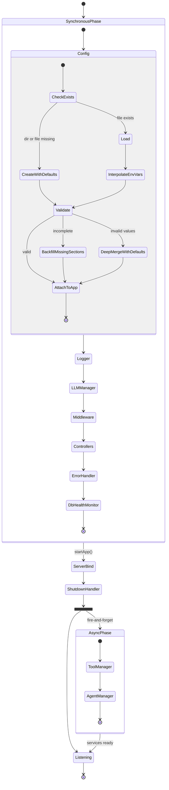

# Backend Initialization

This document describes the complete startup sequence of the backend server, from process entry to the point where all services are ready to handle requests.

---

## Overview

Startup is split into two phases:

1. **Synchronous phase** — everything that must complete before the HTTP server begins accepting connections: configuration, logging, LLMs, middleware, and route registration.
2. **Asynchronous phase** — services that take non-trivial time to initialize and whose absence during the brief startup window is acceptable: the tool manager and agent manager. These run in the background after the server is already listening.

The `DbHealthMonitor` is a special case: it is created synchronously but starts its first database probe asynchronously, overlapping with the async phase.

---

## Entry Point (`src/index.ts`)

The process begins in `index.ts`. It imports the pre-constructed Express application and the `startApp` function from `app.ts`. At import time, `app.ts` executes its module-level code, which runs the entire synchronous phase (see below) before `index.ts` has a chance to call anything.

Once the module is loaded, `index.ts` calls `startApp()`, which binds the HTTP server to the configured host and port and returns the Node.js `Server` instance. It then calls `setupShutdown()` to attach the graceful shutdown handler.

Finally, `index.ts` registers `SIGTERM` and `SIGINT` handlers that both invoke `app.shutdown()`, ensuring container stop signals and keyboard interrupts go through the same graceful shutdown path.

---

## Synchronous Phase (module-level in `src/app.ts`)

All steps in this phase execute in order before the module finishes loading.

### 1. Express Application Construction

A standard Express application instance is created and exported as `app`. All subsequent services are attached directly to this instance so they are accessible as properties in every request handler.

### 2. Config Initialization (`lib/config.ts`)

Config is the first service initialized because every other service depends on it.

The config directory is resolved from the `CONFIG_DIR` environment variable. If unset, it defaults to `~/config/ai-assistant`. The config file is always named `config.yaml` within that directory.

**Branch — config directory or file does not exist:**  
The directory is created recursively. The config file is then generated by parsing an empty object through the full Zod schema, which causes all default values to be written out. The resulting file is saved to disk.

**Branch — config file exists:**  
The file is read and parsed as YAML. Before any validation, all string values are scanned for `${UPPERCASE_VAR}` patterns and substituted with the matching `process.env` values. This allows secrets to be kept out of the config file entirely. If a referenced variable is not set in the environment, a console warning is emitted and the pattern is replaced with an empty string.

The interpolated config is then passed through `validateConfig()`:

  - **Branch — top-level sections are missing:** Each missing section is pulled from the Zod schema defaults and added to the in-memory config object. The updated config is saved back to disk.
  - **Branch — Zod validation fails:** The user's config is deep-merged with the full defaults (user values take priority where they are valid), and the merged result is re-parsed through the schema. The corrected config is saved to disk. This makes the config file self-healing.
  - **Branch — config is fully valid:** No changes are written to disk.

After validation, three internal fields are injected into the config object that are never stored in the YAML file: `appVersion` (read from `package.json`), `appName`, and `assetDir` (resolved relative to the config directory).

The resulting config is attached to `app.config` as an object with typed getter methods (`get`, `getBoolean`, `getNumber`, `getConfigDir`, `has`, `loadConfig`). All getters check `process.env` before the config object, so any config value can always be overridden at the process level.

### 3. Logger Initialization (`lib/logger.ts`)

The logger reads `logging.level` from config to determine the minimum severity level for all transports.

**Branch — `log.toConsole` is true (default):**  
A Console transport is added using a human-readable format: `<timestamp> [LEVEL] [api.<location>] <message> <meta>`. The `location` field is populated by child loggers created throughout the application.

**Branch — `log.toFile` is true (default):**  
A rotating File transport is added using JSON Lines format (one JSON object per line, with `timestamp` and `level` fields). Log files are written to the `logs/` subdirectory within the config directory. Files roll at 10 MB, and up to five rotated files are retained.

The configured logger is attached to `app.logger`.

### 4. LLM Manager Initialization (`lib/llm/index.ts`)

The `llm` config section is loaded and validated against `LlmConfigSchema`. An `LLMManager` instance is created and attached to `app.llm`.

The manager iterates over the `llm.apis` array in config. For each entry:

- **Branch — provider is `ollama`:** An Ollama-backed LangChain chat model is constructed using the entry's `location`, `defaultModel`, and optional `apiKey`.
- **Branch — provider is `openai`:** An OpenAI-compatible LangChain chat model is constructed using the entry's `location`, `apiKey`, and `defaultModel`.
- **Branch — unsupported provider:** A warning is logged and the entry is skipped.

The first registered client automatically becomes the default. Any entry with an explicit `default: true` flag overrides this. The default client is returned by `getClient()` when no alias is specified.

No connection to any LLM provider is made at this point. Clients are constructed lazily and connections are established on the first actual inference call.

### 5. Middleware Registration

Three middleware layers are registered in order:

1. `express.json()` — parses `application/json` request bodies.
2. `express.urlencoded({ extended: true })` — parses form-encoded bodies.
3. `HttpEventMiddleware` — attaches a per-request child logger to `req.logger` tagged with the request ID and route, and emits structured HTTP access log entries.

### 6. Controller Registration

`setupControllers()` mounts the versioned API router at `/api`. All v1 endpoints are registered under `/api/v1`. A root info endpoint (`GET /api/`) and two health endpoints (`GET /api/health` and `GET /api/health/db`) are also registered at this point.

`setupStaticController()` registers the fallback handler that serves the compiled frontend from `dist/` in production. In development this handler is not invoked because Vite's dev server handles static assets via proxy.

### 7. Error Handler Registration

`errorHandler` is registered as the final middleware. Express routes errors to it when a handler either throws synchronously or returns a rejected promise (Express 5 handles both automatically). If the thrown error is an `HttpError` (or subclass such as `NotFoundError` or `BadRequestError`), the middleware serializes it to the appropriate HTTP status code and a JSON body. All other errors are returned as a generic `500 Internal Server Error`, and the full error is logged via `req.logger`.

### 8. DB Health Monitor Construction

A `DbHealthMonitor` instance is created and attached to `app.dbHealth`. It is not yet running at this point. The `start()` call is fire-and-forget — it runs asynchronously and does not block server startup. On `start()`, the monitor immediately runs a database ping and then polls every 15 seconds thereafter, caching the result in `app.dbHealth.state`. The `GET /api/health/db` endpoint reads directly from this cached state, incurring no live I/O per request.

**Branch — database is unreachable on first probe:** The monitor stores `healthy: false` and logs a warning. It continues polling and will set `healthy: true` and log a recovery message when connectivity is restored.

### 9. Async Service Initialization (fire-and-forget)

The tool manager and agent manager are started in a chained promise that is not awaited. The HTTP server begins accepting connections before this chain resolves. This means these services are unavailable for a brief window at startup (typically a few hundred milliseconds in development, potentially longer if MCP servers are slow to connect).

If the chain rejects at any point, the error is logged and `app.shutdown()` is called, terminating the process.

See the Asynchronous Phase section below.

---

## Server Bind (`startApp()` in `src/app.ts`)

`startApp()` is called by `index.ts` after the module-level synchronous phase completes. It reads `server.host` and `server.port` from config and calls `app.listen()`. The HTTP server is now bound and accepting connections. The function returns the Node.js `Server` instance to the caller.

---

## Shutdown Registration (`lib/shutdown.ts`)

`setupShutdown()` is called by `index.ts` immediately after the server binds. It attaches `app.shutdown(code?)` which, when invoked:

1. Stops the `DbHealthMonitor` polling interval.
2. Calls `server.close()` to stop accepting new connections and waits for in-flight requests to drain. On drain, the process exits with the provided code.
3. Starts a 10-second safety timer. If in-flight requests have not drained by then, the process is force-exited to prevent the server from hanging indefinitely.

---

## Asynchronous Phase

This phase runs in the background after the server is already listening.

### Tool Manager Initialization (`lib/tools/manager.ts`)

The `tools` config section is loaded and validated against `ToolsConfigSchema`. A `McpServerManager` and a `ToolManager` are instantiated and `init()` is called in sequence:

**Step 1 — Built-in tool seeding:**  
The set of built-in tools (permission-system tools and memory tools) is seeded into the database if not already present. This ensures the tool registry is consistent across restarts.

**Step 2 — Simple tool loading:**  
**Branch — `tools.simple` is configured:** Each simple tool definition is loaded from the filesystem path specified in config. Failures are logged and do not abort startup; the remaining tools continue to load.

**Step 3 — MCP tool loading:**  
**Branch — `tools.mcp_servers` is configured:** The `McpServerManager` attempts to connect to each configured MCP server and enumerate its exposed tools. Servers that fail to connect are recorded as disconnected. Once loading completes, a background health-check loop is started that periodically re-attempts connection to disconnected servers and adds their tools to the active registry when they come back online.

The fully initialized `ToolManager` is attached to `app.tools`.

### Agent Manager Initialization (`lib/agents/index.ts`)

This step runs only after the tool manager has fully initialized, since agents depend on tools.

An `AgentManager` instance is created and attached to `app.agents`. All agent records are loaded from the database. For each agent:

1. The LLM client specified by the agent's `engine` field is retrieved from `app.llm`.
2. An `AgentRuntime` is constructed from the database record, the LLM client, and the tool manager.
3. The runtime is registered with the `AgentManager`.
4. **Branch — `auto_start` is true:** The agent is immediately marked as active. Any chat request that arrives before this step completes will not yet see this agent as active.

After all agents are registered, the manager subscribes to an `action_resolved` event. This event is emitted by the `PATCH /api/v1/tools/actions/:id` endpoint when a human operator approves or denies a tool permission request. On receipt, the manager locates the relevant `AgentRuntime` and resumes the suspended LangGraph execution on the originating thread without requiring a new user message.
